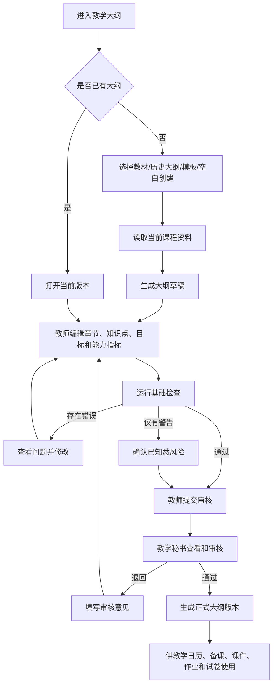
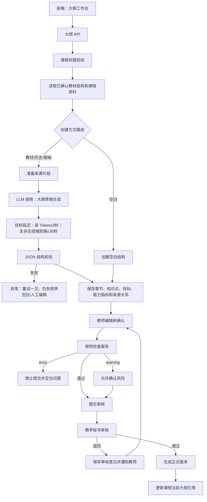

# 教学大纲 PRD

## 1. 模块定位

教学大纲是课程正式教学内容的核心基础，承接课程资料库中的主教材、历史大纲、学校模板和培养方案，并为教学日历、章节备课、课件、作业、试卷和学情分析提供结构化依据。

本模块负责：

- 创建教学大纲
- 解析和复用历史大纲
- 维护章节、学时和知识点
- 维护课程目标、重点难点和课程能力指标
- 维护章节、目标、能力指标之间的映射
- AI 生成和检查建议
- 教师编辑和提交
- 教学秘书审核
- 正式版本和历史版本

本模块不负责：教学日历排课、课件页面编辑、作业题目编辑、试卷组卷和成绩计算。

## 2. 已确认业务规则

1. 教学大纲的主教材来自当前课程资料库中唯一的主教材。
2. 历史大纲、学校模板、培养方案和教师补充说明可以作为辅助来源。
3. AI 生成的是大纲草稿和建议，不直接成为正式大纲。
4. 教师负责编辑和确认内容，教学秘书负责审核。
5. 大纲提交审核前必须通过基础检查。
6. 审核退回必须填写意见；教师修改后重新提交。
7. 审核通过后生成正式大纲版本，后续模块默认使用该版本。
8. 正式版本不能直接覆盖，修改必须复制为新版本。
9. 课程目标、能力指标和章节学时不能只保存为长文本，必须结构化保存。
10. 章节、知识点、课程目标和能力指标之间必须建立可追溯关系。

## 3. 页面清单

| 编号 | 页面 | 路由建议 | 作用 |
|---|---|---|---|
| SY-01 | 大纲工作台 | `/courses/{course_id}/syllabus` | 查看当前版本、状态和操作入口 |
| SY-02 | 创建大纲 | `/courses/{course_id}/syllabus/create` | 选择生成方式和资料来源 |
| SY-03 | 大纲编辑器 | `/courses/{course_id}/syllabus/{syllabus_id}/edit` | 编辑大纲结构和内容 |
| SY-04 | 检查结果 | `/courses/{course_id}/syllabus/{syllabus_id}/checks` | 查看并处理检查问题 |
| SY-05 | 审核详情 | `/courses/{course_id}/syllabus/{syllabus_id}/review` | 教学秘书审核、退回或通过 |
| SY-06 | 版本历史 | `/courses/{course_id}/syllabus/versions` | 查看、对比和复制历史版本 |

弹窗：选择资料来源、生成确认、删除章节、修改学时、提交审核、退回原因、启用版本。

## 4. SY-01 大纲工作台

### 4.1 页面区域

1. 当前课程和版本信息
2. 大纲状态卡片
3. 大纲摘要
4. 章节概览
5. 课程目标和能力指标概览
6. 检查结果
7. 审核记录
8. 操作按钮

### 4.2 页面字段

| 字段 | 类型 | 说明 |
|---|---|---|
| `syllabus_id` | UUID | 大纲标识 |
| `course_id` | UUID | 当前课程 |
| `course_version_id` | UUID | 课程版本 |
| `version_no` | string | 如 `v1.0` |
| `version_name` | string | 版本名称 |
| `syllabus_status` | enum | `draft`、`editing`、`checking`、`pending_review`、`reviewing`、`returned`、`resubmitted`、`approved`、`active`、`superseded`、`archived` |
| `course_name` | string | 课程名称 |
| `term_label` | string | 如“2026 春季” |
| `primary_textbook_name` | string | 主教材名称 |
| `chapter_count` | integer | 一级章节数量 |
| `knowledge_point_count` | integer | 知识点数量 |
| `total_hours` | integer | 大纲章节学时合计 |
| `required_total_hours` | integer | 课程要求总学时 |
| `objective_count` | integer | 课程目标数量 |
| `ability_indicator_count` | integer | 能力指标数量 |
| `check_error_count` | integer | 错误数量 |
| `check_warning_count` | integer | 警告数量 |
| `review_comment_count` | integer | 审核意见数量 |
| `updated_at` | datetime | 最近修改时间 |
| `submitted_at` | datetime/null | 提交时间 |
| `approved_at` | datetime/null | 审核通过时间 |

### 4.3 操作按钮

| 状态 | 可用操作 |
|---|---|
| 未创建 | 创建大纲 |
| 草稿/编辑中 | 继续编辑、运行检查、删除草稿 |
| 检查中 | 查看检查进度 |
| 待审核 | 查看提交内容、撤回提交 |
| 审核中 | 查看审核状态 |
| 已退回 | 查看意见、继续修改 |
| 已通过/已启用 | 查看、复制为新版本、导出 |
| 已归档 | 只读查看、复制为新版本 |

## 5. SY-02 创建大纲

### 5.1 创建方式

| 编码 | 名称 | 必要条件 |
|---|---|---|
| `from_textbook` | 基于主教材生成 | 主教材结构已确认或强制确认 |
| `from_history` | 基于历史大纲生成 | 当前课程资料库存在历史大纲 |
| `from_template` | 基于学校模板生成 | 存在学校大纲模板 |
| `blank` | 新建空白大纲 | 课程已创建且主教材可访问 |
| `copy_version` | 复制历史版本 | 存在可访问历史版本 |

### 5.2 来源字段

| 字段 | 类型 | 必填 | 规则 |
|---|---|---:|---|
| `generation_mode` | enum | 是 | 见创建方式 |
| `primary_textbook_file_id` | UUID | 是 | 当前课程唯一主教材 |
| `source_file_ids` | UUID[] | 否 | 补充资料，必须属于当前课程 |
| `history_syllabus_id` | UUID | 否 | `from_history` 时必填 |
| `template_file_id` | UUID | 否 | `from_template` 时必填 |
| `teacher_instruction` | string(2000) | 否 | 教师补充要求 |
| `target_total_hours` | integer | 是 | 默认读取课程 `total_hours` |
| `target_chapter_count` | integer | 否 | 1-100 |
| `keep_source_structure` | boolean | 是 | 默认 true |
| `include_ability_matrix` | boolean | 是 | 默认 true |
| `include_objective_mapping` | boolean | 是 | 默认 true |

### 5.3 创建前提示

当只使用教材时：

> 当前大纲将主要依据主教材生成。课程目标、考核要求、能力指标和学校格式可能需要你补充确认。

当存在历史大纲和模板时：

> 系统将综合主教材、历史大纲、学校模板和课程要求生成草稿，来源之间存在冲突时会标记给你确认。

## 6. SY-03 大纲编辑器

建议采用“左侧结构树 + 中间编辑区 + 右侧来源和检查栏”。

### 6.1 大纲基本信息字段

| 字段 | 类型 | 必填 | 规则 |
|---|---|---:|---|
| `syllabus_title` | string(200) | 是 | 默认“课程名称+教学大纲” |
| `course_name` | string(100) | 是 | 默认读取课程，不建议在此修改 |
| `course_code` | string(50) | 是 | 只读，来自课程 |
| `term_label` | string | 是 | 只读或跳转课程管理修改 |
| `credit` | decimal(3,1) | 是 | 来自课程 |
| `total_hours` | integer | 是 | 来自课程，可申请调整 |
| `teaching_object` | string(200) | 是 | 来自课程 |
| `course_description` | string(1000) | 否 | 可编辑 |
| `prerequisite_courses` | string[] | 否 | 先修课程名称 |
| `teaching_methods` | enum[] | 否 | `lecture` 讲授、`discussion` 讨论、`practice` 练习、`experiment` 实验、`project` 项目、`online` 在线、`other` 其他 |
| `assessment_description` | string(1000) | 否 | 考核方式说明，权重在成绩模块配置 |
| `textbook_description` | string(1000) | 否 | 教材说明 |

### 6.2 章节字段

| 字段 | 类型 | 必填 | 规则 |
|---|---|---:|---|
| `chapter_id` | UUID | 是 | 章节标识 |
| `parent_chapter_id` | UUID/null | 是 | 父章节 |
| `chapter_code` | string(20) | 是 | 如 `1`、`1.1` |
| `chapter_title` | string(200) | 是 | 1-200 字 |
| `chapter_level` | integer | 是 | 1-4 |
| `sort_order` | integer | 是 | 同级排序 |
| `hours` | integer | 是 | 0-200；一级章节可为 0，由子章节合计 |
| `teaching_content` | string(3000) | 否 | 教学内容 |
| `teaching_requirements` | string(3000) | 否 | 教学要求 |
| `key_points` | string[] | 否 | 重点 |
| `difficult_points` | string[] | 否 | 难点 |
| `source_node_ids` | UUID[] | 否 | 教材结构来源 |
| `is_ai_generated` | boolean | 是 | 是否含 AI 生成内容 |
| `teacher_confirmed` | boolean | 是 | 是否教师确认 |

### 6.3 知识点字段

| 字段 | 类型 | 必填 | 规则 |
|---|---|---:|---|
| `knowledge_point_id` | UUID | 是 | 知识点标识 |
| `chapter_id` | UUID | 是 | 所属章节 |
| `knowledge_code` | string(30) | 是 | 当前大纲内唯一 |
| `knowledge_name` | string(200) | 是 |  |
| `knowledge_type` | enum | 是 | `concept` 概念、`definition` 定义、`theorem` 定理、`formula` 公式、`algorithm` 算法、`example` 例题、`method` 方法、`other` 其他 |
| `knowledge_description` | string(1000) | 否 |  |
| `prerequisite_ids` | UUID[] | 否 | 前置知识点 |
| `source_pages` | PageRange[] | 否 | 文件和页码 |
| `importance` | enum | 是 | `core` 核心、`important` 重要、`general` 一般 |
| `teacher_confirmed` | boolean | 是 |  |

### 6.4 课程目标字段

| 字段 | 类型 | 必填 | 规则 |
|---|---|---:|---|
| `objective_id` | UUID | 是 | 目标标识 |
| `objective_code` | string(30) | 是 | 如 `CO1`，当前大纲内唯一 |
| `objective_title` | string(200) | 是 |  |
| `objective_description` | string(1000) | 是 | 可观察、可评价 |
| `cognitive_level` | enum | 否 | `remember` 记忆、`understand` 理解、`apply` 应用、`analyze` 分析、`evaluate` 评价、`create` 创造 |
| `source_file_ids` | UUID[] | 否 | 来源资料 |
| `is_ai_suggestion` | boolean | 是 |  |
| `teacher_confirmed` | boolean | 是 |  |

### 6.5 课程能力指标字段

| 字段 | 类型 | 必填 | 规则 |
|---|---|---:|---|
| `ability_indicator_id` | UUID | 是 | 指标标识 |
| `ability_code` | string(30) | 是 | 如 `A1`，当前课程内唯一 |
| `ability_name` | string(200) | 是 |  |
| `ability_description` | string(1000) | 是 |  |
| `ability_source_type` | enum | 是 | `textbook` 教材、`history_syllabus` 历史大纲、`school_requirement` 学校要求、`training_plan` 培养方案、`teacher_input` 教师补充、`ai_suggestion` AI 建议 |
| `source_file_ids` | UUID[] | 否 | 来源资料 |
| `is_ai_suggestion` | boolean | 是 |  |
| `teacher_confirmed` | boolean | 是 |  |
| `secretary_reviewed` | boolean | 是 | 是否已被审核查看 |

### 6.6 映射字段

#### 章节-知识点

`chapter_id`、`knowledge_point_id`、`mapping_type`(`primary` 主关联、`related` 相关)、`source`(`ai`/`teacher`)、`confirmed_by`、`confirmed_at`。

#### 章节-课程目标

`chapter_id`、`objective_id`、`support_level`(`high`/`medium`/`low`)、`source`、`teacher_confirmed`、`remark`。

#### 章节-能力指标

`chapter_id`、`ability_indicator_id`、`support_level`(`high`/`medium`/`low`)、`source`、`teacher_confirmed`、`remark`。

#### 课程目标-能力指标

`objective_id`、`ability_indicator_id`、`support_level`、`source`、`teacher_confirmed`、`remark`。

## 7. 编辑交互

- 章节树支持新增、删除、拖拽排序、调整层级和批量修改学时。
- 删除有子章节的节点时，必须选择“同时删除子章节”或“将子章节上移”。
- 修改章节学时后即时更新总学时，并提示与课程要求的差额。
- AI 生成字段使用浅色标识，教师修改后标记为“已人工修改”。
- 每个 AI 建议旁边显示来源文件、章节和页码。
- 章节、知识点、目标和能力指标均支持搜索和快速定位。
- 离开编辑器前存在未保存修改时弹窗提示。
- 不允许将其他课程的资料添加为来源。

## 8. SY-04 大纲检查

### 8.1 检查项目

| 检查编码 | 检查内容 | 等级 |
|---|---|---|
| `SY001` | 课程基本信息缺失 | error |
| `SY002` | 一级章节为空 | error |
| `SY003` | 章节名称为空 | error |
| `SY004` | 章节学时为负数 | error |
| `SY005` | 章节学时合计不等于课程总学时 | error |
| `SY006` | 章节层级断裂 | error |
| `SY007` | 知识点未关联章节 | error |
| `SY008` | 课程目标为空 | error |
| `SY009` | 课程目标没有章节支撑 | warning |
| `SY010` | 能力指标为空 | warning |
| `SY011` | 能力指标没有章节支撑 | warning |
| `SY012` | 存在重复章节名称 | warning |
| `SY013` | 存在重复知识点 | warning |
| `SY014` | 章节没有教学内容 | warning |
| `SY015` | AI 结果未人工确认 | warning |
| `SY016` | 引用资料解析存在风险 | warning |
| `SY017` | 章节页码范围异常 | warning |
| `SY018` | 目标与能力指标无映射 | warning |

### 8.2 检查结果字段

`check_id`、`syllabus_id`、`check_code`、`severity`、`target_type`、`target_id`、`message`、`suggested_action`、`status`(`open`/`resolved`/`ignored`)、`resolved_by`、`resolved_at`。

### 8.3 提交条件

- 存在 `error` 时禁止提交审核。
- 仅有 `warning` 时允许提交，但提交前必须确认“已知悉风险”。
- 忽略 warning 必须记录忽略人和原因。

## 9. SY-05 审核流程

```text
草稿/编辑中
→ 检查通过
→ 教师提交审核
→ 教学秘书审核
→ 退回修改 或 审核通过
→ 正式大纲版本启用
```

### 9.1 审核字段

| 字段 | 类型 | 说明 |
|---|---|---|
| `review_task_id` | UUID | 审核任务 |
| `syllabus_id` | UUID | 大纲 |
| `submitted_by` | UUID | 教师 |
| `reviewer_id` | UUID | 教学秘书 |
| `review_status` | enum | `pending`、`reviewing`、`returned`、`approved`、`cancelled` |
| `overall_comment` | string(2000) | 总体意见 |
| `item_comments` | ReviewComment[] | 逐项意见 |
| `submitted_at` | datetime | 提交时间 |
| `reviewed_at` | datetime/null | 审核时间 |
| `return_reason` | string(2000) | 退回原因 |

### 9.2 审核规则

- 教师可以提交和撤回审核。
- 教学秘书可以查看、提出意见、退回和通过。
- 教学秘书不能直接修改教师大纲内容。
- 退回后教师修改并重新提交，原审核意见保留。
- 通过后生成正式版本，自动通知教师。

## 10. SY-06 版本历史

### 10.1 操作

- 查看版本列表
- 查看版本详情
- 对比两个版本
- 复制历史版本为新草稿
- 启用新版本
- 归档旧版本

### 10.2 版本规则

- 正式版本不能直接编辑。
- 新版本默认复制当前正式版本的章节、知识点、目标、能力指标和映射关系。
- 新版本修改不影响旧版本。
- 成绩和历史教学成果保留原版本关联。

## 11. 状态机

```text
not_created
→ draft
→ editing
→ checking
→ pending_review
→ reviewing
→ returned
→ resubmitted
→ approved
→ active
→ superseded
→ archived
```

## 12. 业务流程图



## 13. 系统流程图



## 14. AI 介入和技术要求

### 14.1 传统技术

- 读取课程和资料权限
- 读取已确认教材结构
- 字段校验
- 学时合计
- 章节层级检查
- 重复名称检查
- 引用关系完整性检查
- 版本复制和状态流转

### 14.2 大模型

- 大纲章节内容候选生成
- 课程目标候选生成
- 课程能力指标候选提取
- 章节、目标、能力指标映射建议
- 多资料冲突摘要
- 大纲语义完整性建议

大模型不负责最终学时、考核比例、正式课程目标和审核结论。

## 15. 完整 Prompt

### 15.1 大纲草稿生成 Prompt

```text
System：
你是高校课程教学大纲草稿助手。请基于当前课程资料和已确认教材结构，生成可供教师编辑的教学大纲草稿。

输入资料可能包括主教材、历史大纲、学校模板、培养方案和教师补充要求。你必须区分来源优先级：学校模板和明确课程要求约束格式与要求；已确认教材结构提供章节和知识点；历史大纲仅作为参考；教师补充要求优先于一般推断。

你不能：
1. 臆造教材中不存在的章节、知识点、页码或课程要求；
2. 将 AI 建议直接标记为正式内容；
3. 自行确定最终学时、考核比例或审核结论；
4. 引用其他课程资料；
5. 忽略来源冲突。

输出要求：
1. 只输出合法 JSON；
2. 章节必须保留已确认结构；
3. 每个章节、知识点、目标和能力指标都必须标记来源；
4. 所有推断内容设置 is_ai_suggestion=true；
5. 不确定内容设置 needs_review=true；
6. 章节学时只能输出建议值，并标记 requires_teacher_confirmation=true；
7. 课程能力指标允许来自教材、历史大纲、学校要求、培养方案或教师输入；
8. 映射关系必须说明 support_level 和依据。

User：
课程基本信息：{{course_info}}
当前课程版本：{{course_version_id}}
已确认教材结构：{{confirmed_structure}}
主教材资料片段：{{textbook_chunks}}
历史大纲资料：{{history_syllabus_chunks}}
学校模板和课程要求：{{school_requirement_chunks}}
培养方案：{{training_plan_chunks}}
教师补充要求：{{teacher_instruction}}
目标总学时：{{target_total_hours}}

请输出课程基本信息、章节、知识点、课程目标、课程能力指标、三类映射关系、来源和待确认事项。

JSON：
{
  "course_profile": {
    "course_description":"",
    "prerequisite_courses":[],
    "teaching_methods":[],
    "assessment_description":"",
    "needs_review":false
  },
  "chapters":[{
    "chapter_code":"1", "title":"", "level":1, "parent_code":null,
    "suggested_hours":0, "teaching_content":"", "teaching_requirements":"",
    "key_points":[], "difficult_points":[], "source_pages":[],
    "is_ai_suggestion":true, "needs_review":false,
    "requires_teacher_confirmation":true
  }],
  "knowledge_points":[{
    "chapter_code":"1", "knowledge_code":"K1", "name":"",
    "type":"concept", "description":"", "source_pages":[],
    "is_ai_suggestion":true, "needs_review":false
  }],
  "objectives":[{
    "objective_code":"CO1", "title":"", "description":"",
    "cognitive_level":"understand", "source_file_ids":[],
    "is_ai_suggestion":true, "needs_review":true
  }],
  "ability_indicators":[{
    "ability_code":"A1", "name":"", "description":"",
    "source_type":"textbook", "source_file_ids":[],
    "is_ai_suggestion":true, "needs_review":true
  }],
  "chapter_objective_mappings":[],
  "chapter_ability_mappings":[],
  "objective_ability_mappings":[],
  "conflicts":[],
  "warnings":[]
}
```

### 15.2 目标和能力指标提取 Prompt

```text
System：
你是课程目标与能力指标提取助手。请从当前课程的历史大纲、学校要求、培养方案和教师输入中提取候选课程目标与能力指标。

规则：
1. 必须区分原文要求和 AI 归纳。
2. 每项结果必须携带来源文件和页码。
3. 相似内容可以合并，但必须列出被合并的原始来源。
4. 冲突内容不得自行选择，必须输出 conflicts。
5. 不得把教材知识点直接等同于课程能力指标。
6. 所有结果默认需要教师确认。
7. 只输出合法 JSON。

User：
课程：{{course_info}}
历史大纲：{{history_syllabus_chunks}}
学校要求：{{school_requirement_chunks}}
培养方案：{{training_plan_chunks}}
教师输入：{{teacher_instruction}}

请输出课程目标和能力指标候选、来源、合并说明、冲突和待确认事项。

JSON：
{
  "objectives":[{
    "objective_code":"CO1", "title":"", "description":"",
    "cognitive_level":"understand", "source_refs":[],
    "is_ai_suggestion":true, "needs_review":true
  }],
  "ability_indicators":[{
    "ability_code":"A1", "name":"", "description":"",
    "source_type":"school_requirement", "source_refs":[],
    "is_ai_suggestion":true, "needs_review":true
  }],
  "merged_items":[],
  "conflicts":[],
  "warnings":[]
}
```

### 15.3 大纲语义检查 Prompt

```text
System：
你是教学大纲语义检查助手。请检查当前大纲是否存在内容缺失、目标与章节不匹配、能力指标无支撑、知识点重复或教学要求表述不清的问题。

你只能检查和提出建议，不能直接修改大纲，不能替教师决定学时、考核方式或审核结论。
每条问题必须关联具体对象和来源；没有证据时不要提出确定性问题。
只输出合法 JSON。

User：
课程信息：{{course_info}}
大纲内容：{{syllabus_json}}
来源资料摘要：{{source_summaries}}

请输出问题编码、问题等级、关联对象、问题说明、证据、建议动作和是否必须人工处理。

JSON：
{
  "issues":[{
    "issue_code":"SEM001", "severity":"warning",
    "target_type":"chapter", "target_id":"",
    "message":"", "evidence":"", "suggested_action":"",
    "requires_human_action":true
  }],
  "overall_result":"pass_with_warnings",
  "warnings":[]
}
```

## 16. 埋点与验收

### 16.1 埋点

`syllabus_view`、`syllabus_create_start`、`syllabus_source_selected`、`syllabus_generate_start`、`syllabus_generate_success`、`syllabus_generate_fail`、`syllabus_edit`、`chapter_create`、`chapter_delete`、`chapter_reorder`、`chapter_hours_change`、`objective_edit`、`ability_indicator_edit`、`mapping_edit`、`syllabus_check_start`、`syllabus_check_complete`、`syllabus_warning_ignore`、`syllabus_submit_review`、`syllabus_withdraw_review`、`syllabus_review_return`、`syllabus_review_approve`、`syllabus_copy_version`、`syllabus_export`。

### 16.2 验收标准

- 教师可以从主教材、历史大纲、模板、空白或历史版本创建大纲。
- 主教材和补充资料来源必须属于当前课程。
- 大纲章节、知识点、目标、能力指标和映射关系结构化保存。
- AI 生成结果显示来源和待确认标识。
- 章节学时合计可以自动计算并与课程总学时比较。
- 存在 error 时不能提交审核；warning 可确认后提交。
- 教学秘书可以审核、退回和通过，但不能直接修改教师内容。
- 课件和作业不受本模块审核流程影响。
- 审核通过后生成正式版本并供下游模块使用。
- 正式版本不可直接覆盖，历史版本可查询和复制。
- 课程归档后大纲只读，历史资料和版本仍可查看。

## 17. 当前页面与交互规范（2026-09-04）

以下为教学大纲页面的当前有效页面与交互规范。

### 17.1 标题区

- 页面标题区保留“教学大纲”、当前版本和 Mock 数据状态。
- 课程工作空间左侧显示固定课程内导航，课程名称、学期、版本和课程切换位于右侧内容区顶部；标题区最多两行并保持紧凑。
- 不显示 `教学大纲 / SYLLABUS` 小标签，也不显示“按学校大纲顺序逐项完成，保存后可继续下一项；章节内容支持 AI 草稿与教师确认。”说明文案。
- 标题区保持紧凑，避免占用章节编辑空间。

### 17.2 大纲区块与章节编辑

- 大纲工作台使用左侧“完成进度”轨道，按固定大纲区块顺序维护 8 个页面区块；进度项只显示区块名称，不显示二级说明，保存当前区块后可进入下一项。
- “课程基本信息”区块采用三列信息网格，课程简介归入该区块；页面不展示模板状态、模板抽取或模板映射标签。
- 原“课程的性质、目的和任务”区块统一改名为“课程目标”，页面结构分为“课程内容编辑”和“课程目标编辑”两部分。课程内容编辑提供“课程目的”输入框；课程目标编辑以纵向列表展示目标，每条目标包含可自主修改的目标名称和目标内容，编号从“课程目标 1”开始并按列表顺序自动累加。
- 课程目标支持自定义新增和删除，至少保留一条；保存大纲时同步保存目标名称与目标内容，目标顺序即编号顺序。
- “课程教学内容与基本要求”区块支持一级章节、子章节、上下移动和层级化编辑。
- 点击章节打开居中编辑弹窗，不使用侧边抽屉；遮罩不承担关闭操作，关闭必须通过右上角关闭按钮或底部取消按钮。
- 章节弹窗至少包含：章节编号、名称、学时、教学内容、教学基本要求、重点、难点、知识点、课程目标、能力指标和思政切入点。
- 弹窗右侧展示教材引用章节/页码、能力矩阵、理论/实验/大作业课时总览和思政信息，不展示模板抽取、模板映射或模板状态说明。

### 17.3 AI 与版本交互

- 页面提供大纲助手对话窗口，支持自然语言生成、拆分、合并、调整课时和修改章节。
- AI 输出支持流式展示；生成结果只能回填为 AI 草稿，教师保存或确认后才进入正式编辑数据。
- AI 草稿、教师确认、人工修改和来源文件/页码必须可区分显示。
- 版本选择、版本记录和章节编辑使用同一套居中弹窗样式；归档版本只读。

## 18. 封版基线（2026-09-05）

本节是当前课程大纲原型的唯一有效基线。后续修改必须先更新本节和对应验收项，再修改前端；不得重新加载已删除的历史模块或旧版页面。

### 18.1 封版范围与版本

| 项目 | 封版值 |
|---|---|
| 原型入口 | `prototype/index.html` |
| 当前缓存版本 | `20260905-81` |
| 有效模块 | `js/modules/00-course-base.js`、`01-syllabus-cleanup.js`、`02-calendar-domain.js`、`03-calendar-traceability.js`、`04-calendar-fidelity.js`、`05-syllabus-workspace.js`、`06-calendar-semantic.js`、`07-calendar-template.js`、`08-calendar-config.js`、`09-calendar-affordance.js`、`12-syllabus-fields.js`、`13-syllabus-fields-extra.js`、`14-dialog-shell.js`、`15-calendar-route.js`、`16-course-basics.js`、`17-calendar-edit-guard.js`、`18-calendar-final-config.js` |
| 已移除 | 未加载的旧版摘要模块、历史合并脚本；不得恢复引用 |
| 数据边界 | 当前课程数据存于浏览器本地；不得用清缓存覆盖课程编辑数据、章节详情或版本快照 |

### 18.2 八个固定流程区块

大纲流程固定为以下 8 项，顺序不可改变：

1. **课程基本信息**：课程名称、英文名称、课程编号、课程类别、适用专业、学分、总学时、理论讲授学时、实验/上机学时、中文课程简介、英文课程简介。
2. **课程目标**：课程目的；课程目标名称和课程目标内容列表。目标可新增、删除和改名，编号根据列表顺序自动累加，至少保留一条。
3. **课程目标与毕业要求支撑**：课程目标、权重、支撑的毕业要求指标点、教学内容、教学方法。课程目标必须沿用第 2 项，不能在本区块新增；权重合计必须等于 `1.0`。
4. **课程教学内容与基本要求**：一级、二级、三级章节树；章节编号按层级自动生成；章节支持新增、删除、拖拽/上下移动、展开/收起和进入编辑页。
5. **学时分配表**：章节内容来自第 4 项；表头为“章次、教学内容、学时分配（理论教学、实验或上机、大作业、合计）”；支持学分编辑，合计实时计算。
6. **课程思政案例**：统一表头“序号、案例名称、所属章节/实验实践项目、案例教学目标、案例教学内容”，每行独立输入，序号列保持最小宽度。
7. **课程考核与成绩评定**：统一表头“课程目标、毕业要求、考核方式、考核细则、单项成绩占比(%)”；单项成绩拆分为出勤、作业、期末考试三个独立输入，三者合计 `100%`。
8. **教材、参考书与审签**：主要教材、主要参考书、执笔、审阅、审定。

### 18.3 章节详情字段与回显规则

每个章节（一级、二级、三级）进入编辑页后必须展示并可保存：

| 字段 | 展示要求 |
|---|---|
| 章节编号 | 根据当前层级回显 `1`、`1.2`、`1.2.1` 等编号，不得出现四级编号 |
| 章节名称 | 回显当前章节名称，允许修改 |
| 本章学时 | 回显章节数据，允许修改 |
| 教学内容 | 独立文本输入 |
| 教学重点 | 独立文本输入 |
| 教学难点 | 独立文本输入 |
| 教学基本要求 | 独立文本输入 |
| 作业与思考题 | 分点输入；兼容字符串和数组保存格式 |
| 课程能力指标 | 来自教材、现有大纲及教育部/学校培养材料，可维护权重 |
| 本章节知识点与解析 | 展示知识点及解析说明 |
| 教材来源与位置 | 从教材名称及章节位置抽取并可维护 |

章节目录右侧状态由以上章节字段实际是否完整决定：全部必填内容均有值显示“已完善”，任意一项缺失显示“待完善”。状态和编辑页必须使用同一份章节详情数据；章节 ID 变化时按章节编号/名称兼容匹配历史详情。

### 18.4 固定交互

- 进入 04 时默认展开第一个一级章节，其余一级章节默认收起；收起/展开使用图标按钮。
- 点击章节内容区域进入章节编辑页；点击按钮不触发进入编辑。
- 章节编辑页顶部固定显示章节名称和操作按钮；保存按钮与返回按钮同排。
- 有未保存修改直接返回时，提示“是否保存”；选择保存则保存后返回，选择否则丢弃修改返回。
- AI 章节检测按钮文案固定为“AI一键检测章节结构”。点击后隐藏原按钮，打开 AI 检测面板；面板右上角有关闭按钮，关闭后恢复原按钮。
- 检测面板显示可折叠的思考过程、按顺序排列的建议事项；支持单条勾选、批量勾选、一键采纳全部、发送已选建议给 AI 修改。
- AI 检测面板打开时隐藏右下角全局 AI 入口，避免遮挡输入框和发送按钮；关闭后恢复。
- 全局 AI 助手入口始终位于页面右下角；打开后从右侧推入，高度占满页面，左侧流程收缩为数字，中间内容与 AI 面板同屏显示。
- 顶部固定提供“教学大纲预览、保存草稿、保存版本”；三者使用与 AI 助手一致的深青绿色按钮。
- 预览整合 01～08 全部流程内容，模拟 Word 文档格式，支持 PDF 和 Word 导出。
- 预览中的章节详情标签“教学内容、教学重点与难点、教学基本要求、作业与思考题、课程能力指标、本章节知识点与解析”统一加粗。

### 18.5 保存、版本与缓存规则

- 保存草稿只更新当前编辑快照；保存版本创建完整的 01～08 快照，包含字段、章节树、章节详情、目标、映射、学时、思政、考核和教材信息。
- 切换版本必须恢复对应完整快照，不能继续显示最后编辑版本。
- 版本号只在明确执行“保存版本”时递增；刷新页面不得自动创建新版本。
- 正式版本不可直接覆盖，修改必须生成新版本。
- HTML 使用 `no-cache/no-store` 元信息；CSS、核心脚本和模块统一使用当前缓存版本查询参数。
- 清理缓存只清理浏览器资源缓存，不得删除课程编辑数据、章节详情、版本快照或本地草稿。

### 18.6 封版验收

- 刷新后仍停留在当前最新页面和当前版本，不回退到历史 UI。
- 04 章节树不跳动、不重复重绘；05 学时分配表不跳动，左右滚动条稳定。
- 已完善章节点击后，编号、教学内容、重点、难点、基本要求、作业、能力指标和知识点均能回显。
- 三级章节编号连续且最多三级；点击三级章节不会打开其父级内容。
- 预览包含课程简介、英文介绍、课程目的、课程目标、章节详情、学时、思政、考核、教材及审签。
- 运行 `node tools/dev-check.mjs` 必须通过入口、模块引用和 JavaScript 语法检查。
