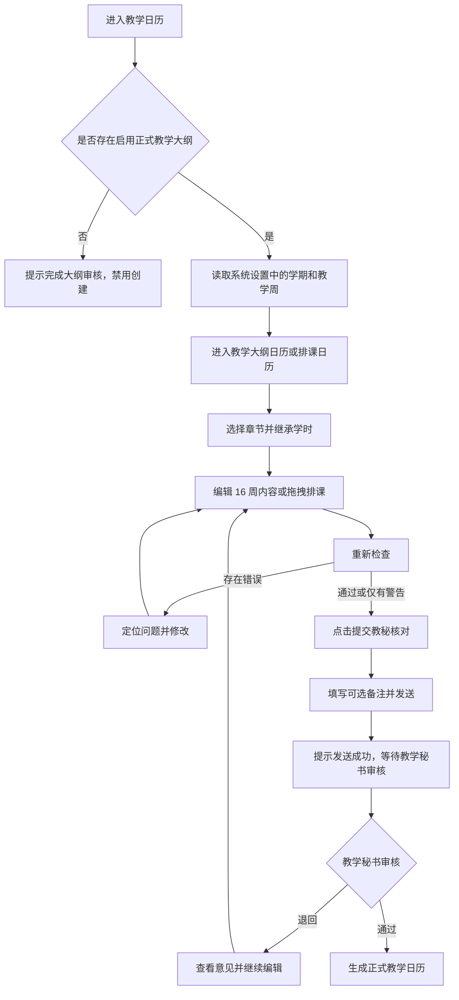

# 教学日历 PRD

## 1. 模块定位

教学日历将当前课程已确定的正式教学大纲转换为按周执行、按课表落位的教学安排，供任课教师编辑、检查并提交教学秘书核对。

教学日历页面只包含两个 Tab：

- **教学大纲日历**：维护 16 周教学内容总表，明确每周章节、讲授/实验/实践学时、内容、作业和授课教师。
- **排课日历**：把教学大纲日历中的每周教学内容拖拽到具体星期和节次，形成可供教学秘书综合核对的课表安排。

本模块负责：

- 展示当前课程与正式教学大纲的课程信息和学时分配；
- 按正式教学大纲维护 16 周教学内容；
- 选择正式大纲中的一级、二级、三级章节并继承章节学时；
- 在不改变周次的前提下拖拽移动章节内容；
- 将章节内容拖拽到排课日历的星期和节次；
- 检查学时、章节覆盖、章节来源和排课冲突；
- 提交当前教学日历给教学秘书核对；
- 提供教学日历专属 AI 助手入口。

本模块不负责：

- 编辑教学大纲、创建作业题目、记录学生考勤、排学校教室或同步外部教务平台；
- 配置校历与教学周（由系统设置负责）；
- 在教学日历页面维护节假日、停课、补课、调课；
- 学校模板展示模块、填表与审签模块；
- 在页面中展示“学时待核对”或其他已删除的旧摘要卡片。

教学日历的前端修改必须遵循《[教学日历页面隔离规范](04-teaching-calendar-isolation.md)》，只作用于 `#course/calendar` 页面，不影响顶部全局区域、左侧课程导航、课程切换和其他业务页面。

## 2. 已确认业务规则

1. 只有当前课程已审核通过且处于启用状态的正式教学大纲可以作为教学日历来源。
2. 教学日历页面的所有学时均继承正式教学大纲；教学日历不得静默修改、覆盖或回写正式大纲来源数据。
3. 每周的讲授学时、实验学时和实践学时之和必须等于该周所选章节的正式总学时；全日历总学时必须等于正式大纲总学时。
4. 课程当前流程按 16 周展示和排课；周次显示为“第 X 周”，不在教学大纲日历的周次字段中展示具体日期。
5. 周次编号固定。教学大纲日历拖拽只移动章节内容的顺序或归属，不改变周次编号；排课日历拖拽只改变星期和节次位置，不改变所属教学周。
6. 章节选择只能来自当前正式大纲已有的一级、二级、三级章节，不得引用其他课程或其他版本的章节。
7. 章节学时、讲授内容、实验或实践内容、课外作业和授课教师由章节数据带出；实验或实践内容、课外作业和授课教师允许教师在编辑弹窗中调整并保存。
8. 提交“教秘核对”前必须通过错误级检查；存在错误时禁止提交。警告可由教师确认后提交，并记录确认原因。
9. 教学秘书可以查看教师提交的教学大纲日历和排课日历，结合其他教师的排课情况进行核对、提出意见、退回或通过，但不能直接修改教师日历内容。
10. 教师被退回后可继续编辑并重新提交，原审核意见保留在审核记录中。
11. 正式日历版本不能直接覆盖；已通过或已启用的日历如需修改，复制为新版本后编辑。课程归档后历史日历只读，可查看和导出。
12. 正式大纲版本发生变化时，不自动修改现有教学日历，只提示教师重新检查或创建新日历版本。
13. 教学日历页面不再读取或展示“北京印刷学院教学日历 · 学校模板”模块、不再维护节假日与调停课模块、不再维护填表与审签模块，也不再显示“学时待核对”。

## 3. 页面清单

| 编号 | 页面/区域 | 路由或状态 | 作用 |
|---|---|---|---|
| TC-01 | 教学日历工作台 | `/courses/{course_id}/calendar` 或 `#course/calendar` | 展示课程信息、Tab、检查状态和常驻操作 |
| TC-02 | 教学大纲日历 Tab | `tab=syllabus-calendar` | 编辑 16 周教学内容总表 |
| TC-03 | 排课日历 Tab | `tab=schedule-calendar` | 按周将教学内容安排到星期和节次 |
| TC-04 | 章节编辑弹窗 | 页面内弹窗 | 选择章节、核对学时并编辑周内容 |
| TC-05 | 提交教秘核对弹窗 | 页面内弹窗 | 填写可选备注并提交审核 |
| TC-06 | 日历检查结果 | 页面内区域/弹窗 | 展示学时、覆盖和排课冲突检查结果 |
| TC-07 | 版本与导出 | 页面内区域或独立只读页 | 查看、复制版本及导出正式日历 |

校历与周次设置入口属于系统设置，不在本页面清单中。节假日与调停课、填表与审签不再作为教学日历页面区域或弹窗。

## 4. TC-01 教学日历工作台

### 4.1 页面标题与顶部课程信息

- 页面主标题只显示“教学日历”。删除“教学日历 / TEACHING CALENDAR”、重复的小字“教学日历”和旧的课程标题替代文案。
- 课程内左侧导航中的教学日历入口沿用平台统一的课程导航/教学大纲样式；入口和课程切换由公共壳层负责，教学日历页面不得通过改写左侧导航实现样式调整。
- 页面上方为三段式课程信息区：
  - 左侧：课程编号、课程名称、任课教师、辅导教师；
  - 中间：授课班级；
  - 右侧：总学时、周学时、学时分配（讲授、实验、实践）。
- 学时分配的讲授、实验、实践值必须来自正式教学大纲，展示值与编辑值保持一致。

### 4.2 Tab 与常驻操作

- Tab 文案固定为“教学大纲日历”和“排课日历”。
- 两个 Tab 均在页面右上角常驻显示两个按钮，顺序为：
  1. “重新检查”；
  2. “提交教秘核对”。
- 切换周次、切换 Tab 或重新渲染时，按钮不得先闪现后消失，也不得被周次状态区域挤出页面。
- 排课日历中，按钮右侧或同一操作区显示“已安排 3 / 16 周 当前第 X 周”对应的实时状态；状态更新不能改变按钮的常驻位置。

### 4.3 页面字段

| 字段 | 类型 | 说明 |
|---|---|---|
| `course_id` | UUID | 当前课程标识 |
| `course_code` | string | 课程编号 |
| `course_name` | string | 课程名称 |
| `teaching_teacher` | string | 任课教师 |
| `assistant_teacher` | string | 辅导教师 |
| `teaching_classes` | string[] | 授课班级 |
| `total_hours` | integer | 正式大纲总学时 |
| `weekly_hours` | integer | 周学时 |
| `lecture_hours` | integer | 讲授学时 |
| `experiment_hours` | integer | 实验学时 |
| `practice_hours` | integer | 实践学时 |
| `syllabus_id` | UUID | 当前正式大纲 |
| `syllabus_version_no` | string | 正式大纲版本号 |
| `calendar_id` | UUID/null | 当前教学日历 |
| `calendar_status` | enum | `not_created`、`draft`、`editing`、`checking`、`pending_review`、`reviewing`、`returned`、`resubmitted`、`approved`、`active`、`superseded`、`archived` |
| `teaching_week_count` | integer | 当前流程为 16 |
| `current_teaching_week` | integer/null | 当前排课周次，1-16 |
| `assigned_week_count` | integer | 已完成排课的周数 |
| `calendar_total_hours` | integer | 教学日历已安排总学时 |
| `check_error_count` | integer | 错误数量 |
| `check_warning_count` | integer | 警告数量 |
| `updated_at` | datetime | 最近更新时间 |
| `submitted_at` | datetime/null | 提交时间 |
| `approved_at` | datetime/null | 审核时间 |

旧的学校模板字段、填表日期、教师签字栏和“学时待核对”字段不属于当前页面数据模型。

### 4.4 状态与操作

| 状态 | 可用操作 |
|---|---|
| `not_created` 且有正式大纲 | 查看课程信息、创建/生成教学日历 |
| `not_created` 且无正式大纲 | 查看大纲状态，创建操作禁用 |
| `draft`/`editing` | 编辑教学大纲日历、排课日历、重新检查、提交教秘核对 |
| `checking` | 查看检查进度，禁止重复提交 |
| `pending_review`/`reviewing` | 查看提交内容和审核状态 |
| `returned` | 查看意见、继续编辑、重新检查、重新提交 |
| `approved`/`active` | 查看、导出、复制为新版本 |
| `archived` | 只读查看和导出 |

## 5. TC-02 教学大纲日历 Tab

### 5.1 16 周教学内容总表

表头必须严格为：

`周次、讲授学时、实验学时、实践学时、讲授内容、实验或实践内容、课外作业、授课教师、编辑`

要求：

- 共显示第 1 周至第 16 周，周次只显示“第 X 周”，不显示具体日期；
- “周次”右侧增加拖拽移动图标，并提供“可拖拽排序/移动章节内容”的可识别提示；
- 表头和表单数据列必须一一对应，不能出现课外作业显示教师姓名、授课教师显示编辑等错位；
- 表头、第一行和其余数据行使用统一底色，表格内容区域横向铺满页面，不出现两侧无意义白块；
- 第一列和“编辑”列保留适当内边距，周次不贴左边缘，编辑操作不贴右边缘；无数据单元格可以适当缩小，但不得破坏列对齐；
- 表头字段字体相对正文更大并加重，至少达到清晰可读的半粗视觉层级；
- “编辑”列保留编辑入口，不删除编辑表头或对应操作。

### 5.2 教学大纲日历数据字段

| 字段 | 类型 | 必填 | 规则 |
|---|---|---:|---|
| `week_plan_id` | UUID | 是 | 周计划标识 |
| `calendar_id` | UUID | 是 | 所属教学日历 |
| `week_no` | integer | 是 | 1-16，固定且唯一 |
| `lecture_hours` | integer | 是 | 当前周讲授学时，来自所选章节 |
| `experiment_hours` | integer | 是 | 当前周实验学时，来自所选章节 |
| `practice_hours` | integer | 是 | 当前周实践学时，来自所选章节 |
| `chapter_ids` | UUID[] | 是 | 当前正式大纲中的一级/二级/三级章节 |
| `lecture_content` | string | 是 | 章节带出的讲授内容 |
| `experiment_practice_content` | string | 否 | 章节带出的实验或实践内容，可编辑 |
| `homework` | string | 否 | 章节带出的课外作业，可编辑 |
| `teaching_teacher` | string | 是 | 章节带出的授课教师，可编辑 |
| `sort_order` | integer | 是 | 周内章节顺序，周次编号不变 |
| `source_syllabus_version` | string | 是 | 数据来源正式大纲版本 |
| `teacher_confirmed` | boolean | 是 | 是否确认当前编辑 |

### 5.3 编辑弹窗

点击“编辑”打开居中弹窗。弹窗必须包含：

1. 一级、二级、三级章节选择器；只能选择当前正式大纲已有章节，并显示章节层级和章节总学时。
2. 选择章节后自动带出章节学时、讲授内容、实验或实践内容、课外作业和授课教师。
3. 讲授学时、实验学时、实践学时可在弹窗中核对和编辑，但三者之和必须等于所选章节总学时；不满足时显示错误并禁止保存。
4. 实验或实践内容、课外作业、授课教师允许编辑并保存。
5. 关闭按钮固定在弹窗标题区；遮罩不直接关闭弹窗，支持 Escape 关闭。
6. 保存后只更新教学日历数据，不回写正式教学大纲。

### 5.4 拖拽交互

- 周次编号不可拖动、不可重命名。
- 拖拽章节内容时，只调整章节在 16 周表中的顺序或所在周，自动重新计算受影响周的学时；任何学时超限都必须显示冲突。
- 拖拽结束后保留明确的保存状态；刷新页面不得短暂显示已删除的旧页面或摘要页。
- 拖拽不允许引入非当前课程、非当前大纲版本的章节。

### 5.5 教学内容生成规则

- 默认根据当前正式教学大纲的一级章节、子章节和学时生成 16 周草稿；教师可选择规则建议、AI 建议后确认或空白日历三种生成方式。
- 规则引擎按正式大纲章节顺序分配学时，章节学时大于单周容量时允许跨周，单周可以包含多个连续章节。
- 学时不足或超出时生成检查错误，不自动压缩、增加或改写正式大纲学时。
- 复习、测验、答疑、练习等教学节点如占用授课时间，必须计入教学日历总学时；课外作业的发布时间和截止时间不计入授课学时。
- AI 或规则建议只生成可编辑草稿，教师确认后才写入正式周计划。

## 6. TC-03 排课日历 Tab

### 6.1 目标与周次切换

- 排课日历用于根据每周授课时间安排课程，最终提交给教学秘书核对。
- 页面标题使用“第 X 周教学内容”，删除“本周教学内容”旧文案。
- 提供第 1 周至第 16 周切换；切换周次后，课程内容、状态和课表即时更新。
- 课表右上方始终显示“已安排 N / 16 周 当前第 X 周”和“重新检查”“提交教秘核对”；切换周次不得闪回页面最右侧、隐藏按钮或延迟到渲染完成后才出现。

### 6.2 课表结构

- 顶部列为周一、周二、周三、周四、周五、周六、周日；
- 左侧列为节次和时间；
- 中间网格为课程安排；
- 默认提供第 1 节至第 8 节，满足大学课程常见的 8 节课安排；
- 网格单元格可显示章节名称、讲授/实验/实践类型、学时和授课教师；
- 课表布局、按钮位置和周次状态在首次加载、切换周次、保存和刷新后保持稳定。

### 6.3 排课拖拽

- 左侧显示当前周可安排的教学内容，来源于“教学大纲日历”；
- 支持将左侧教学内容拖拽到具体星期和节次；
- 已放入课表的课程卡片支持拖拽到其他星期和节次；
- 拖拽只改变课程的星期、节次和排课位置，不改变教学大纲日历的周次和章节学时；
- 同一节次发生冲突时，保留原安排并显示冲突提示，不静默覆盖；
- 拖拽后重新计算已安排周数、节次冲突和当前周排课状态。

### 6.4 排课字段

| 字段 | 类型 | 说明 |
|---|---|---|
| `schedule_item_id` | UUID | 排课项标识 |
| `week_no` | integer | 所属教学周，1-16 |
| `weekday` | enum | `monday` 至 `sunday` |
| `period_start` | integer | 起始节次，1-8 |
| `period_end` | integer | 结束节次，1-8 |
| `week_plan_id` | UUID | 来源周计划 |
| `chapter_ids` | UUID[] | 来源章节 |
| `teaching_content` | string | 来源教学大纲日历 |
| `teaching_teacher` | string | 来源授课教师 |
| `hours` | integer | 来源章节学时，不可超出正式大纲 |
| `conflict_status` | enum | `none`、`warning`、`error` |

## 7. 日历检查

### 7.1 检查项

| 编码 | 内容 | 等级 |
|---|---|---|
| `TC001` | 教学日历总学时不等于正式大纲总学时 | error |
| `TC002` | 存在未安排章节或未完成周计划 | error |
| `TC003` | 讲授/实验/实践学时小于 0 或三者之和不等于章节总学时 | error |
| `TC004` | 教学内容引用非当前正式大纲章节 | error |
| `TC005` | 排课项发生星期/节次冲突 | error |
| `TC006` | 排课项不属于当前教学周 | error |
| `TC007` | 同一章节重复覆盖 | warning |
| `TC008` | 章节顺序异常 | warning |
| `TC009` | 重点难点缺少练习或复习安排 | warning |
| `TC010` | 连续多周学时分布明显不均 | warning |
| `TC011` | 正式大纲版本已更新 | warning |
| `TC012` | AI 建议尚未由教师确认 | warning |

不再检查或维护教学日历页面内的节假日、停课、补课、调课记录；这些属于系统设置或其他模块职责。

### 7.2 检查按钮行为

- 教学大纲日历点击“重新检查”时，检查 16 周教学内容、章节覆盖和讲授/实验/实践学时；
- 排课日历点击“重新检查”时，检查当前 16 周排课位置、节次冲突、已安排周数以及与教学大纲日历的关联；
- 两个 Tab 均必须提供同一位置、同一文案的“重新检查”按钮；
- 检查结果显示问题、影响和下一步处理方式，不使用“学时待核对”旧文案。

### 7.3 提交规则

- 存在 error 时禁止提交“教秘核对”；
- 只有 warning 时，教师确认风险并填写原因后可以提交；
- 提交时生成当前教学大纲日历和排课日历的不可修改提交快照；
- 提交快照记录正式大纲版本、总学时、16 周内容和排课位置。

## 8. 提交教秘核对与审核

### 8.1 提交弹窗

点击右上角“提交教秘核对”后打开确认弹窗：

- 说明当前教学日历将提交教学秘书核对；
- 提供“备注”输入框，备注非必填；
- 点击“发送”保存提交状态和备注，关闭弹窗并提示：`发送成功，请耐心等待教学秘书审核`；
- 点击“取消”关闭弹窗，不改变提交状态；
- 支持标题区关闭按钮和 Escape 关闭；
- 发送按钮必须可见，不被 AI 图标、浮层或其他控件遮挡。

### 8.2 审核字段

| 字段 | 类型 | 必填 | 说明 |
|---|---|---:|---|
| `review_task_id` | UUID | 是 | 审核任务 |
| `calendar_id` | UUID | 是 | 教学日历 |
| `submitted_by` | UUID | 是 | 任课教师 |
| `reviewer_id` | UUID | 是 | 教学秘书 |
| `review_status` | enum | 是 | `pending`、`reviewing`、`returned`、`approved`、`cancelled` |
| `submission_note` | string(2000) | 否 | 教师提交备注 |
| `overall_comment` | string(2000) | 否 | 教学秘书总体意见 |
| `item_comments` | ReviewComment[] | 否 | 针对周次、章节或排课项的意见 |
| `submitted_at` | datetime | 是 | 提交时间 |
| `reviewed_at` | datetime/null | 否 | 审核时间 |
| `return_reason` | string(2000) | 退回必填 | 退回原因 |

### 8.3 审核规则

- 教学秘书可以结合其他教师的排课情况核对时间安排、章节覆盖和冲突；
- 教学秘书不能直接编辑教师的教学内容、学时或排课位置；
- 退回必须填写原因；
- 教师修改后重新检查并重新提交，原意见保留；
- 审核通过后状态为 `approved`，启用后为 `active`；
- 审核状态变化通过站内消息通知教师。

## 9. 数据来源与依赖

### 9.1 正式教学大纲

教学日历只读取当前课程启用的正式教学大纲，继承课程编号、课程名称、任课教师、辅导教师、授课班级、总学时、周学时、讲授/实验/实践学时、章节层级、章节学时和章节内容。教学日历的编辑、拖拽、排课和提交均不得反向修改正式大纲。

### 9.2 系统设置

校历、学期、教学周数和周次基础设置由系统设置提供。教学日历只读取已生效的设置，不在本页面复制校历配置、节假日或调停课维护表单。

### 9.3 教学秘书审核

教学日历向审核流程输出提交快照、教师备注、16 周教学内容、排课位置、检查结果和数据来源版本；审核结果和意见回流教学日历状态，但不回写教学大纲。

### 9.4 排课依赖

排课日历只能使用教学大纲日历中已确认的周计划和章节内容。删除或替换教学大纲日历章节时，必须重新检查受影响的排课项；不能保留失效章节的排课卡片。

## 10. 数据模型

### 10.1 Calendar

保留 `calendar_id`、`course_id`、`course_version_id`、`syllabus_id`、`syllabus_version_no`、`calendar_version_id`、`calendar_version_no`、`calendar_status`、`teaching_week_count`、`calendar_total_hours`、`assigned_week_count`、`current_teaching_week`、`updated_at`、`submitted_at`、`approved_at`。

### 10.2 WeekPlan

保留 `week_plan_id`、`calendar_id`、`week_no`、`week_start_date`、`week_end_date`、`week_status`、`lecture_hours`、`experiment_hours`、`practice_hours`、`chapter_ids`、`lecture_content`、`experiment_practice_content`、`homework`、`teaching_teacher`、`sort_order`、`source_syllabus_version`、`teacher_confirmed`。日期是系统设置提供的内部元数据，不在教学大纲日历的“周次”单元格中展示；`week_status` 仅用于正常/已完成等执行状态，不承担节假日或调停课维护。

### 10.3 HomeworkPlan

保留 `homework_plan_id`、`week_plan_id`、`title`、`chapter_ids`、`knowledge_point_ids`、`publish_date`、`due_date`、`homework_status`、`assignment_id`、`teacher_note`。作业计划只记录时间和知识范围，不在教学日历模块生成题目；`due_date` 不得早于 `publish_date`。

### 10.4 ScheduleItem

保留 `schedule_item_id`、`week_no`、`weekday`、`period_start`、`period_end`、`week_plan_id`、`chapter_ids`、`teaching_content`、`teaching_teacher`、`hours`、`conflict_status`。

### 10.5 ReviewTask

保留 `review_task_id`、`calendar_id`、`submitted_by`、`reviewer_id`、`review_status`、`submission_note`、`overall_comment`、`item_comments`、`submitted_at`、`reviewed_at`、`return_reason`。

教学日历本地原型数据如需保存，必须使用以 `ai-jiaowu-calendar-` 开头且包含课程标识的存储 key；不得复用教学大纲或其他模块的 key。

## 11. 状态机

```text
not_created
→ draft
→ editing
→ checking
→ pending_review
→ reviewing
→ returned
→ resubmitted
→ approved
→ active
→ superseded
→ archived
```

## 12. 计算规则

### 12.1 学时

```text
章节总学时 = 讲授学时 + 实验学时 + 实践学时
教学日历总学时 = Σ 全部周计划章节总学时
```

必须满足：

```text
教学日历总学时 = 正式大纲总学时
```

任何不一致都不得通过静默覆盖来源数据解决；提交前必须显示检查错误并阻止提交。页面不再显示“学时待核对”。

### 12.2 周次与排课

```text
已安排周数 = 至少存在一个有效排课项的教学周数量
当前周排课学时 = Σ 当前教学周全部排课项学时
```

周次编号固定为 1-16；拖拽不改变 `week_no`，只改变章节顺序、星期或节次。

### 12.3 章节覆盖率

```text
章节覆盖率 = 已安排的必需章节数量 ÷ 正式大纲必需章节数量 × 100%
```

提交教秘核对时章节覆盖率必须为 100%。

## 13. 交互流程



## 14. AI 助手

### 14.1 页面入口与布局

- 教学日历页面右下角提供 AI 助手入口；默认不在右侧常驻展开。
- 点击入口后打开与其他页面一致的右侧 AI 助手抽屉；教学日历主体必须向左让出抽屉空间，不能直接覆盖左侧内容。
- 教学大纲日历和排课日历共用该入口和交互；切换 Tab、切换周次和关闭抽屉后布局保持稳定。
- 抽屉必须有左上角关闭按钮；底部发送按钮完整可见，不得被 AI 图标或浮层遮挡。
- AI 助手相关 DOM、事件和样式必须限定在教学日历根节点和 `tc-` 命名空间内，不得覆盖公共 `window.openAI`、`window.closeAI` 或其他页面样式。

### 14.2 能力边界

AI 可以：

- 提供章节顺序、跨周安排、复习、测验、答疑、练习和作业时点建议；
- 生成每周教学内容摘要；
- 提示教学节奏和排课冲突风险。

AI 不得：

- 修改正式大纲章节、章节学时、课程总学时、周次编号或系统设置中的校历；
- 未经教师确认直接写入正式教学日历或排课结果；
- 代替“重新检查”规则引擎或代替教学秘书审核。

### 14.3 AI 失败处理

AI 调用失败、超时或输出不合法时，必须保留规则引擎生成的可编辑数据，并明确提示可重试；不得清空教学日历内容。

### 14.4 AI 建议约束

AI 可以建议适合跨周的章节、复习/测验/答疑/练习节点、作业时点、每周教学摘要和重点难点练习，但必须遵守：

1. 正式大纲章节顺序、章节学时和课程总学时不可擅自修改；
2. 系统设置提供的学期和教学周不可擅自修改；
3. 每条建议说明依据章节和原因，并标记是否需要教师确认；
4. 可用学时与正式大纲学时冲突时输出冲突，不私自压缩或增加学时；
5. 不引用其他课程资料，只输出与当前课程和当前正式大纲有关的建议；
6. 建议结果采用结构化数据返回，结构校验失败时重试一次，仍失败则保留规则结果。

建议结果至少包含周次、教学摘要、章节标识、建议教学项、建议作业章节、依据和冲突信息。

## 15. 性能与隔离要求

- 页面保存和拖拽后的规则重算 P95 ≤ 2 秒；
- 教学日历检查 P95 ≤ 5 秒；
- 提交教秘核对反馈 P95 ≤ 2 秒；
- AI 教学建议端到端 P95 ≤ 30 秒；
- 教学日历脚本只在 `location.hash === '#course/calendar'` 且教学日历根节点存在时运行；
- 教学日历 CSS 必须以页面根节点为第一层作用域，禁止覆盖 `body`、`.main`、`.layout`、`.side`、`.topbar`、`h1`、`button` 等公共选择器；
- 教学日历事件、状态、拖拽和弹窗不得写入顶部导航、左侧课程导航、课程切换或其他页面 DOM。

## 16. 版本与导出

### 16.1 版本规则

已通过或已启用的教学日历不可直接覆盖。教师需要修改时复制为新版本；新版本继续绑定当前课程和正式大纲版本，并在提交快照中记录来源。版本记录至少包含 `calendar_version_id`、`version_no`、`version_name`、`source_version_id`、`version_status`、`created_by`、`created_at`、`approved_by`、`approved_at` 和 `change_note`。

### 16.2 导出格式

| 格式 | 编码 | 内容 |
|---|---|---|
| Excel | `xlsx` | 16 周、章节、讲授/实验/实践学时、内容、作业、授课教师和排课位置 |
| Word | `docx` | 当前平台教学日历结构，不恢复已删除的学校模板、填表或审签模块 |
| PDF | `pdf` | 只读正式版本 |

导出字段包括课程编号、课程名称、授课班级、任课教师、辅导教师、学期、总学时、周学时、讲授/实验/实践学时、正式大纲版本、16 周内容、实验或实践内容、课外作业、授课教师、排课星期和节次、审核人和审核时间。

## 17. 埋点

保留并补充以下教学日历专属事件：

`calendar_view`、`calendar_tab_switch`、`calendar_week_switch`、`calendar_chapter_edit_open`、`calendar_chapter_save`、`calendar_week_item_move`、`calendar_schedule_item_create`、`calendar_schedule_item_move`、`calendar_schedule_conflict`、`calendar_check_start`、`calendar_check_complete`、`calendar_warning_confirm`、`calendar_submit_review_open`、`calendar_submit_review_send`、`calendar_submit_review_cancel`、`calendar_review_return`、`calendar_review_approve`、`calendar_ai_open`、`calendar_ai_close`、`calendar_ai_send`、`calendar_copy_version`、`calendar_export`。

不再埋点已删除的学校模板、节假日/调停课页面、填表与审签页面或“学时待核对”展示。

## 18. 验收标准

### 18.1 页面与布局

- 页面标题只有“教学日历”，无“教学日历 / TEACHING CALENDAR”、重复小字或旧课程标题替代文案；
- 顶部左侧、中间、右侧分别正确展示课程信息、授课班级和总学时/周学时/讲授实验实践学时；
- 两个 Tab 文案准确，两个 Tab 的“重新检查”“提交教秘核对”按钮均常驻右上角；
- 教学日历右下角只显示 AI 助手入口，打开后抽屉推动主体内容，关闭按钮和发送按钮可用；
- 顶部导航、左侧课程导航、课程切换和其他页面样式不发生变化。

### 18.2 教学大纲日历

- 表格为 16 周，表头严格符合“周次、讲授学时、实验学时、实践学时、讲授内容、实验或实践内容、课外作业、授课教师、编辑”；
- 周次仅显示“第 X 周”，周次右侧有拖拽提示图标；
- 表头字体清晰、加重，第一行和数据行底色统一，列与数据严格对齐；
- 编辑弹窗只能选择当前正式大纲的一级、二级、三级章节，并自动带出章节学时和相关字段；
- 讲授/实验/实践学时之和等于章节总学时，且总学时继承正式大纲；
- 拖拽章节不改变周次编号，不引入外部章节；
- 不出现学校模板、节假日与调停课、填表与审签、“学时待核对”或旧资料摘要页面。

### 18.3 排课日历

- 标题为“第 X 周教学内容”，支持第 1-16 周切换；
- 顶部为周一至周日，左侧为第 1-8 节及时间，中间为课程安排；
- 支持从教学内容区拖入课表，也支持移动已排课程卡片；
- 拖拽不改变教学周和章节学时，冲突清晰提示且不静默覆盖；
- 周次切换过程中右上角按钮始终可见，状态文案与按钮位置稳定。

### 18.4 提交与审核

- 点击“提交教秘核对”打开确认弹窗，备注非必填；
- 点击“发送”后提示 `发送成功，请耐心等待教学秘书审核` 并关闭弹窗；
- 点击“取消”只关闭弹窗，不产生提交记录；
- 错误阻止提交，警告经教师确认后可以提交；
- 教学秘书可核对、评论、退回和通过，但不能直接修改教师内容。

### 18.5 隔离与数据

- 无正式大纲时不能创建或编辑教学日历；
- 教学日历所有学时继承正式教学大纲，任何检查错误不得通过静默覆盖来源数据解决；
- 教学日历本地数据使用专属 key，不覆盖教学大纲和其他页面数据；
- 页面刷新、Tab 切换和周次切换不闪现旧页面、不显示旧摘要页；
- 代码检查和页面回归应符合《教学日历页面隔离规范》。

