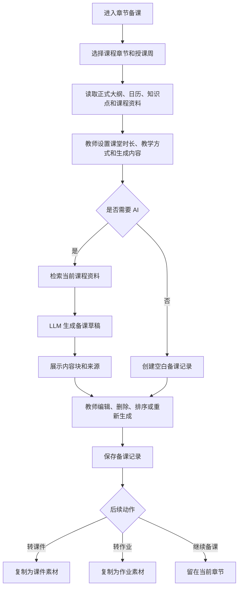
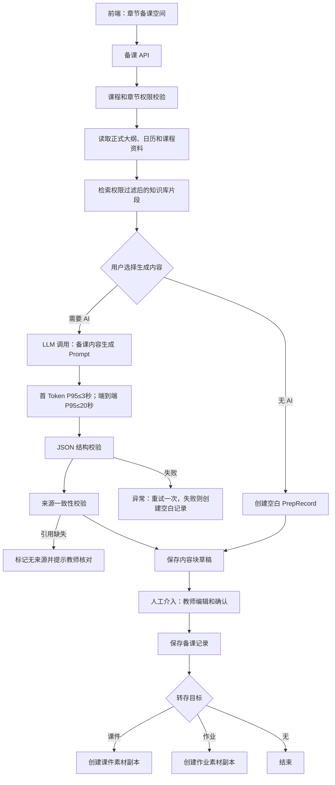

# 备课工作台（章节备课）PRD

## 1. 模块定位

章节备课是教师围绕某个课程章节准备课堂教学内容的工作空间。系统自动带入当前课程、课程版本、已审核教学大纲、教学日历、章节知识点、课程能力指标和课程资料，教师通过 AI 对话或结构化操作生成并完善备课内容。

本模块负责：

- 选择课程章节和授课周
- 查看章节教学目标、知识点、重点难点和能力指标
- 按三级教学内容节点组织课堂内容和学时建议（以 MD 格式预览与编辑呈现）
- 继承教学大纲模块的文本划词编辑、AI 润色/改写与差异高亮样式
- 收集、整理与复用外部学术资料（论文、链接、图片、文本、最新资讯）
- 自定义配置学术检索来源（知网、论文网、专利网等）并支持 AI 自动搜索与网页知识扒取
- 生成分步骤讲解、例题、反例和易错点
- 生成课堂互动问题和练习
- 生成板书结构和课堂总结
- 教师编辑、保存、复制和归档备课记录
- 将备课内容转为课件或作业素材
- 查看教学目的、重点难点对应的教材来源与学术资料引用来源

本模块不负责：编辑正式教学大纲、修改教学日历、生成正式课件页面、生成正式作业或试卷、成绩计算和教学秘书审核。

## 2. 已确认业务规则

1. 备课必须绑定当前课程、课程版本和章节。
2. 章节来源必须是当前课程已启用的大纲；不允许跨课程引用。
3. 教学日历已确认时，默认带入当前授课周和教学内容；没有日历时允许教师手动选择章节和周次。
4. AI 输出是备课草稿，教师编辑保存后才成为备课记录。
5. 备课记录不需要教学秘书审核。
6. 例题、反例、课堂互动问题和练习必须显示来源或标记为 AI 生成内容。
7. AI 不能替教师确定最终教学目标、学时和考核要求。
8. 备课内容可以复制到课件制作和作业管理，但复制后形成目标模块的新内容，不建立不可控的跨模块编辑关系。
9. 课程归档后允许查看历史备课记录，禁止新建、编辑和 AI 生成。

## 3. 页面清单

| 编号 | 页面 | 路由建议 | 作用 |
|---|---|---|---|
| CP-01 | 备课工作台 | `/courses/{course_id}/preparation` | 按章节和教学周查看备课记录 |
| CP-02 | 章节备课空间 | `/courses/{course_id}/preparation/{chapter_id}` | 查看章节上下文并开始备课 |
| CP-03 | 备课编辑器 | `/courses/{course_id}/preparation/{prep_id}/edit` | 编辑和保存备课内容 |
| CP-04 | 生成设置弹窗 | `CP-02 modal` | 选择生成内容、风格和课堂时长 |
| CP-05 | 来源与历史弹窗 | `CP-03 modal` | 查看来源、历史版本和复用记录 |

## 4. CP-01 备课工作台

### 4.1 筛选字段

| 字段 | 类型 | 枚举/规则 |
|---|---|---|
| `keyword` | string | 0-100 字，匹配章节、知识点、备课标题 |
| `chapter_id` | UUID/null | 章节筛选 |
| `week_no` | integer/null | 1-52 |
| `prep_status` | enum[] | `not_started`、`draft`、`generating`、`editing`、`saved`、`archived` |
| `teaching_mode` | enum[] | `lecture` 讲授、`discussion` 讨论、`practice` 练习、`experiment` 实验、`project` 项目、`online` 在线、`mixed` 混合 |
| `sort_by` | enum | `updated_at`、`week_no`、`chapter_order` |
| `sort_order` | enum | `asc`、`desc` |

### 4.2 列表字段

| 字段 | 类型 | 说明 |
|---|---|---|
| `prep_id` | UUID | 备课记录 |
| `chapter_id` | UUID | 章节 |
| `chapter_title` | string | 章节名称 |
| `week_no` | integer/null | 授课周 |
| `teaching_date` | date/null | 授课日期 |
| `prep_title` | string | 备课标题 |
| `prep_status` | enum | 备课状态 |
| `content_block_count` | integer | 内容块数量 |
| `source_count` | integer | 来源数量 |
| `last_generated_at` | datetime/null | 最近生成时间 |
| `updated_at` | datetime | 最近更新时间 |
| `owner_name` | string | 创建教师 |

### 4.3 操作

- 新建章节备课
- 继续编辑
- 查看备课
- 复制备课
- 转为课件素材
- 转为作业素材
- 归档备课
- 删除草稿

## 5. CP-02 章节备课空间

### 5.1 自动带入的课程上下文

| 字段 | 类型 | 来源 |
|---|---|---|
| `course_id` | UUID | 当前课程 |
| `course_version_id` | UUID | 当前课程版本 |
| `syllabus_id` | UUID | 已启用正式大纲 |
| `calendar_id` | UUID/null | 已启用教学日历 |
| `chapter_id` | UUID | 当前章节 |
| `chapter_title` | string | 大纲章节 |
| `chapter_hours` | integer | 大纲学时 |
| `week_no` | integer/null | 日历授课周 |
| `teaching_date` | date/null | 日历授课日期 |
| `knowledge_point_ids` | UUID[] | 章节知识点 |
| `objective_ids` | UUID[] | 章节关联课程目标 |
| `ability_indicator_ids` | UUID[] | 章节关联能力指标 |
| `key_points` | string[] | 大纲重点 |
| `difficult_points` | string[] | 大纲难点 |
| `source_file_ids` | UUID[] | 课程资料来源 |

### 5.2 教师输入字段

| 字段 | 类型 | 必填 | 枚举/规则 |
|---|---|---:|---|
| `prep_title` | string(200) | 是 | 默认“章节名称+备课” |
| `teaching_mode` | enum | 是 | `lecture`、`discussion`、`practice`、`experiment`、`project`、`online`、`mixed` |
| `class_duration_minutes` | integer | 是 | 30-300，默认 90 |
| `student_level` | enum | 是 | `beginner` 初学、`intermediate` 中等、`advanced` 较高、`mixed` 混合 |
| `student_count` | integer | 否 | 1-1000 |
| `teacher_focus` | string(2000) | 否 | 教师特别关注内容 |
| `known_difficulties` | string(2000) | 否 | 已知学生难点 |
| `selected_knowledge_point_ids` | UUID[] | 否 | 生成范围，不填表示全部 |
| `selected_source_file_ids` | UUID[] | 否 | 必须属于当前课程 |
| `generate_language` | enum | 是 | `zh_cn` 简体中文 |
| `tone` | enum | 是 | `formal` 正式、`plain` 通俗、`interactive` 互动、`step_by_step` 分步骤 |

## 6. CP-04 生成设置

### 6.1 生成内容枚举

| 编码 | 内容 |
|---|---|
| `lesson_objectives` | 本节教学目标 |
| `key_difficult_explanation` | 重点难点讲解 |
| `step_by_step_explanation` | 分步骤讲解 |
| `examples` | 例题和答案 |
| `counterexamples` | 反例 |
| `common_errors` | 易错点 |
| `interaction_questions` | 课堂互动问题 |
| `practice_questions` | 课堂练习 |
| `board_plan` | 板书结构 |
| `lesson_summary` | 课堂总结 |
| `after_class_task` | 课后任务建议 |

字段：`selected_content_types` 为以上枚举数组，至少选择一项。

### 6.2 题目生成配置

| 字段 | 类型 | 必填 | 枚举/规则 |
|---|---|---:|---|
| `question_type` | enum[] | 否 | `short_answer` 简答、`calculation` 计算、`proof` 证明、`choice` 选择、`true_false` 判断、`discussion` 讨论、`practice` 练习 |
| `difficulty` | enum | 否 | `basic` 基础、`intermediate` 中等、`advanced` 提高、`mixed` 混合 |
| `question_count` | integer | 否 | 1-20 |
| `include_answer` | boolean | 否 | 默认 true |
| `include_explanation` | boolean | 否 | 默认 true |
| `include_scoring_hint` | boolean | 否 | 默认 false |

### 6.3 生成确认弹窗

展示：当前课程、章节、知识点、资料来源、预计生成内容和课堂时长。

提示：

> AI 将基于当前课程资料生成备课草稿。例题、证明和公式可能需要教师核对，生成内容不会自动成为正式课件或作业。

按钮：取消、开始生成。

## 7. CP-03 备课编辑器

### 7.1 PrepRecord 字段

| 字段 | 类型 | 必填 | 说明 |
|---|---|---:|---|
| `prep_id` | UUID | 是 | 备课记录 |
| `course_id` | UUID | 是 | 课程 |
| `course_version_id` | UUID | 是 | 课程版本 |
| `chapter_id` | UUID | 是 | 章节 |
| `week_no` | integer/null | 否 | 教学周 |
| `teaching_date` | date/null | 否 | 授课日期 |
| `prep_title` | string(200) | 是 | 标题 |
| `teaching_mode` | enum | 是 | 教学方式 |
| `class_duration_minutes` | integer | 是 | 课堂时长 |
| `student_level` | enum | 是 | 学生水平 |
| `teacher_focus` | string(2000) | 否 | 教师输入 |
| `prep_status` | enum | 是 | `draft`、`generating`、`editing`、`saved`、`archived` |
| `is_ai_generated` | boolean | 是 | 是否含 AI 内容 |
| `last_generated_at` | datetime/null | 否 |  |
| `created_by` | UUID | 是 | 创建人 |
| `updated_by` | UUID | 是 | 最近修改人 |

### 7.2 PrepBlock 字段

| 字段 | 类型 | 必填 | 枚举/规则 |
|---|---|---:|---|
| `block_id` | UUID | 是 | 内容块 |
| `prep_id` | UUID | 是 | 备课记录 |
| `block_type` | enum | 是 | `lesson_objective`、`explanation`、`example`、`counterexample`、`common_error`、`interaction_question`、`practice_question`、`board_plan`、`summary`、`after_class_task` |
| `title` | string(200) | 是 |  |
| `content` | richtext | 是 | 富文本内容 |
| `answer` | richtext/null | 否 | 题目答案 |
| `explanation` | richtext/null | 否 | 题目解析 |
| `difficulty` | enum/null | 否 | `basic`、`intermediate`、`advanced`、`mixed` |
| `knowledge_point_ids` | UUID[] | 否 | 关联知识点 |
| `objective_ids` | UUID[] | 否 | 关联目标 |
| `ability_indicator_ids` | UUID[] | 否 | 关联能力 |
| `source_refs` | SourceRef[] | 否 | 文件、页码和片段 |
| `is_ai_generated` | boolean | 是 |  |
| `is_teacher_modified` | boolean | 是 |  |
| `sort_order` | integer | 是 | 内容顺序 |
| `block_status` | enum | 是 | `draft`、`confirmed`、`archived` |

### 7.3 编辑操作

- 编辑标题和正文
- 编辑答案和解析
- 拖拽内容块排序
- 删除内容块
- 新增内容块
- 单块重新生成
- 选择部分文字重新生成
- 编辑内容并使用 AI 修改
- 添加或修改来源
- 复制内容到课件
- 复制题目到作业
- 保存备课记录

AI 重新生成时保留旧内容，用户确认新内容后再替换。

## 8. 来源展示

教学目的和教学重点与难点可以展开查看教材依据：

- 文件名称
- 章节名称
- 页码
- 来源片段
- 来源类型：教材
- AI 生成时间

其他备课字段不展示“查看依据”和教材切片，仅保留教师教案模板、教学日历、课程基础信息或教师输入作为编辑依据。

没有可靠来源的内容显示：

> 该内容为 AI 教学建议，未找到可直接引用的课程资料，请教师核对。

## 9. 业务流程图



## 10. 系统流程图



## 11. AI 介入和技术要求

### 11.1 传统技术

- 读取章节、大纲、日历和权限
- 检索和过滤课程资料
- 保存和排序内容块
- 版本复制
- 富文本编辑
- 生成结果 JSON 校验
- 来源 ID 和页码格式校验

### 11.2 大模型

- 按三级教学内容节点组织课堂内容与学时建议
- 重点难点解释
- 分步骤讲解
- 例题、反例和易错点
- 课堂互动问题和练习
- 板书结构和课堂总结
- 单块重新生成

### 11.3 性能

- 首 Token P95 ≤ 3 秒。
- 普通单块重新生成端到端 P95 ≤ 12 秒。
- 一次完整备课生成端到端 P95 ≤ 20 秒。
- 保存编辑内容 P95 ≤ 2 秒。
- AI 失败时保留空白或已有备课记录，不丢失教师内容。

## 12. 完整 Prompt

### 12.1 章节备课生成 Prompt

```text
System：
你是高校教师的章节备课助手。请根据当前课程已确认的教学大纲、教学日历、章节知识点、课程能力指标和课程资料，生成可供教师编辑的备课草稿。

必须遵守：
1. 只使用当前课程且通过权限过滤的资料。
2. 不得引用其他课程资料。
3. 不得擅自修改正式大纲的章节、学时、课程目标和能力指标。
4. 教学目标、重点难点和教学顺序只能作为建议，不能表示正式审核结论。
5. 例题、证明、公式和结论必须尽量附文件、章节和页码。
6. 找不到可靠来源时，必须设置 needs_teacher_confirmation=true。
7. 所有 AI 生成内容设置 is_ai_generated=true。
8. 只输出合法 JSON，不输出 Markdown。

输出内容类型只能是：
lesson_objective、explanation、example、counterexample、common_error、interaction_question、practice_question、board_plan、summary、after_class_task。

User：
课程信息：{{course_info}}
课程版本：{{course_version_id}}
章节信息：{{chapter_context}}
教学日历信息：{{calendar_context}}
章节知识点：{{knowledge_points}}
课程目标：{{objectives}}
能力指标：{{ability_indicators}}
教师教学方式：{{teaching_mode}}
课堂时长：{{class_duration_minutes}}
学生水平：{{student_level}}
教师关注点：{{teacher_focus}}
指定资料片段：{{retrieved_chunks}}
需要生成的内容类型：{{selected_content_types}}

请输出：教学目标、重点难点讲解、分步骤讲解、例题、反例、易错点、课堂互动问题、课堂练习、板书结构、课堂总结和课后任务建议。

JSON：
{
  "prep_title":"",
  "blocks":[{
    "block_type":"explanation",
    "title":"",
    "content":"",
    "answer":null,
    "explanation":null,
    "difficulty":null,
    "knowledge_point_ids":[],
    "objective_ids":[],
    "ability_indicator_ids":[],
    "source_refs":[{
      "file_id":"", "file_name":"", "chapter_title":"",
      "page_start":0, "page_end":0, "excerpt":""
    }],
    "is_ai_generated":true,
    "needs_teacher_confirmation":false,
    "warnings":[]
  }],
  "global_warnings":[]
}
```

### 12.2 例题和互动问题生成 Prompt

```text
System：
你是课程课堂练习设计助手。请基于当前课程的指定知识点和资料生成例题、反例、课堂互动问题或练习。

规则：
1. 题目必须符合当前章节和学生水平。
2. 题目和答案必须可追溯到提供的资料或明确标记为 AI 设计。
3. 证明题和计算题不得省略关键步骤。
4. 不能声称题目已经经过正式教学审核。
5. 发现答案不确定时，必须标记 needs_teacher_confirmation=true。
6. 只输出合法 JSON。

User：
课程：{{course_info}}
章节：{{chapter_context}}
知识点：{{selected_knowledge_points}}
学生水平：{{student_level}}
题型：{{question_types}}
难度：{{difficulty}}
题量：{{question_count}}
是否生成答案：{{include_answer}}
是否生成解析：{{include_explanation}}
资料片段：{{retrieved_chunks}}

请输出题目、答案、解析、难度、知识点关联、来源和教师核对提示。

JSON：
{
  "items":[{
    "item_type":"example",
    "question":"",
    "answer":"",
    "explanation":"",
    "difficulty":"basic",
    "knowledge_point_ids":[],
    "source_refs":[],
    "is_ai_generated":true,
    "needs_teacher_confirmation":true,
    "warnings":[]
  }],
  "warnings":[]
}
```

### 12.3 单个内容块重新生成 Prompt

```text
System：
你是章节备课内容重写助手。请只重写指定内容块，不改变课程、章节、知识点和能力指标范围。

规则：
1. 保留原内容中已确认的事实和来源。
2. 不得引入其他课程资料。
3. 不确定内容标记 needs_teacher_confirmation=true。
4. 输出内容必须符合指定的内容类型和长度要求。
5. 只输出合法 JSON。

User：
课程：{{course_info}}
章节：{{chapter_context}}
知识点：{{knowledge_points}}
原内容块：{{original_block}}
教师修改要求：{{rewrite_instruction}}
可用资料片段：{{retrieved_chunks}}

请输出新的内容块，并保留可用来源。

JSON：
{
  "block_type":"{{block_type}}",
  "title":"",
  "content":"",
  "answer":null,
  "explanation":null,
  "source_refs":[],
  "is_ai_generated":true,
  "needs_teacher_confirmation":false,
  "warnings":[]
}
```

## 13. 埋点与业务验收

### 13.1 埋点

`preparation_view`、`preparation_chapter_select`、`preparation_create_start`、`preparation_setting_submit`、`preparation_generate_start`、`preparation_generate_success`、`preparation_generate_fail`、`preparation_block_edit`、`preparation_block_delete`、`preparation_block_reorder`、`preparation_block_regenerate`、`preparation_source_open`、`preparation_save`、`preparation_draft_restore`、`preparation_download`、`preparation_copy_to_courseware`、`preparation_copy_to_assignment`、`preparation_archive`。

### 13.2 验收标准

- 备课必须绑定当前课程和章节。
- 已有教学日历时自动带入授课周和日期。
- 没有日历时可以手动选择章节和周次。
- AI 生成前可以选择教学方式、课堂时长、学生水平和内容类型。
- AI 输出按内容块展示，支持编辑、删除、排序和单块重生成；当前工作台不设置独立的“接受”按钮。
- 例题、反例、互动问题和练习显示来源或 AI 生成标识。
- 教师保存后形成备课记录，不需要教学秘书审核。
- 备课内容可以复制为课件或作业素材副本。
- 课程归档后历史备课可查看和导出，但不能新增、编辑或生成。
- AI 失败不影响已有备课记录和教师编辑内容。

## 14. 当前页面与交互规范

### 14.1 备课单元与层级

- 页面展示名称统一为“备课工作台”；课程内左侧导航、路由和页面根节点均保持既有公共壳层不变。
- 大纲允许一级、二级、三级目录；备课单元定义为教学日历中实际安排授课的最小单元。上级目录只用于路径归属，下级目录作为该备课单元的教学内容节点。
- 顶部使用“备课单元”选择器，不修改左侧字段导航。选择器仅保留“当前备课单元”和章节胶囊，以胶囊按钮展示可授课单元、授课周、学时和当前完善度，并提供上一组/下一组浏览；不额外展示“按教学日历切换备课单元”等说明行。
- 备课单元状态仅允许“已确认”“待确认”“生成中”，并使用不同颜色区块区分：绿色表示已确认、米黄色表示待确认、蓝色表示生成中；不得使用“待审核”或“待生成”。
- 点击顶部备课单元后，下方教案内容同步切换：当前路径、基础信息、教学目的、重点难点、解决方法、本章小结和思考/作业题均切换到对应单元；教案字段结构保持一致。
- 页面标题下显示层级路径，例如“第一章 集合论基础 / 第二节 关系”，并标注该单元包含的三级教学内容节点和总学时。

### 14.2 教案模板字段

每个备课单元基于教师提供的教案模板生成以下字段：

- 基础信息：开课系部、教师姓名、课程名称、授课专业和班级、教学内容、授课学时。
- 教学目的。
- 教学重点与难点。
- 解决方法。
- 教学方法和手段。
- 课程特色。
- 课程思政。
- 本章小结。
- 思考或作业题。

“教学设计”不作为独立内容块展示；三级教学内容节点和学时安排在备课单元上下文或生成内容中表达。

字段审核检查区域展示字段完整度、教学目标覆盖、学时安排和待核对数量；左侧模块列表使用统一的绿色勾选图标，不区分灰色或橙色图例。

### 14.3 数据来源与教材依据

- 自动生成内容基于已审核大纲、已确定教学日历、当前课程教材、课程资料和教师教案模板；不得跨课程引用。
- 只有“教学目的”和“教学重点与难点”提供直接教材来源。
- 这两个字段显示“查看依据”入口；编辑弹窗右侧展示对应教材章节、节次和文档切片，可独立滚动浏览。
- 其他字段不展示“查看依据”入口、教材来源说明或教材原文区域，仅依据教师教案模板、教学日历、课程基础信息或教师输入编辑。
- 无直接教材来源的模块，在编辑弹窗中仅展示对应表单，不虚构教材出处。

### 14.4 字段编辑弹窗

- 每个字段模块提供“编辑”按钮；弹窗左侧根据模块类型生成对应表单并回显当前值。
- 基础信息、教学目的、重点难点、解决方法、教学方法和手段、课程特色、课程思政、本章小结、思考/作业题分别使用匹配的表单字段，不使用单一通用输入框替代。
- 教学目的输入区使用更高的编辑区域，以容纳多条目标内容。
- 仅教学目的和重点难点弹窗包含右侧教材原文切片；其他弹窗为单栏信息修改弹窗。
- 教材切片区域采用独立滚动的等宽文本块样式，展示章节路径、页码/片段说明和连续上下文。
- 点击遮罩不关闭弹窗；只能通过右上角关闭、取消或保存修改退出。
- 保存修改后回写当前字段内容，并保留下一次打开时的回显值。
- 模块内不展示“接受”按钮、“已接受”状态、“已确认”状态或“AI 草稿”状态文案；保留编辑和 AI 修改能力。

### 14.5 AI 助手与底部操作

- 右侧提供备课 AI 助手，可围绕当前备课单元执行内容增删改查、重写和检查建议。
- AI 对话结果不在底部显示额外的 Mock 或“接受后修改”提示文案。
- “保存草稿”“转为课件”“确认本节备课”三个操作按钮放置在备课 AI 助手卡片下方，不使用悬浮操作条。
- 保存草稿：提示“草稿已保存”，并将当前备课字段内容保存到备课专用草稿存储；下次进入工作台自动恢复。
- 转为课件：弹窗提示“已加入课件，正在制作中，稍后可前往【课件制作】页面查看”，可稍后查看或前往课件制作页面。
- 确认本节备课：提示本节备课已完成，并询问是否切换至下一节；确认后切换顶部备课单元。

### 14.6 下载与导出

- 左侧模块检查内容下方提供“下载备课内容”按钮。
- 点击后可选择下载“当前章节”或“全部备课内容”。
- 下载内容至少包含课程名称、备课单元、教案字段和当前编辑后的正文内容。

### 14.7 页面隔离与公共壳层

- 备课页面唯一根节点为 `data-page="preparation"`，所有备课 DOM、样式和交互均限定在 `.preparation-page` 或 `.prep-*` 范围。
- 顶部导航、左侧公共导航、应用壳层和其他课程页面不得因备课工作台修改而改变。
- 备课 JavaScript 函数统一使用 `prep*` 前缀；备课草稿使用独立命名空间，不复用大纲、日历或课件存储键。
- 备课页面可以模拟转课件和下载，但不得直接改写课件模块页面状态或公共数据。

## 15. 备课工作台 Markdown 格式预览与编辑规范

### 15.1 展现形式改造

1. **MD 实时渲染预览**：备课教案主面板由传统的表单卡片升级为富文本 Markdown 实时预览模式。支持标准 MD 语法（H1-H6 标题级联、列表、引用块、代码块、表格、LaTeX 数学公式、提示 Callout 框）。
2. **源码与预览切换**：支持“MD 预览模式（实时渲染与内联交互）”与“MD 源码编辑模式”无缝切换，提供常用 Markdown 快捷排版工具栏。
3. **大纲编辑样式继承**：继承教学大纲模块（Syllabus Workspace）的视觉风格、交互设计和样式规范：
   - **划词/内联编辑**：在 MD 预览模式下选中任意文本段落，自动唤起内联浮动工具栏（Float Toolbar），提供“加粗/倾斜”、“快捷引用学术资料”、“AI 润色”、“AI 改写”、“AI 扩写/精简”等操作。
   - **AI 改写与差异高亮（Diff Highlight）**：触发 AI 修改或改写后，呈现如大纲模块相同的 Diff 对比视图（绿色底纹表示新增/润色替换内容，红色贯穿线表示建议删除内容），支持教师点击“应用变更”、“放弃”或“重新改写”。
   - **智能检查与纠错标注**：教案文本中针对知识点覆盖度、逻辑完整性或缺乏资料支撑的警告，采用与大纲检查组件一致的提示高亮与下划线标注样式。

## 16. 学术资料功能与 AI 知识扒取规范

### 16.1 功能定位与业务价值

备课不应只是“查询资料”或“填写表单”，更是教师收集学术素材与备课知识积累的过程。学术资料功能允许教师在备课过程中搜集外部学术资源（论文、链接、图片、文本、最新资讯），固定保存为当前备课单元的基础知识库，避免 AI 凭空幻觉生成，且支持在后续备课或跨版式复用。

### 16.2 资料收集与多模态管理

1. **多模态内容类型**：
   - **论文**：解析或上传的学术论文（支持 PDF/摘要/全文预览）。
   - **链接**：外部网页 URL、新闻资讯与学术报告链接。
   - **图片**：教学图表、实验截图、定理示例图。
   - **文本**：教师摘录的重点段落、定理推论、教案切片。
   - **最新资讯**：课程相关的行业动态、最新技术突破、教学前沿资讯。
2. **四大语义标记分类**：
   资料加入备课单元时必须可标记以下分类之一：
   - `【课堂案例】`（用于例题、工程项目、实际应用）
   - `【背景知识】`（用于历史背景、人物介绍、学科前沿）
   - `【拓展阅读】`（用于课后阅读材料、参考文献）
   - `【最新资讯】`（用于行业最新消息、时政/科技资讯）
3. **备注与交互**：
   - 支持教师对每条学术资料添加个性化“教师备注/研读笔记”（Notes）。
   - 提供在 MD 教案中“一键引用”功能，点击后自动在当前光标位置插入规范 Markdown 引用卡片/脚注（例如 `> 📌 [引用论文] 《某某论文标题》 (来源: 知网, 抓取时间: 2026-09-08 14:30)`）。
4. **溯源与抓取元数据**：
   每条学术资料必须记录并展示：数据来源（原始网站/平台名称）、原始 URL、抓取时间戳（Crawled Timestamp）、采集方式（AI 扒取/手动采集）。

### 16.3 AI 自动搜索与扒取引擎 (AI Search & Scraper Engine)

1. **数据源配置（原系统配置 + 教师自定义配置）**：
   - **内置默认来源**：中国知网 (CNKI)、万方数据、维普网、国家高等教育智慧教育平台等。
   - **教师自定义配置**：允许教师添加、编辑、开启/禁用个性化检索网址（如“中国专利网”、“arXiv”、“IEEE Xplore”、“TechCrunch”等）。
2. **AI 自动扒取与结构化提取**：
   - 教师在备课工作台发起搜索或基于某主题检索时，系统自动调度 AI 扒取引擎，根据配置的目标网址列表进行实时抓取与提取。
   - AI 自动对抓取内容进行结构化清洗：提取标题、摘要、核心结论、发表时间、作者及图片素材，过滤广告与无关网页元素。
3. **单元知识固化与跨单元复用**：
   - 收集与扒取的学术资料关联到当前授课单元（章节/课时），固化为“备课基础知识库”。
   - 在下次备课、复制备课或新开课表时，学术资料库自动作为上下文带入，支持跨单元和跨学期复用。
