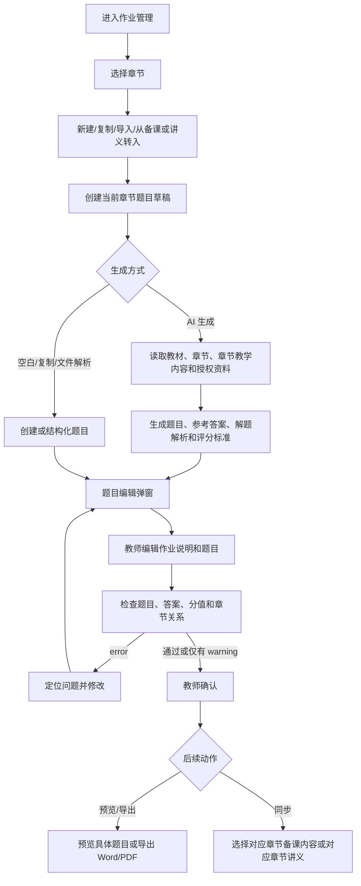
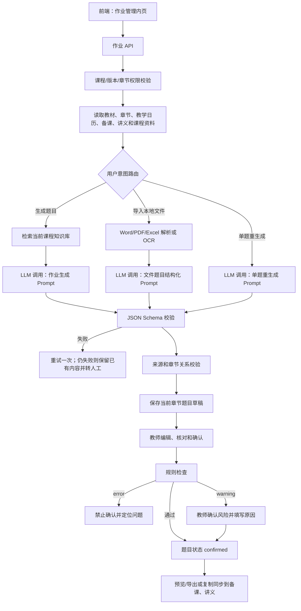

# 作业管理 PRD

## 1. 模块定位

作业管理模块用于教师围绕课程章节确定最终提供给学生的作业题目，支持新建、复制、导入、AI 辅助生成、编辑、检查、教师确认、预览、导出，以及将已确认内容同步到对应章节的备课内容或讲义中。

本模块只维护作业成品及其组成题目，不维护学生提交、作答过程、批改、成绩、完成率或其他学习过程数据。成绩与学习结果由未来的“学情平台”（学生画像模块）负责，本模块只向其提供已确认的作业题目定义（如有对接需要）。

本模块负责：

- 按课程章节展示作业题目，并维护章节关系
- 新建、复制和删除草稿题目
- 上传本地 Word、PDF、Excel 文档并解析生成作业草稿
- 从教学日历、章节备课、章节讲义、课程资料或历史作业转入
- 按章节、知识点、课程目标和能力指标生成或补全题目
- 维护题目内容、参考答案、解题解析、评分标准和分值
- 检查题目、答案、分值、章节和关联关系
- 教师确认、预览和导出作业成品
- 将编辑保存后的题目同步到对应章节备课内容或讲义

本模块不负责：试卷组卷、学生提交、学生作答过程、批改、成绩管理、完成率统计、学情分析、在线教学平台发布和教学秘书审核。

## 2. 已确认业务规则

1. 作业以当前课程章节为展示和维护单位；每道题目必须绑定当前课程、课程版本和一个章节。
2. 顶部章节切换使用“当前作业单元”，其头部 UI 样式与备课工作台、课件制作的章节切换保持一致。
3. 教学日历、章节备课、章节讲义、课程资料、历史作业和本地导入文件都是作业的可选来源；转入后保存为当前课程的新题目记录。
4. 核心流程为：选择章节 → 新建 / 复制 / 导入 / 从备课或讲义转入 → 编辑作业说明和题目 → 检查题目、答案、分值和章节关系 → 教师确认 → 预览或导出给学生，或同步到备课和讲义中。
5. 教师确认即可使用或导出，不需要教学秘书审核。
6. AI 生成和本地文件解析结果均先保存为草稿；教师核对题目、参考答案、解题解析、评分标准、分值和章节关系后才可确认。
7. AI 内容是候选内容，不保证绝对正确；教师手工保存的内容优先于 AI 默认生成内容。
8. 每道题目应关联章节、知识点和课程能力指标；无法关联时允许保存草稿，确认前必须处理或明确忽略检查警告。
9. 复制历史作业或题目后必须生成当前课程的新记录，不复用来源记录的主键。
10. 题目总分由各题分值合计得出，确认前不得存在不一致。
11. 编辑保存后记录“编辑保存时间”，题目条目显示“同步”按钮；同步为复制到目标模块，目标内容独立维护，不建立双向自动覆盖。
12. “同步”可分别选择“对应章节备课内容”和“对应章节讲义”。只同步一个目标时仍保留“同步”按钮，以便补同步另一个目标；两个目标均完成后显示“已同步到对应章节备课内容中、对应章节讲义中”。
13. 课程归档后允许查看和导出历史作业，禁止新建、编辑、生成、导入、同步和删除。
14. 作业不强制在线发布，第一阶段以编辑、确认、预览和导出为主。

### 2.1 页面范围与固定区域

- 顶部全局导航和左侧课程导航固定不变。
- 本次作业管理需求只作用于课程内“作业管理”入口的内页，不影响其他页面。
- 除页面标题外，作业管理内页的内容均按本需求重新组织；不得恢复已删除的“当前章节”深色上下文面板。

### 2.2 待确认事项

- Word、PDF、Excel 的单文件大小、批量数量、OCR 语言和解析超时阈值。
- 备课内容与讲义接收同步题目时的具体落位（章节下的题目区、练习区或其他既有容器）。
- 学情平台未来接收已确认题目定义的接口字段和同步时机。

## 3. 页面清单

| 编号 | 页面 | 路由建议 | 作用 |
|---|---|---|---|
| AS-01 | 作业工作台 | `/courses/{course_id}/assignments` | 按章节查看题目列表、状态和入口 |
| AS-02 | 新建作业题目 | `AS-01 modal` | 选择章节、来源并填写题目级字段 |
| AS-03 | 编辑作业题目 | `AS-01 modal` | 编辑题目级字段、保存和同步 |
| AS-04 | AI 题目生成弹窗 | `AS-01/AS-03 modal` | 设置题型、难度、题量和覆盖范围 |
| AS-05 | 作业检查结果 | `AS-01 modal` | 检查并定位题目、答案、分值和关系问题 |
| AS-06 | 作业预览与导出 | `AS-01 modal` | 展示当前点击的具体题目并导出成品 |
| AS-07 | 本地文件与历史作业导入 | `AS-01 modal` | 上传并解析 Word/PDF/Excel 作业文件，或结构化历史作业 |

弹窗：删除题目、复制历史题目、修改关联、单题重生成、确认作业、导出设置、同步目标。

## 4. AS-01 作业工作台

### 4.1 页面结构

1. 顶部为课程内章节切换头部，标题为“当前作业单元”；章节切换头部的布局、间距、交互和视觉样式与备课工作台、课件制作一致。
2. 页面保留“本章节作业”标题和“已保存的作业成品”说明。
3. 当前选中章节的题目直接按序号逐条罗列，不使用“作业合集”、作业包或按题型分类卡片包裹题目。
4. 题目条目示例：
   - `1、结合教材内容完成第一章集合论基础的概念辨析与基础练习。`
   - `2、结合教材内容完成1.1.1 集合的表示方法的概念辨析与基础练习。`
5. 每条题目展示题干摘要、题型、分值、章节/知识点关联、题目状态、编辑保存时间、来源和可用操作；完整内容通过预览或编辑弹窗查看。

### 4.2 筛选字段

| 字段 | 类型 | 枚举/规则 |
|---|---|---|
| `keyword` | string | 0-100 字，匹配题目内容、章节、来源文件 |
| `question_status` | enum[] | `draft`、`generating`、`editing`、`checking`、`confirmed`、`archived` |
| `question_type` | enum[] | 单选、多选、判断、填空、简答、计算、证明、案例分析、编程、设计 |
| `chapter_id` | UUID/null | 当前课程章节，默认当前章节 |
| `week_no` | integer/null | 教学周 1-52 |
| `date_from` | date/null | 编辑保存日期开始 |
| `date_to` | date/null | 编辑保存日期结束 |
| `sort_by` | enum | `updated_at`、`created_at`、`chapter_order`、`question_no` |
| `sort_order` | enum | `asc`、`desc` |

### 4.3 列表字段

| 字段 | 类型 | 说明 |
|---|---|---|
| `question_id` | UUID | 题目标识 |
| `question_no` | integer | 当前章节内显示序号 |
| `question_content` | string | 题干摘要，按题目逐条展示 |
| `question_type` | enum | 题型 |
| `chapter_id` | UUID | 所属章节 |
| `knowledge_point_ids` | UUID[] | 关联知识点 |
| `score` | decimal(6,2) | 题目分值 |
| `question_status` | enum | 题目状态 |
| `source_type` | enum | AI、本地文件、备课、讲义、历史作业或教师创建 |
| `last_edited_at` | datetime/null | 编辑保存时间 |
| `sync_status` | enum | `unsynced`、`preparation_synced`、`handout_synced`、`both_synced` |

### 4.4 操作

- 新建作业题目
- 复制题目
- 导入本地文件
- 从备课或讲义转入
- AI 生成题目
- 编辑题目
- 删除草稿题目
- 调整题目顺序
- 预览当前题目
- 运行检查
- 确认作业
- 导出 Word/PDF
- 同步到对应章节备课内容或对应章节讲义

## 5. AS-02 新建作业题目

### 5.1 创建方式

| 编码 | 名称 | 必要条件 |
|---|---|---|
| `from_calendar` | 从教学日历作业计划创建 | 存在当前课程日历作业计划 |
| `from_preparation` | 从章节备课转入 | 存在当前课程备课素材 |
| `from_handout` | 从章节讲义转入 | 存在当前课程讲义素材 |
| `from_history` | 复制历史作业/题目 | 存在当前课程历史作业 |
| `from_material` | 从课程资料创建 | 存在当前课程可用资料 |
| `blank` | 空白新建 | 课程未归档 |
| `import_file` | 导入文件 | 文件格式可解析 |

### 5.2 新建与编辑共用字段

新建作业题目弹窗和编辑作业题目弹窗使用完全相同的字段、字段顺序、校验规则和操作文案。字段如下：

| 字段 | 类型 | 必填 | 说明 |
|---|---|---:|---|
| `chapter_id` | UUID | 是 | 当前章节，显示为“当前章节” |
| `instruction` | richtext | 否 | 作业说明 |
| `question_content` | richtext | 是 | 题目内容 |
| `correct_answer` | richtext | 否 | 参考答案 |
| `explanation` | richtext | 否 | 解题解析 |
| `scoring_rubric` | RubricItem[] | 否 | 评分标准；主观题建议填写评分点和分值 |
| `score` | decimal(6,2) | 是 | 分值，大于 0 |
| `last_edited_at` | datetime/null | 系统 | 编辑保存时间，保存后自动记录 |

弹窗中的字段标签必须使用“当前章节”“题目内容”“参考答案”“解题解析”“评分标准”“分值”“编辑保存时间”。底部按钮为“取消”“保存题目”。保存提示为：保存后会记录编辑时间，并在题目条目中显示“同步”按钮。

题型、难度、知识点、课程目标、能力指标、来源和教师备注等扩展字段可在同一弹窗的扩展区维护；其字段含义与 AS-03 保持一致。新建时未填写的参考答案、解题解析和评分标准，可由 AI 基于教材、章节、章节教学内容和题目生成草稿，但仍需教师核对。

### 5.3 作业关联规则

- `chapter_id` 必须属于当前课程正式大纲，且默认为顶部当前选中的章节。
- 知识点必须属于当前章节；课程目标和能力指标必须属于当前课程版本。
- 从教学日历、备课或讲义转入时继承来源的章节和教学内容关联，教师可以在保存前修改。
- 题目保存为草稿不要求所有关联完整；确认前必须处理 error，warning 需教师确认并可填写忽略原因。

## 6. AS-04 题目生成

### 6.1 题目配置字段

| 字段 | 类型 | 必填 | 枚举/规则 |
|---|---|---:|---|
| `question_types` | enum[] | 是 | 单选、多选、判断、填空、简答、计算、证明、案例分析、编程、设计 |
| `difficulty` | enum | 是 | `basic` 基础、`intermediate` 中等、`advanced` 提高、`mixed` 混合 |
| `question_count` | integer | 是 | 1-100 |
| `score_per_question` | decimal(6,2) | 是 | 0.1-1000 |
| `knowledge_point_ids` | UUID[] | 否 | 空值表示使用当前章节范围 |
| `ability_indicator_ids` | UUID[] | 否 | 空值表示使用当前作业范围 |
| `include_answer` | boolean | 是 | 默认 true |
| `include_explanation` | boolean | 是 | 默认 true |
| `include_scoring_rubric` | boolean | 是 | 主观题默认 true |
| `reuse_history_questions` | boolean | 是 | 默认 false |
| `history_question_ratio` | decimal(3,2) | 否 | 0-1 |
| `teacher_instruction` | string(2000) | 否 | 题目风格和限制 |

### 6.2 题目生成规则

- AI 生成范围受当前教材、课程、章节、章节教学内容、知识点、课程目标、能力指标和已授权资料限制。
- AI 同时生成题目、参考答案、解题解析和评分标准；生成结果标记为草稿并显示来源与教师确认状态。
- 多选题至少包含 2 个选项；单选题只有一个正确选项；判断题必须明确答案。
- 填空题支持多个可接受答案；证明题输出关键证明步骤或评分要点；计算题输出过程和结果。
- 主观题的评分标准拆分为评分点和分值；题目总分必须等于各题分值合计。
- 单题重生成只替换当前题目候选内容，不改变已确认的章节、知识点和能力指标关系，除非教师明确修改。

## 7. AS-03 作业编辑器

### 7.1 作业/题目字段

作业工作台以题目为最小维护单位；作业说明、题型、难度、关联关系和来源等扩展字段仍归属于题目记录或当前章节作业上下文。核心字段与 AS-02 共用，确保新建和编辑完全一致。

| 字段 | 类型 | 必填 | 说明 |
|---|---|---:|---|
| `question_id` | UUID | 是 | 题目标识 |
| `course_id` | UUID | 是 | 当前课程 |
| `course_version_id` | UUID | 是 | 当前课程版本 |
| `chapter_id` | UUID | 是 | 当前章节 |
| `instruction` | richtext | 否 | 作业说明 |
| `question_no` | integer | 是 | 当前章节内序号 |
| `question_type` | enum | 是 | 题型 |
| `question_content` | richtext | 是 | 题目内容 |
| `correct_answer` | richtext | 否 | 参考答案 |
| `acceptable_answers` | string[] | 否 | 填空题可接受答案 |
| `explanation` | richtext | 否 | 解题解析 |
| `scoring_rubric` | RubricItem[] | 否 | 评分标准 |
| `score` | decimal(6,2) | 是 | 分值 |
| `difficulty` | enum | 是 | 基础、中等、提高 |
| `knowledge_point_ids` | UUID[] | 否 | 草稿阶段可为空，确认前处理 |
| `objective_ids` | UUID[] | 否 | 课程目标 |
| `ability_indicator_ids` | UUID[] | 否 | 能力指标 |
| `source_type` | enum | 是 | `history_question`、`course_material`、`preparation`、`handout`、`local_file`、`teacher_created`、`ai_generated` |
| `source_refs` | SourceRef[] | 否 | 文件、章节、页码或模块引用 |
| `is_ai_generated` | boolean | 是 | 是否含 AI 生成内容 |
| `is_teacher_modified` | boolean | 是 | 是否被教师修改 |
| `last_edited_at` | datetime/null | 系统 | 编辑保存时间 |
| `question_status` | enum | 是 | `draft`、`confirmed`、`archived` |

### 7.2 Option 字段

`option_id` UUID、`option_key` enum(`A`/`B`/`C`/`D`/`E`/`F`)、`option_content` richtext、`is_correct` boolean、`sort_order` integer。

### 7.3 RubricItem 字段

`rubric_id` UUID、`description` string(500)、`score` decimal(6,2)、`order_no` integer、`must_have` boolean。

### 7.4 编辑操作

- 新增、删除、复制题目
- 调整题目顺序
- 编辑题目内容、参考答案、解题解析、评分标准和分值
- 修改题型、难度、章节、知识点、课程目标和能力指标关联
- 单题重新生成
- 保存草稿并记录编辑保存时间
- 运行检查、确认作业
- 保存后通过“同步”选择对应章节备课内容或对应章节讲义

## 8. AS-05 作业检查

### 8.1 检查项

| 编码 | 内容 | 等级 |
|---|---|---|
| `AS001` | 题目内容为空 | error |
| `AS002` | 未关联章节 | error |
| `AS003` | 题目分值小于等于 0 | error |
| `AS004` | 总分与题目分值合计不一致 | error |
| `AS005` | 单选题正确选项数量不为 1 | error |
| `AS006` | 选择题选项数量不足 | error |
| `AS007` | 证明题缺少参考答案或评分标准 | warning |
| `AS008` | 题目未关联知识点 | warning |
| `AS009` | 题目未关联能力指标 | warning |
| `AS010` | 参考答案为空 | error |
| `AS011` | 题目和参考答案可能不匹配 | warning |
| `AS012` | 题目疑似重复 | warning |
| `AS013` | 题目日期关系错误 | error |
| `AS014` | AI 内容未教师确认 | warning |
| `AS015` | 来源资料存在解析风险 | warning |
| `AS016` | 评分标准与分值合计不一致 | error |

### 8.2 检查规则

- error 必须修改后才能确认。
- warning 可以由教师确认后继续；忽略 warning 时必须填写原因。
- AI 检查只能生成疑似问题，不能自动删除或修改题目。
- 检查结果必须定位到具体题目和具体字段，并允许从结果直接打开编辑弹窗。

## 9. AS-06 预览与导出

### 9.1 预览内容

- 预览弹窗展示教师当前点击的具体题目，不展示作业合集或分类汇总卡片。
- 展示题目内容、教材、当前章节、章节教学内容等生成依据，以及题型、分值和来源。
- 展示“参考答案”“解题解析”“评分标准”和“编辑保存时间”（如有）。
- 预览仅提供当前题目的教师核对内容，不提供学生版切换或学生版导出操作。

### 9.2 导出

确认后的章节作业成品可导出 Word/PDF。导出设置字段为 `export_format`、`include_answer`、`include_explanation`、`include_scoring_rubric`、`include_sources`、`template_id`、`page_range`、`export_title`。

枚举：`export_format` 为 `docx`、`pdf`；`include_sources` 为 `none`、`end_notes`、`per_question`；`page_range` 为 `all` 或指定题目编号数组。导出内容必须与预览中的当前题目数据一致，不得缺失参考答案、解析或评分标准（当教师选择包含时）。

## 10. AS-07 本地文件与历史作业导入

### 10.1 导入字段

`import_file_id`、`file_type`、`file_name`、`file_size_bytes`、`source_course_id`、`source_term_label`、`import_mode`、`parse_status`、`source_refs`。

支持上传本地 Word、PDF、Excel 文档。`import_mode`：`new_assignment` 新建作业、`question_bank_only` 仅导入题目。

### 10.2 导入流程

```text
上传 Word/PDF/Excel
→ 文本、表格或 OCR 解析
→ 题目边界识别
→ 题目内容/参考答案/解题解析/评分标准/分值拆分
→ 章节、知识点、难度和能力指标候选标记
→ 保存为当前章节草稿
→ 教师核对并确认
```

解析结果必须保留已识别内容、来源文件和页码/工作表信息。解析失败或字段不完整时不得静默丢弃，需标记风险并允许教师补录。导入题目保存后生成新的 `question_id`，不直接复用文件或历史作业主键。

## 11. 状态机

```text
draft → generating → editing → checking → confirmed → archived
```

生成、解析或检查失败回到 `editing`，保留错误信息和已有内容。`confirmed` 表示教师已确认可作为作业成品使用；`archived` 只读。

## 12. 业务流程图



## 13. 系统流程图



## 14. AI 介入和技术要求

### 14.1 传统技术

- 章节题目列表、排序和富文本编辑
- 题型字段、参考答案格式和评分标准校验
- 分值合计、日期和章节关系校验
- 教材、章节、教学日历、备课、讲义和课程资料权限过滤
- Word/PDF/Excel 文件解析和 OCR
- 题目去重初筛、来源页码记录和 Word/PDF 导出
- 同步目标选择、同步状态记录和重复同步保护

### 14.2 大模型

- 基于教材、章节、章节教学内容和题目生成参考答案、解题解析和评分标准
- 作业题目生成、历史题目结构化和单题重生成
- 题目与知识点/能力指标匹配建议
- 题目与参考答案一致性检查、重复题目提示和解析风险提示

### 14.3 性能目标

- 首 Token P95 ≤ 3 秒。
- 一次作业批量生成端到端 P95 ≤ 30 秒。
- 单题重新生成端到端 P95 ≤ 12 秒。
- 规则检查 P95 ≤ 5 秒。
- 保存题目 P95 ≤ 2 秒。
- 文件解析完成后应显示进度、成功数量、失败数量和下一步操作。

## 15. 完整 Prompt

### 15.1 作业生成 Prompt

```text
System：
你是高校课程作业设计助手。请根据当前课程已启用的教材、教学大纲、章节知识点、课程能力指标、教学日历、章节备课内容、章节讲义和当前课程资料，生成可供教师编辑的作业题目草稿。

必须遵守：
1. 只能使用当前课程且通过权限过滤的资料。
2. 题目必须属于指定章节和知识点范围。
3. 不得虚构教材中不存在的定义、公式、题目依据或课程要求。
4. 生成内容必须标记 is_ai_generated=true，且 needs_teacher_confirmation=true。
5. 参考答案、解题解析和评分标准必须与题目一致；无法确认时标记风险。
6. 证明题给出关键证明步骤，计算题给出过程和结果，主观题评分标准拆分为评分点和分值。
7. 题目、参考答案、解题解析和评分标准不是最终正确性保证，教师确认前必须核对。
8. 只输出合法 JSON，不输出 Markdown。

User：
课程信息：{{course_info}}
课程版本：{{course_version_id}}
教材：{{textbook}}
章节：{{chapter_context}}
章节教学内容：{{chapter_teaching_content}}
知识点：{{knowledge_points}}
课程目标：{{objectives}}
能力指标：{{ability_indicators}}
教学日历作业计划：{{calendar_homework_plan}}
题型：{{question_types}}
难度：{{difficulty}}
题量：{{question_count}}
每题分值：{{score_per_question}}
教师要求：{{teacher_instruction}}
资料片段：{{retrieved_chunks}}

请输出题目、选项、参考答案、解题解析、评分标准、分值、难度、章节、知识点、能力指标和来源。
```

### 15.2 历史作业结构化 Prompt

```text
System：
你是历史作业结构化助手。请从当前课程授权的 Word/PDF/Excel 文件中识别题目、选项、参考答案、解题解析、评分标准、分值和题目边界，并为题目提出章节、知识点、难度和能力指标候选。

规则：
1. 只使用输入文件内容，不补造答案。
2. 无法确认答案时设置 answer_needs_review=true。
3. 无法确定题目边界时设置 boundary_needs_review=true。
4. 章节、知识点和能力指标只是候选，必须设置 needs_teacher_confirmation=true。
5. 每项内容记录文件、页码或工作表。
6. 只输出合法 JSON。

User：
当前课程：{{course_info}}
来源文件：{{file_id}}
文件名称：{{file_name}}
页面或工作表内容：{{page_blocks}}
当前课程章节和知识点：{{current_structure}}
```

### 15.3 单题重生成 Prompt

```text
System：
你是作业单题重生成助手。请只重写指定题目，不改变作业、课程、章节、知识点和能力指标范围。

规则：
1. 保留教师已经确认的关联关系，除非教师明确要求修改。
2. 只使用当前课程教材、章节教学内容和授权资料。
3. 参考答案、解题解析和评分标准必须与新题目一致。
4. 题目不能与当前章节作业中其他题目重复。
5. 不确定内容必须标记 needs_teacher_confirmation=true。
6. 只输出合法 JSON。
```

### 15.4 题目答案检查 Prompt

```text
System：
你是作业题目质量检查助手。请检查题目、参考答案、解题解析和评分标准是否存在明显不匹配、条件缺失、推理跳步、分值与评分标准不一致、题目重复或章节/知识点关联错误。

你只能提出疑似问题，不能直接改题。对数学公式、证明和计算结果要特别谨慎；没有足够证据时标记为 needs_teacher_confirmation=true。只输出合法 JSON。

User：
课程：{{course_info}}
教材：{{textbook}}
章节：{{chapter_context}}
章节教学内容：{{chapter_teaching_content}}
题目：{{question}}
参考答案：{{answer}}
解题解析：{{explanation}}
评分标准：{{scoring_rubric}}
关联章节/知识点/能力指标：{{relations}}
```

## 16. 埋点与业务验收

### 16.1 埋点

`assignment_view`、`assignment_create_start`、`assignment_source_selected`、`assignment_generate_start`、`assignment_generate_success`、`assignment_generate_fail`、`assignment_file_upload`、`assignment_file_parse_complete`、`assignment_question_create`、`assignment_question_edit`、`assignment_question_delete`、`assignment_question_reorder`、`assignment_question_regenerate`、`assignment_relation_edit`、`assignment_check_start`、`assignment_check_complete`、`assignment_warning_ignore`、`assignment_confirm`、`assignment_preview`、`assignment_export`、`assignment_sync_start`、`assignment_sync_success`、`assignment_archive`。

### 16.2 正向 Case

- 教师选择章节，从教学日历、章节备课或章节讲义转入题目。
- 教师上传本地 Word/PDF/Excel，解析结果保存为当前章节草稿并完成核对。
- 教师接受部分 AI 题目，补充或修改参考答案、解题解析、评分标准和分值。
- 教师检查通过后确认作业，预览具体题目并成功导出 Word/PDF。
- 教师编辑保存后将题目同步到对应章节备课内容和对应章节讲义。

### 16.3 负向 Case

- 题目无法关联当前章节或题目内容为空。
- 参考答案、解题解析或评分标准缺失或与题目不一致。
- 总分与题目分值合计不一致。
- 大量删除 AI 题目或反复重新生成同一题目。
- 文件解析失败、题目边界不清或来源字段不完整。
- 导出后题目、参考答案、解题解析或评分标准缺失。

### 16.4 验收标准

- 顶部章节切换头部与备课工作台、课件制作一致，页面只在作业管理内页变化。
- 当前章节题目逐条罗列，保留“本章节作业”和“已保存的作业成品”，不出现作业合集分类卡片。
- 支持新建、复制、导入、从备课或讲义转入、AI 生成、编辑、删除草稿和调整顺序。
- 新建和编辑弹窗字段完全一致，均包含“当前章节”“题目内容”“参考答案”“解题解析”“评分标准”“分值”“编辑保存时间”，按钮为“取消”“保存题目”。
- 参考答案、解题解析和评分标准可基于教材、章节、章节教学内容和题目生成，并支持教师修改后保存。
- 预览展示当前点击的具体题目及参考答案、解题解析、评分标准和编辑保存时间；不提供学生版切换或学生版导出操作。
- 支持上传 Word/PDF/Excel，解析结果保留来源和风险并保存为当前章节草稿。
- error 阻止确认，warning 可由教师确认后继续；确认不需要教学秘书审核。
- 编辑保存后显示“同步”按钮，可同步到“对应章节备课内容”或“对应章节讲义”；两者完成后显示“已同步到对应章节备课内容中、对应章节讲义中”。
- 课程归档后历史作业可查看和导出，所有写操作被拦截。

## 17. 当前页面与交互规范

- 顶部全局导航和左侧课程导航固定；作业管理入口进入后默认展示当前章节。
- 章节切换头部标题为“当前作业单元”，样式与备课工作台、课件制作统一。
- 页面保留“本章节作业”和“已保存的作业成品”；题目按序号逐条展示，不按作业合集或题型分类。
- 新建作业题目、编辑作业题目、导入文件、AI 生成、检查结果、题目预览、同步选择和导出设置均使用居中模态窗口，不使用侧边抽屉。遮罩不可关闭，弹窗开启时禁止背景滚动，底部操作固定。
- 新建与编辑弹窗字段顺序一致，均展示“当前章节”“题目内容”“参考答案”“解题解析”“评分标准”“分值”“编辑保存时间”；底部操作为“取消”“保存题目”。
- 点击预览时只展示当前点击的具体题目，并展示教材、章节教学内容、参考答案、解题解析、评分标准和编辑保存时间。
- 预览仅展示教师核对内容，不提供学生版切换或学生版导出操作。
- 编辑保存后题目条目显示“同步”按钮；同步弹窗提供“对应章节备课内容”和“对应章节讲义”两个目标。两者均同步后显示“已同步到对应章节备课内容中、对应章节讲义中”。
- AI 生成弹窗支持选择章节、知识点、能力指标、题型、难度、题量、分值、参考答案、解题解析和评分标准；生成过程中展示进度，结果先保存为草稿。
- 作业工作台提供空状态、加载、处理中、失败和归档只读状态；错误提示说明是否影响当前题目、是否可重试以及下一步。
- 文件解析失败或字段不完整时保留已识别内容，明确标注风险，不静默丢失。
