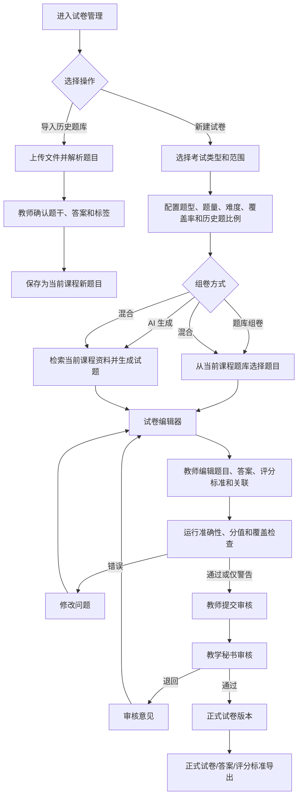
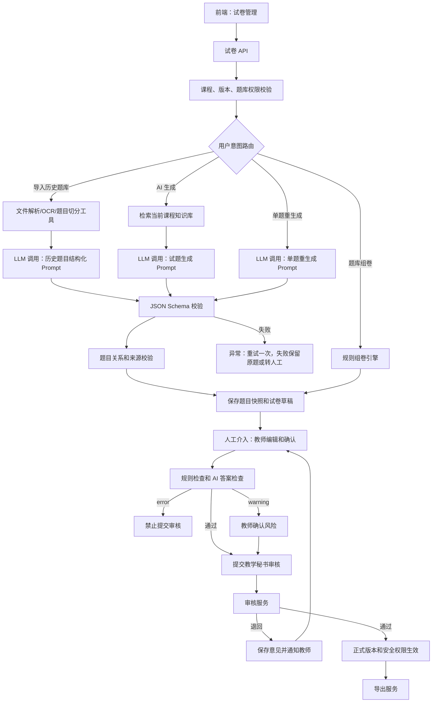

# 试卷管理（试卷与题库）PRD

## 1. 模块定位

试卷与题库模块用于教师围绕课程章节、知识点和课程能力指标建立题库，创建期中、期末、模拟和阶段测验试卷，并完成组卷、AI 生成、答案与评分标准、覆盖检查、审核、保密和导出。

本模块负责：

- 导入和维护历史题库、历史试卷
- 结构化解析历史题目
- 题目分类、去重和标签管理
- 新建试卷和配置组卷参数
- 从题库组卷和 AI 生成新题
- 混合历史题与新生成题
- 生成答案和评分标准
- 检查题目准确性、覆盖率、难度和分值
- 教师编辑和提交审核
- 教学秘书审核、退回和通过
- 试卷版本、保密权限和导出

本模块不负责：作业管理、成绩批改、自动在线发布和考试排考。

## 2. 已确认业务规则

1. 试卷必须绑定当前课程、课程版本和考试范围。
2. 试题来源只能是当前课程题库、当前课程资料、教师输入或 AI 生成，不允许跨课程引用。
3. 历史题目导入后生成当前课程的新题目记录，不能直接复用原题目主键。
4. 试卷可以混合历史题和 AI 新生成题，但历史题使用比例必须由教师配置。
5. AI 生成试题、答案和评分标准均为草稿，教师必须核对。
6. 正式试卷需要教学秘书审核；教学秘书可以查看、提出意见、退回和通过，但不能直接修改教师试卷。
7. 试卷和答案必须分离控制访问权限。
8. 题目必须关联章节、知识点和课程能力指标；草稿阶段允许缺失，提交审核前必须处理或明确忽略。
9. AI 只做辅助检查，不承诺题目和答案绝对正确。
10. 课程归档后允许查看和导出历史试卷、题目和审核记录，禁止新建、编辑、生成和删除。

## 3. 页面清单

| 编号 | 页面 | 路由建议 | 作用 |
|---|---|---|---|
| EX-01 | 试卷工作台 | `/courses/{course_id}/exams` | 查看试卷列表、状态和入口 |
| EX-02 | 题库 | `/courses/{course_id}/exams/question-bank` | 查看、筛选和维护当前课程题目 |
| EX-03 | 历史题库导入 | `/courses/{course_id}/exams/import` | 上传并解析历史题库或试卷 |
| EX-04 | 创建试卷 | `/courses/{course_id}/exams/create` | 选择考试类型、范围和组卷参数 |
| EX-05 | 试卷编辑器 | `/courses/{course_id}/exams/{exam_id}/edit` | 编辑试卷和题目 |
| EX-06 | 试卷检查 | `/courses/{course_id}/exams/{exam_id}/checks` | 查看题目、覆盖率和分值检查 |
| EX-07 | 试卷审核 | `/courses/{course_id}/exams/{exam_id}/review` | 教学秘书审核、退回或通过 |
| EX-08 | 试卷预览与导出 | `/courses/{course_id}/exams/{exam_id}/preview` | 分离预览试卷、答案和评分标准 |
| EX-09 | 试卷版本 | `/courses/{course_id}/exams/versions` | 查看、对比和复制版本 |

弹窗：题库筛选、题目标签、组卷配置、AI 生成、删除、试卷保密、提交审核、退回意见、导出设置。

## 4. EX-01 试卷工作台

### 4.1 筛选字段

| 字段 | 类型 | 枚举/规则 |
|---|---|---|
| `keyword` | string | 0-100 字，匹配试卷标题、考试类型、章节 |
| `exam_type` | enum[] | `midterm` 期中、`final` 期末、`quiz` 测验、`mock` 模拟、`makeup` 补考、`other` 其他 |
| `exam_status` | enum[] | `draft`、`generating`、`editing`、`checking`、`pending_review`、`reviewing`、`returned`、`resubmitted`、`approved`、`active`、`superseded`、`archived` |
| `chapter_id` | UUID/null | 章节筛选 |
| `date_from` | date/null | 创建时间开始 |
| `date_to` | date/null | 创建时间结束 |
| `sort_by` | enum | `updated_at`、`created_at`、`exam_date`、`exam_type` |
| `sort_order` | enum | `asc`、`desc` |

### 4.2 列表字段

| 字段 | 类型 | 说明 |
|---|---|---|
| `exam_id` | UUID | 试卷标识 |
| `title` | string | 试卷名称 |
| `exam_type` | enum | 考试类型 |
| `exam_date` | date/null | 考试日期 |
| `scope_description` | string | 考试范围 |
| `question_count` | integer | 题目数 |
| `total_score` | decimal(8,2) | 总分 |
| `exam_status` | enum | 试卷状态 |
| `version_no` | string | 当前版本 |
| `history_question_ratio` | decimal(3,2) | 历史题比例 |
| `check_error_count` | integer | 检查错误数 |
| `check_warning_count` | integer | 检查警告数 |
| `review_status` | enum | `not_submitted`、`pending`、`reviewing`、`returned`、`approved` |
| `security_level` | enum | `normal`、`confidential`、`highly_confidential` |
| `updated_at` | datetime | 更新时间 |
| `created_by_name` | string | 创建人 |

### 4.3 操作

- 新建试卷
- 打开编辑
- 预览
- 查看检查
- 提交审核
- 查看审核
- 复制试卷
- 查看版本
- 导出
- 归档
- 删除草稿

## 5. EX-02 题库

### 5.1 题库筛选字段

| 字段 | 类型 | 枚举/规则 |
|---|---|---|
| `keyword` | string | 搜索题干、答案、标签 |
| `question_type` | enum[] | `single_choice`、`multiple_choice`、`true_false`、`fill_blank`、`short_answer`、`calculation`、`proof`、`case_analysis`、`programming`、`design` |
| `difficulty` | enum[] | `basic`、`intermediate`、`advanced` |
| `source_type` | enum[] | `history_question`、`course_material`、`teacher_created`、`ai_generated` |
| `chapter_id` | UUID/null | 章节 |
| `knowledge_point_id` | UUID/null | 知识点 |
| `ability_indicator_id` | UUID/null | 能力指标 |
| `question_status` | enum[] | `draft`、`available`、`retired` |
| `has_answer` | boolean/null | 是否有答案 |
| `has_rubric` | boolean/null | 是否有评分标准 |
| `date_from` | date/null | 创建时间 |
| `date_to` | date/null | 创建时间 |

### 5.2 题库列表字段

`question_id`、`question_type`、`question_summary`、`difficulty`、`score_reference`、`chapter_title`、`knowledge_point_names`、`ability_indicator_names`、`source_type`、`source_file_name`、`source_pages`、`question_status`、`usage_count`、`last_used_at`、`created_by_name`、`updated_at`。

### 5.3 题库操作

- 查看题目详情
- 编辑题目
- 修改标签和关联
- 查看来源
- 查看使用记录
- 复制为新题目
- 标记可用
- 标记退役
- 加入试卷
- 批量修改难度或标签

题库题目退役后不能加入新试卷，但历史试卷中的引用不受影响。

## 6. EX-03 历史题库导入

### 6.1 导入字段

| 字段 | 类型 | 必填 | 枚举/规则 |
|---|---|---:|---|
| `import_batch_id` | UUID | 是 | 导入批次 |
| `file_id` | UUID | 是 | 当前课程资料库文件 |
| `file_type` | enum | 是 | `pdf`、`docx`、`pptx`、`xlsx`、`csv` |
| `import_mode` | enum | 是 | `question_bank_only` 仅题库、`create_exam_draft` 创建试卷草稿 |
| `source_exam_type` | enum/null | 否 | `midterm`、`final`、`quiz`、`mock`、`makeup`、`other` |
| `source_term_label` | string | 否 | 原考试学期 |
| `parse_status` | enum | 是 | `queued`、`processing`、`partial_success`、`success`、`failed` |
| `question_count_detected` | integer | 是 | 识别题目数 |
| `question_count_confirmed` | integer | 是 | 教师确认题目数 |
| `warning_count` | integer | 是 | 风险数 |
| `error_message` | string | 否 | 失败原因 |

### 6.2 导入流程

```text
上传历史题库/试卷
→ 文件解析和 OCR
→ 题目边界识别
→ 题干、选项、答案、解析拆分
→ 章节、知识点、难度和能力指标候选
→ 教师确认或修正
→ 生成当前课程新题目
```

### 6.3 导入确认字段

`import_question_id`、`question_content`、`question_type`、`correct_answer`、`explanation`、`score`、`chapter_candidate_ids`、`knowledge_point_candidate_ids`、`ability_candidate_ids`、`boundary_needs_review`、`answer_needs_review`、`teacher_confirmed`、`source_refs`。

## 7. EX-04 创建试卷

### 7.1 基础字段

| 字段 | 类型 | 必填 | 枚举/规则 |
|---|---|---:|---|
| `title` | string(200) | 是 | 试卷名称 |
| `exam_type` | enum | 是 | `midterm`、`final`、`quiz`、`mock`、`makeup`、`other` |
| `course_id` | UUID | 是 | 当前课程 |
| `course_version_id` | UUID | 是 | 当前课程版本 |
| `syllabus_id` | UUID | 是 | 当前正式大纲 |
| `exam_date` | date | 否 | 计划考试日期 |
| `duration_minutes` | integer | 是 | 10-600 |
| `total_score` | decimal(8,2) | 是 | 默认 100，0-1000 |
| `passing_score` | decimal(8,2) | 否 | 0-total_score |
| `scope_description` | string(1000) | 是 | 考试范围说明 |
| `chapter_ids` | UUID[] | 是 | 至少一个当前课程章节 |
| `knowledge_point_ids` | UUID[] | 否 | 考试知识点范围 |
| `objective_ids` | UUID[] | 否 | 课程目标范围 |
| `ability_indicator_ids` | UUID[] | 否 | 能力范围 |
| `security_level` | enum | 是 | `normal`、`confidential`、`highly_confidential` |
| `history_question_ratio` | decimal(3,2) | 是 | 0-1，默认 0 |
| `generation_mode` | enum | 是 | `question_bank` 题库组卷、`ai_generation` AI 生成、`mixed` 混合、`blank` 空白 |
| `teacher_instruction` | string(2000) | 否 | 教师要求 |

### 7.2 组卷配置字段

| 字段 | 类型 | 必填 | 说明 |
|---|---|---:|---|
| `question_type_configs` | QuestionTypeConfig[] | 是 | 题型、题量、分值和难度 |
| `chapter_distribution` | Distribution[] | 否 | 章节题量或分值比例 |
| `knowledge_distribution` | Distribution[] | 否 | 知识点题量或分值比例 |
| `difficulty_distribution` | Distribution[] | 否 | 基础/中等/提高比例 |
| `ability_distribution` | Distribution[] | 否 | 能力指标覆盖比例 |
| `history_question_ratio` | decimal(3,2) | 是 | 历史题使用比例 |
| `random_seed` | string(100) | 否 | 可复现组卷种子 |

QuestionTypeConfig：`question_type`、`question_count`、`total_score`、`difficulty`、`source_preference`(`history`/`new`/`mixed`)。

Distribution：`target_id`、`target_name`、`target_ratio`、`target_count`、`tolerance_ratio`。

## 8. EX-05 试卷编辑器

### 8.1 Exam 字段

| 字段 | 类型 | 必填 | 说明 |
|---|---|---:|---|
| `exam_id` | UUID | 是 | 试卷标识 |
| `course_id` | UUID | 是 | 课程 |
| `course_version_id` | UUID | 是 | 课程版本 |
| `syllabus_id` | UUID | 是 | 正式大纲 |
| `title` | string(200) | 是 | 试卷标题 |
| `exam_type` | enum | 是 | 考试类型 |
| `exam_date` | date/null | 否 | 考试日期 |
| `duration_minutes` | integer | 是 | 考试时长 |
| `total_score` | decimal(8,2) | 是 | 总分 |
| `passing_score` | decimal(8,2) | 否 | 及格分 |
| `scope_description` | string(1000) | 是 | 考试范围 |
| `chapter_ids` | UUID[] | 是 | 章节范围 |
| `security_level` | enum | 是 | 保密等级 |
| `exam_status` | enum | 是 | `draft`、`generating`、`editing`、`checking`、`pending_review`、`reviewing`、`returned`、`resubmitted`、`approved`、`active`、`superseded`、`archived` |
| `version_no` | string | 是 | 版本号 |
| `review_status` | enum | 是 | 审核状态 |
| `created_by` | UUID | 是 | 创建人 |
| `updated_by` | UUID | 是 | 最近修改人 |
| `approved_by` | UUID/null | 否 | 审核人 |
| `approved_at` | datetime/null | 否 | 审核时间 |

### 8.2 ExamQuestion 字段

| 字段 | 类型 | 必填 | 说明 |
|---|---|---:|---|
| `exam_question_id` | UUID | 是 | 试卷题目关系标识 |
| `exam_id` | UUID | 是 | 试卷 |
| `question_id` | UUID | 是 | 当前课程题库题目 |
| `question_no` | integer | 是 | 试卷序号 |
| `question_type` | enum | 是 | 题型 |
| `question_content` | richtext | 是 | 题干快照 |
| `options` | Option[] | 否 | 选项快照 |
| `correct_answer` | richtext | 否 | 答案快照 |
| `explanation` | richtext | 否 | 解析快照 |
| `scoring_rubric` | RubricItem[] | 否 | 评分标准快照 |
| `score` | decimal(8,2) | 是 | 分值 |
| `difficulty` | enum | 是 | `basic`、`intermediate`、`advanced` |
| `chapter_id` | UUID | 是 | 章节 |
| `knowledge_point_ids` | UUID[] | 是 | 知识点 |
| `objective_ids` | UUID[] | 否 | 目标 |
| `ability_indicator_ids` | UUID[] | 否 | 能力指标 |
| `source_type` | enum | 是 | `history_question`、`course_material`、`teacher_created`、`ai_generated` |
| `source_refs` | SourceRef[] | 否 | 来源 |
| `is_ai_generated` | boolean | 是 |  |
| `teacher_confirmed` | boolean | 是 |  |
| `security_level` | enum | 是 | 继承试卷或单题更高等级 |

题目进入试卷后保存内容快照，题库原题后续变化不影响已生成试卷。

## 9. EX-06 试卷检查

### 9.1 检查项

| 编码 | 内容 | 等级 |
|---|---|---|
| `EX001` | 试卷基本信息缺失 | error |
| `EX002` | 未关联章节 | error |
| `EX003` | 题目数量为 0 | error |
| `EX004` | 题目分值小于等于 0 | error |
| `EX005` | 题目分值合计不等于试卷总分 | error |
| `EX006` | 单选题正确选项不为 1 | error |
| `EX007` | 选择题选项数量不足 | error |
| `EX008` | 主观题缺少答案或评分标准 | warning |
| `EX009` | 题目未关联知识点 | error |
| `EX010` | 题目未关联能力指标 | warning |
| `EX011` | 存在未确认 AI 题目 | warning |
| `EX012` | 知识点覆盖率低于配置 | warning |
| `EX013` | 能力指标覆盖率低于配置 | warning |
| `EX014` | 题型比例不符合配置 | warning |
| `EX015` | 难度比例不符合配置 | warning |
| `EX016` | 历史题比例不符合配置 | warning |
| `EX017` | 题目疑似重复 | warning |
| `EX018` | 题目和答案可能不匹配 | error |
| `EX019` | 试卷引用过时大纲版本 | warning |
| `EX020` | 试卷安全等级未配置 | error |

### 9.2 提交条件

- 存在 error 时禁止提交审核。
- warning 可以确认后提交。
- 忽略 warning 必须填写原因。
- 提交审核后生成不可编辑快照。

## 10. EX-07 审核

### 10.1 审核字段

`review_task_id`、`exam_id`、`submitted_by`、`reviewer_id`、`review_status`(`pending`、`reviewing`、`returned`、`approved`、`cancelled`)、`overall_comment`、`item_comments`、`submitted_at`、`reviewed_at`、`return_reason`。

### 10.2 审核规则

- 教师提交试卷审核。
- 教学秘书查看试卷、答案、评分标准和检查结果。
- 教学秘书可以整体或逐题提出意见。
- 教学秘书不能直接修改试题内容。
- 退回后教师修改并重新提交。
- 通过后试卷状态为 `approved`，启用后为 `active`。
- 审核通过后才允许导出“正式试卷”文件。

## 11. EX-08 预览与导出

### 11.1 预览模式

- 学生试卷预览：隐藏答案和评分标准
- 教师校对预览：展示答案、解析、评分标准和来源
- 教学秘书审核预览：展示完整内容和检查结果
- 答案文件预览：只允许有权限角色访问

### 11.2 导出字段

`export_format`、`export_type`、`include_answer`、`include_explanation`、`include_scoring_rubric`、`include_sources`、`template_id`、`page_range`、`watermark_text`、`export_title`。

枚举：

- `export_format`：`docx`、`pdf`
- `export_type`：`exam_paper`、`answer_sheet`、`scoring_rubric`、`complete_package`
- `include_sources`：`none`、`end_notes`、`per_question`
- `watermark_text`：用户输入，0-100 字，可为空

未审核通过的试卷只能导出“草稿”并必须带草稿水印；审核通过后才可导出正式文件。

## 12. 状态机

```text
draft → generating → editing → checking → pending_review
→ reviewing → returned → resubmitted → approved → active
→ superseded → archived
```

## 13. 计算规则

### 13.1 总分

```text
试卷总分 = Σ 全部 ExamQuestion.score
```

### 13.2 知识点覆盖率

```text
知识点覆盖率 = 试卷已覆盖知识点数 ÷ 配置范围知识点总数 × 100%
```

### 13.3 能力指标覆盖率

```text
能力指标覆盖率 = 试卷已覆盖能力指标数 ÷ 配置范围能力指标总数 × 100%
```

### 13.4 历史题比例

```text
历史题比例 = 历史题分值 ÷ 试卷总分
```

### 13.5 难度比例

```text
某难度比例 = 该难度题目分值 ÷ 试卷总分
```

所有比例支持配置容差，超出容差生成 warning。

## 14. 业务流程图



## 15. 系统流程图



## 16. AI 介入与技术要求

### 16.1 传统技术

- 题库筛选、排序和分页
- 题型、分值和答案字段校验
- 组卷数量和分值计算
- 章节、知识点和能力指标关系校验
- 历史题库文件解析和 OCR
- 题目初步去重
- 保密权限和答案分离
- 试卷导出

### 16.2 大模型

- 历史题目结构化
- 题目与章节、知识点、能力指标匹配建议
- 新题生成
- 答案、解析和评分标准生成
- 题目和答案一致性检查
- 题目重复语义判断
- 题型和难度建议

### 16.3 性能目标

- 首 Token P95 ≤ 3 秒。
- 单题重新生成端到端 P95 ≤ 12 秒。
- 批量生成试题端到端 P95 ≤ 30 秒。
- 规则组卷 P95 ≤ 5 秒。
- 试卷检查 P95 ≤ 10 秒。
- 保存和提交审核 P95 ≤ 2 秒。

## 17. 完整 Prompt

### 17.1 历史题目结构化 Prompt

```text
System：
你是高校课程历史题库结构化助手。请从当前课程授权的历史题库或历史试卷文件中识别题目边界、题型、题干、选项、答案、解析、分值，并为题目提出当前课程章节、知识点、难度和能力指标候选。

必须遵守：
1. 只能使用输入文件内容，不得补造答案、解析或题目条件。
2. 无法确认题目边界时设置 boundary_needs_review=true。
3. 无法确认答案时设置 answer_needs_review=true。
4. 章节、知识点、难度和能力指标只是候选，必须设置 needs_teacher_confirmation=true。
5. 每项内容携带文件和页码。
6. 不得引用其他课程资料。
7. 只输出合法 JSON，不输出 Markdown。

User：
当前课程：{{course_info}}
来源文件：{{file_id}}
文件名称：{{file_name}}
页面文本：{{page_blocks}}
当前课程章节：{{current_chapters}}
当前课程知识点：{{current_knowledge_points}}
当前课程能力指标：{{current_ability_indicators}}

请输出结构化题目、答案、解析、分值、候选关联、来源页码和风险。

JSON：
{
  "questions":[{
    "question_no":1,
    "question_type":"short_answer",
    "question_content":"",
    "options":[],
    "correct_answer":"",
    "explanation":"",
    "score":0,
    "chapter_candidates":[],
    "knowledge_point_candidates":[],
    "ability_indicator_candidates":[],
    "source_refs":[],
    "boundary_needs_review":false,
    "answer_needs_review":true,
    "needs_teacher_confirmation":true,
    "warnings":[]
  }],
  "global_warnings":[]
}
```

### 17.2 试题生成 Prompt

```text
System：
你是高校课程试题生成助手。请依据当前课程已启用的大纲、章节、知识点、课程能力指标和当前课程资料生成试卷题目草稿。

规则：
1. 只能使用当前课程且通过权限过滤的资料。
2. 必须遵守指定考试范围、题型、题量、分值、难度和覆盖比例。
3. 不得虚构教材中不存在的知识、公式或课程要求。
4. 选择题必须保证选项和正确答案一致。
5. 计算题必须提供过程和结果；证明题必须提供关键步骤；主观题必须提供评分点。
6. 每题都要关联章节、知识点和能力指标候选。
7. 所有 AI 生成题目、答案和解析必须标记为需要教师核对。
8. 只输出合法 JSON，不输出 Markdown。

User：
课程信息：{{course_info}}
课程版本：{{course_version_id}}
正式大纲：{{approved_syllabus}}
考试范围：{{exam_scope}}
章节和知识点：{{chapter_knowledge_scope}}
课程能力指标：{{ability_indicators}}
题型配置：{{question_type_configs}}
难度配置：{{difficulty_distribution}}
覆盖配置：{{knowledge_distribution}}
历史题比例：{{history_question_ratio}}
历史题摘要：{{history_question_summaries}}
教师要求：{{teacher_instruction}}
资料片段：{{retrieved_chunks}}

请输出题目、选项、答案、解析、评分标准、分值、难度、关联关系和来源。

JSON：
{
  "questions":[{
    "question_no":1,
    "question_type":"calculation",
    "question_content":"",
    "options":[],
    "correct_answer":"",
    "explanation":"",
    "scoring_rubric":[{"description":"", "score":0, "order_no":1, "must_have":false}],
    "score":0,
    "difficulty":"intermediate",
    "chapter_id":"",
    "knowledge_point_ids":[],
    "objective_ids":[],
    "ability_indicator_ids":[],
    "source_type":"ai_generated",
    "source_refs":[],
    "is_ai_generated":true,
    "needs_teacher_confirmation":true,
    "warnings":[]
  }],
  "coverage_summary":{"chapters":[], "knowledge_points":[], "ability_indicators":[]},
  "conflicts":[],
  "warnings":[]
}
```

### 17.3 单题重生成 Prompt

```text
System：
你是试卷单题重生成助手。请只修改指定题目，不改变试卷的课程、版本、考试范围、章节、知识点和能力指标约束。

规则：
1. 保留教师已经确认的关联关系，除非教师明确要求修改。
2. 题目不得与当前试卷其他题目重复。
3. 新题目的答案、解析和评分标准必须一致。
4. 只能使用当前课程资料。
5. 不确定内容必须标记 needs_teacher_confirmation=true。
6. 只输出合法 JSON。

User：
课程：{{course_info}}
试卷配置：{{exam_config}}
原题目：{{original_question}}
当前试卷其他题目摘要：{{other_question_summaries}}
教师修改要求：{{rewrite_instruction}}
可用资料：{{retrieved_chunks}}

请输出新题目、答案、解析、评分标准、关联关系、来源和复核提示。

JSON：
{
  "question_type":"calculation",
  "question_content":"",
  "options":[],
  "correct_answer":"",
  "explanation":"",
  "scoring_rubric":[],
  "score":0,
  "difficulty":"intermediate",
  "chapter_id":"",
  "knowledge_point_ids":[],
  "ability_indicator_ids":[],
  "source_refs":[],
  "is_ai_generated":true,
  "needs_teacher_confirmation":true,
  "warnings":[]
}
```

### 17.4 试卷质量检查 Prompt

```text
System：
你是高校试卷质量检查助手。请检查试卷题目、答案、解析和评分标准是否存在明显错误、不一致、重复、覆盖不足、难度失衡或关联错误。

你只能提出疑似问题，不能直接修改试题。对公式、证明、计算和主观题答案要谨慎；没有充分证据时设置 requires_teacher_action=true。
只输出合法 JSON。

User：
课程：{{course_info}}
正式大纲：{{approved_syllabus}}
试卷配置：{{exam_config}}
试卷题目：{{exam_questions}}
答案和评分标准：{{answers_and_rubrics}}
覆盖统计：{{coverage_statistics}}

请输出问题编码、等级、关联题目、证据、建议动作和是否需要教师处理。

JSON：
{
  "issues":[{
    "issue_code":"EXCHECK001",
    "severity":"error",
    "question_no":1,
    "message":"",
    "evidence":"",
    "suggested_action":"",
    "requires_teacher_action":true
  }],
  "coverage_warnings":[],
  "result":"pass_with_warnings",
  "warnings":[]
}
```

## 18. 埋点与业务验收

### 18.1 埋点

`exam_view`、`question_bank_view`、`question_bank_search`、`question_filter`、`question_import_start`、`question_import_success`、`question_import_fail`、`question_import_confirm`、`exam_create_start`、`exam_config_submit`、`exam_generate_start`、`exam_generate_success`、`exam_generate_fail`、`exam_question_add`、`exam_question_delete`、`exam_question_reorder`、`exam_question_edit`、`exam_question_regenerate`、`exam_relation_edit`、`exam_check_start`、`exam_check_complete`、`exam_warning_ignore`、`exam_submit_review`、`exam_review_return`、`exam_review_approve`、`exam_preview`、`exam_export_draft`、`exam_export_official`、`exam_archive`。

### 18.2 正向 Case

- 历史题库成功解析并被教师确认。
- 教师按配置组卷并少量调整。
- AI 题目、答案和评分标准经过教师核对。
- 试卷覆盖率、难度和分值检查通过。
- 教学秘书审核通过。
- 正式试卷、答案和评分标准成功导出。

### 18.3 负向 Case

- 历史题目边界识别错误。
- 题目答案或解析被大幅修改。
- 题目重复率过高。
- 知识点或能力指标覆盖不足。
- AI 生成题目被教师批量拒绝。
- 试卷被教学秘书多次退回。
- 未审核试卷被尝试导出正式文件。
- 非授权用户尝试查看答案。

### 18.4 验收标准

- 支持当前课程历史题库和历史试卷导入。
- 历史题目导入后生成当前课程新题目记录。
- 支持期中、期末、测验、模拟、补考和其他考试类型。
- 支持题型、题量、分值、难度、章节、知识点、能力指标和历史题比例配置。
- 支持题库组卷、AI 生成和混合组卷。
- 每道题保存题干、选项、答案、解析、评分标准、来源和结构化关联。
- 规则检查能校验分值、答案、覆盖率、难度、题型和重复题。
- AI 检查只提供问题提示，不自动修改题目。
- 正式试卷必须经教学秘书审核；课件和作业审核规则不适用于本模块。
- 试卷、答案和评分标准分离控制权限。
- 未审核试卷只能导出草稿并带水印，审核通过后才能导出正式文件。
- 正式版本不可直接覆盖，历史版本可查看和复制。
- 课程归档后历史试卷、题库和审核记录可查看和导出，所有写操作被拦截。

## 19. 当前页面与交互规范（2026-09-04）

- 页面标题区保持紧凑两行，课程上下文和试卷/题库状态在右侧内容区展示。
- 课程内导航名称统一为“试卷管理”；页面同时提供试卷列表、题库入口、组卷配置和审核状态。
- 新建试卷、导入题库、AI 生成题目、组卷检查、审核意见和导出设置均使用居中模态窗口，不使用侧边抽屉；遮罩不可关闭，背景锁定滚动，关闭按钮固定在右上角，底部操作固定。
- AI 生成支持按章节、知识点、能力指标、题型、难度、题量和历史题比例配置，结果按题目流式回填并标记“AI 草稿”。
- 试卷列表明确区分草稿、待审核、退回、已通过、当前有效、已归档；正式试卷必须经教学秘书审核，未通过只能导出带水印草稿。
- 教师可编辑、删除、排序和单题重生成，旧版本保留；AI 或规则检查失败不得覆盖已有题目。课程归档后只读、可对比和导出。
