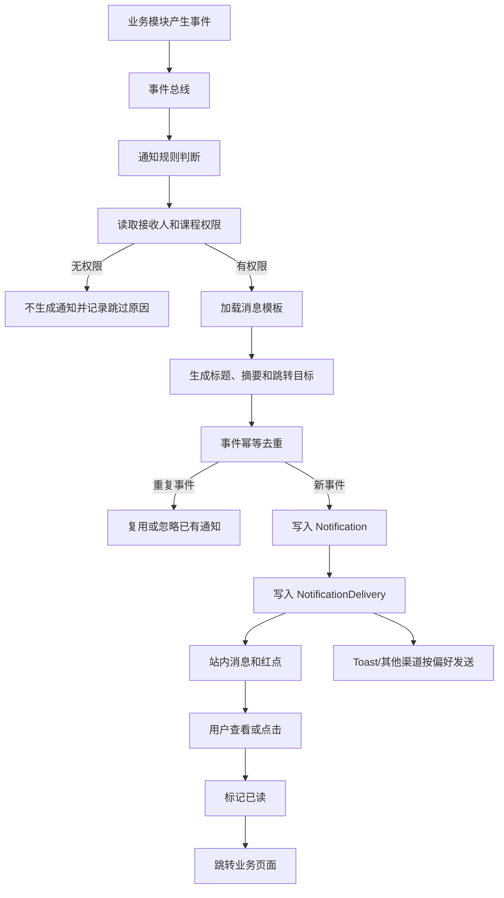
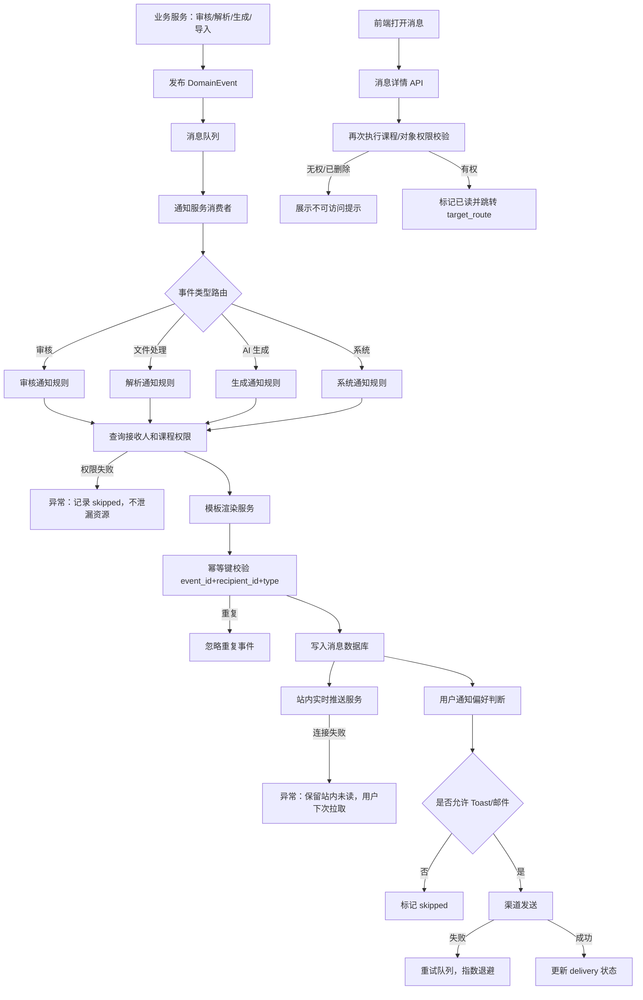

# 消息提醒 PRD

## 1. 模块定位

消息提醒是系统级通知中心，用于将审核、文件处理、AI 生成、成绩导入、版本变化和系统异常等事件，以站内消息、页面红点和即时提示的方式通知有权限的用户，并提供明确的后续操作入口。

本模块负责：

- 接收各业务模块产生的通知事件
- 根据用户和课程权限生成通知
- 展示未读、已读和历史消息
- 消息分类、筛选、搜索和归档
- 消息跳转到对应业务页面
- 处理通知偏好和免打扰设置
- 记录发送、送达、失败和阅读状态
- 对失败通知进行重试和告警

本模块不负责：业务状态本身的修改、审核决策、业务数据计算、短信/邮件供应商管理和大模型生成内容。

## 2. 已确认业务规则

1. 消息提醒是全局顶部导航入口，用户只能查看与自己相关且有权限访问的消息。
2. 课程类通知必须绑定 `course_id`；用户失去课程权限后不能继续打开受保护详情。
3. 消息必须提供明确标题、摘要、发生时间和跳转目标。
4. 审核退回、审核通过、文件解析失败和数据导入失败属于高优先级消息。
5. 普通消息可以批量标记已读和归档；高优先级消息不能被系统自动删除。
6. 已读状态属于用户个人状态，同一条业务事件对不同用户可以分别未读或已读。
7. 通知不改变业务数据状态，点击消息后跳转对应业务页面处理。
8. 消息发送失败需要重试；重复事件需要幂等去重。
9. 课程归档后历史消息仍可查看，但跳转到课程内容时只允许只读。
10. 本模块默认不使用大模型，通知标题、摘要和跳转目标由事件模板和规则生成。

## 3. 页面清单

| 编号 | 页面/组件 | 路由建议 | 作用 |
|---|---|---|---|
| NT-01 | 消息中心 | `/notifications` | 查看全部消息、筛选、搜索和批量操作 |
| NT-02 | 消息详情弹窗 | `NT-01 modal` | 查看完整内容、来源和操作入口 |
| NT-03 | 顶部通知下拉 | `global component` | 快速查看最近未读消息 |
| NT-04 | 通知设置 | `/settings/notifications` | 管理分类和渠道偏好 |
| NT-05 | 通知异常详情弹窗 | `NT-02 modal` | 查看发送失败和系统处理结果 |

不单独建立“消息创建页”；消息由业务事件自动生成。

## 4. NT-03 顶部通知下拉

### 4.1 展示字段

| 字段 | 类型 | 说明 |
|---|---|---|
| `unread_count` | integer | 未读数量；超过 99 显示 `99+` |
| `high_priority_unread_count` | integer | 高优先级未读数量 |
| `latest_notifications` | Notification[] | 最近 10 条未读消息 |
| `last_fetched_at` | datetime | 最近刷新时间 |

### 4.2 交互

- 点击顶部铃铛打开最近未读消息下拉。
- 点击消息标记为已读并跳转 `target_route`。
- 点击“全部消息”进入 NT-01。
- 点击“全部标记已读”只处理当前用户可见消息。
- 新消息到达时显示红点；高优先级消息可显示短暂 Toast。
- 无未读消息时显示：`暂无新的消息`。

## 5. NT-01 消息中心

### 5.1 筛选字段

| 字段 | 类型 | 枚举/规则 |
|---|---|---|
| `keyword` | string | 0-100 字，匹配标题、摘要、课程名称 |
| `category` | enum[] | `approval` 审核、`processing` 处理、`ai_generation` AI 生成、`data_import` 数据导入、`version` 版本、`system` 系统 |
| `priority` | enum[] | `high` 高、`medium` 中、`low` 低 |
| `read_status` | enum[] | `unread` 未读、`read` 已读、`archived` 已归档 |
| `course_id` | UUID/null | 当前课程筛选 |
| `date_from` | date/null | 发生日期开始 |
| `date_to` | date/null | 发生日期结束 |
| `sort_by` | enum | `created_at`、`priority` |
| `sort_order` | enum | `asc`、`desc` |

### 5.2 消息列表字段

| 字段 | 类型 | 说明 |
|---|---|---|
| `notification_id` | UUID | 消息标识 |
| `event_id` | UUID | 业务事件标识 |
| `category` | enum | 消息分类 |
| `notification_type` | enum | 具体消息类型 |
| `priority` | enum | 优先级 |
| `title` | string | 标题，建议不超过 80 字 |
| `summary` | string | 摘要，建议不超过 200 字 |
| `course_id` | UUID/null | 关联课程 |
| `course_name` | string/null | 课程名称快照 |
| `actor_name` | string/null | 触发人 |
| `read_status` | enum | `unread`、`read`、`archived` |
| `created_at` | datetime | 消息生成时间 |
| `read_at` | datetime/null | 阅读时间 |
| `target_route` | string/null | 跳转路由 |
| `has_action` | boolean | 是否有处理入口 |
| `action_label` | string/null | 操作按钮文案 |

### 5.3 列表操作

- 查看详情
- 标记已读
- 标记未读
- 归档
- 批量标记已读
- 批量归档
- 按分类筛选
- 搜索
- 刷新

高优先级消息可以归档，但不能物理删除。

## 6. 消息类型枚举

### 6.1 审核类

| 编码 | 标题示例 | 触发条件 | 优先级 |
|---|---|---|---|
| `syllabus_review_submitted` | 教学大纲已提交审核 | 教师提交大纲 | medium |
| `syllabus_review_returned` | 教学大纲已退回 | 教学秘书退回 | high |
| `syllabus_review_approved` | 教学大纲审核通过 | 教学秘书通过 | high |
| `calendar_review_submitted` | 教学日历已提交审核 | 教师提交日历 | medium |
| `calendar_review_returned` | 教学日历已退回 | 教学秘书退回 | high |
| `calendar_review_approved` | 教学日历审核通过 | 教学秘书通过 | high |
| `exam_review_submitted` | 试卷已提交审核 | 教师提交试卷 | medium |
| `exam_review_returned` | 试卷已退回 | 教学秘书退回 | high |
| `exam_review_approved` | 试卷审核通过 | 教学秘书通过 | high |

### 6.2 文件和解析类

| 编码 | 标题示例 | 触发条件 | 优先级 |
|---|---|---|---|
| `file_upload_success` | 文件上传完成 | 文件上传成功 | low |
| `file_upload_failed` | 文件上传失败 | 上传失败 | high |
| `file_parse_completed` | 教材解析完成 | 文件解析成功 | medium |
| `file_parse_partial` | 教材部分解析完成 | 部分页面失败 | high |
| `file_parse_failed` | 教材解析失败 | 解析失败 | high |
| `structure_review_required` | 请确认教材结构 | 解析结果待确认 | high |
| `knowledge_index_completed` | 课程资料已可检索 | 知识库构建完成 | medium |
| `knowledge_index_failed` | 课程资料索引失败 | 知识库构建失败 | high |

### 6.3 AI 和数据类

| 编码 | 标题示例 | 触发条件 | 优先级 |
|---|---|---|---|
| `ai_generation_completed` | AI 内容生成完成 | 异步生成完成 | medium |
| `ai_generation_failed` | AI 内容生成失败 | 异步生成失败 | high |
| `score_import_completed` | 成绩导入完成 | 成绩导入完成 | medium |
| `score_import_failed` | 成绩导入失败 | 成绩导入失败 | high |
| `score_import_partial` | 成绩部分导入 | 存在错误行 | high |
| `version_updated` | 课程内容有新版本 | 关联版本更新 | medium |
| `source_outdated` | 课件引用资料已更新 | 来源文件有新版本 | medium |

### 6.4 系统类

| 编码 | 标题示例 | 触发条件 | 优先级 |
|---|---|---|---|
| `course_owner_transferred` | 课程负责人已变更 | 负责人转移成功 | medium |
| `course_member_added` | 你已加入课程 | 被添加为成员 | medium |
| `course_member_removed` | 你已退出课程 | 被移除或主动退出 | high |
| `course_archived` | 课程已归档 | 课程负责人归档课程 | medium |
| `system_maintenance` | 系统维护通知 | 管理员发布 | high |
| `system_error` | 系统处理异常 | 重要系统异常 | high |

## 7. Notification 数据字段

| 字段 | 类型 | 必填 | 枚举/规则 |
|---|---|---:|---|
| `notification_id` | UUID | 是 | 主键 |
| `event_id` | UUID | 是 | 业务事件，幂等键之一 |
| `recipient_id` | UUID | 是 | 接收用户 |
| `category` | enum | 是 | `approval`、`processing`、`ai_generation`、`data_import`、`version`、`system` |
| `notification_type` | enum | 是 | 见通知类型枚举 |
| `priority` | enum | 是 | `high`、`medium`、`low` |
| `title` | string(80) | 是 | 模板生成 |
| `summary` | string(200) | 是 | 模板生成 |
| `detail` | richtext/string(2000) | 否 | 详情 |
| `course_id` | UUID/null | 否 | 课程类消息必填 |
| `course_name_snapshot` | string(100) | 否 | 课程名称快照 |
| `actor_id` | UUID/null | 否 | 触发人 |
| `actor_name_snapshot` | string(100) | 否 | 触发人快照 |
| `target_type` | enum | 否 | `course`、`file`、`syllabus`、`calendar`、`preparation`、`courseware`、`assignment`、`exam`、`score_import`、`system` |
| `target_id` | UUID/null | 否 | 目标对象 |
| `target_route` | string(500) | 否 | 前端路由 |
| `action_label` | string(50) | 否 | 例如“去处理” |
| `read_status` | enum | 是 | `unread`、`read`、`archived` |
| `created_at` | datetime | 是 |  |
| `read_at` | datetime/null | 否 |  |
| `archived_at` | datetime/null | 否 |  |
| `expires_at` | datetime/null | 否 | 仅低优先级可设置过期 |
| `payload_json` | JSON | 否 | 模板参数，不保存敏感原文 |

## 8. NotificationDelivery 数据字段

| 字段 | 类型 | 必填 | 枚举/规则 |
|---|---|---:|---|
| `delivery_id` | UUID | 是 | 主键 |
| `notification_id` | UUID | 是 | 消息 |
| `channel` | enum | 是 | `in_app` 站内、`toast` 即时提示、`email` 预留、`sms` 预留 |
| `delivery_status` | enum | 是 | `queued`、`sending`、`sent`、`delivered`、`failed`、`skipped` |
| `attempt_count` | integer | 是 | >=0 |
| `last_error_code` | string(50) | 否 | 失败码 |
| `last_error_message` | string(500) | 否 | 失败原因 |
| `queued_at` | datetime | 是 |  |
| `sent_at` | datetime/null | 否 |  |
| `delivered_at` | datetime/null | 否 |  |
| `next_retry_at` | datetime/null | 否 |  |

## 9. NotificationPreference 数据字段

| 字段 | 类型 | 必填 | 枚举/规则 |
|---|---|---:|---|
| `preference_id` | UUID | 是 | 主键 |
| `user_id` | UUID | 是 | 用户 |
| `category` | enum | 是 | 消息分类 |
| `in_app_enabled` | boolean | 是 | 默认 true，不可关闭高优先级系统消息 |
| `toast_enabled` | boolean | 是 | 默认 true |
| `email_enabled` | boolean | 是 | 默认 false，邮件开通后可用 |
| `quiet_hours_enabled` | boolean | 是 | 默认 false |
| `quiet_hours_start` | time/null | 否 | 例如 22:00 |
| `quiet_hours_end` | time/null | 否 | 例如 08:00 |
| `updated_at` | datetime | 是 |  |

## 10. NT-02 消息详情

### 10.1 展示字段

- 标题
- 分类
- 优先级
- 完整详情
- 关联课程
- 触发人
- 发生时间
- 业务对象
- 处理状态快照
- 操作按钮
- 来源和跳转说明

### 10.2 点击规则

- 打开详情即标记已读，除非用户关闭“打开不自动标记已读”设置。
- 点击处理按钮跳转 `target_route`。
- 目标对象不存在或无权限时显示：

> 该内容已不存在，或你已没有访问权限。

- 课程已归档时跳转只读页面，并提示：

> 课程已归档，当前仅支持查看历史内容。

## 11. NT-04 通知设置

### 11.1 分类设置

每个分类配置：站内消息、Toast、邮件预留、免打扰时段。

高优先级消息默认保留站内通知，用户不能关闭系统故障、审核退回和数据导入失败通知。

### 11.2 设置交互

- 修改后立即保存。
- 修改成功提示：`通知设置已更新`。
- 关闭 Toast 不影响消息中心未读数量。
- 免打扰时段只影响 Toast 和预留外部渠道，不影响站内消息。

## 12. 状态和保留规则

### 12.1 阅读状态

```text
unread → read → archived
```

用户可以将 `read` 改回 `unread`，归档后也可以恢复为已读。

### 12.2 发送状态

```text
queued → sending → sent → delivered
                 ↘ failed → retry
```

站内消息 `sent` 即视为系统可见；Toast 只记录尝试状态。

### 12.3 保留规则

- 高优先级消息至少保留 180 天。
- 普通消息至少保留 90 天。
- 审核、版本和操作相关消息与业务审计记录保持一致。
- 删除用户账号前，消息需按数据保留规则匿名化或归档。

## 13. 业务流程图



## 14. 系统流程图



## 15. 技术开发要点

### 15.1 是否使用大模型

本模块默认不使用大模型。

通知内容属于结构化事件到模板的映射，使用传统技术更稳定、可控、可审计。标题、摘要、优先级和跳转目标由通知类型和模板参数生成。

### 15.2 延迟目标

- 业务事件写入到站内消息可见：P95 ≤ 5 秒。
- 顶部未读数量刷新：P95 ≤ 2 秒。
- 消息详情打开：P95 ≤ 2 秒。
- 标记已读：P95 ≤ 1 秒。
- Toast 发送：业务事件产生后 P95 ≤ 3 秒。
- 发送失败重试开始：≤ 60 秒。

### 15.3 并发目标

- 100 个同时在线用户。
- 单分钟 10,000 条通知事件写入。
- 单分钟 5,000 条站内推送。
- 通知消费者支持水平扩展。
- 同一事件重复投递不产生重复消息。

### 15.4 错误码

- `NOTIFICATION_NOT_FOUND`
- `NOTIFICATION_ACCESS_DENIED`
- `NOTIFICATION_ALREADY_READ`
- `NOTIFICATION_TARGET_NOT_FOUND`
- `NOTIFICATION_TARGET_ACCESS_DENIED`
- `NOTIFICATION_DELIVERY_FAILED`
- `NOTIFICATION_TEMPLATE_NOT_FOUND`
- `NOTIFICATION_DUPLICATE_EVENT`
- `NOTIFICATION_PREFERENCE_INVALID`

## 16. 数据埋点与业务验收

### 16.1 埋点

`notification_center_view`、`notification_dropdown_open`、`notification_filter`、`notification_search`、`notification_open`、`notification_mark_read`、`notification_mark_unread`、`notification_archive`、`notification_batch_read`、`notification_batch_archive`、`notification_target_click`、`notification_target_invalid`、`notification_preference_view`、`notification_preference_update`、`notification_toast_show`、`notification_toast_click`、`notification_delivery_fail`、`notification_delivery_retry`。

### 16.2 正向 Case

- 高优先级审核退回消息及时到达。
- 用户点击消息后进入正确的业务对象。
- 用户打开消息后未读数量正确减少。
- 用户可以从消息直接处理待办。
- 课程归档后历史通知仍可查看。
- 用户关闭 Toast 后仍能在消息中心看到消息。

### 16.3 负向 Case

- 同一事件重复产生多条相同消息。
- 无课程权限的用户通过消息打开受保护内容。
- 消息跳转到不存在的对象。
- 发送失败后没有重试。
- 批量标记已读误改其他用户状态。
- 免打扰设置导致高优先级站内消息丢失。

### 16.4 验收标准

- 顶部导航显示未读数量和高优先级提示。
- 消息中心支持分类、优先级、课程、阅读状态、日期和关键词筛选。
- 每条消息包含标题、摘要、时间和跳转目标。
- 审核、解析、AI 生成、成绩导入、版本和系统事件均可生成通知。
- 同一事件对同一接收人只生成一条有效消息。
- 用户只能查看自己有权限访问的消息和业务对象。
- 支持未读、已读、归档和批量操作。
- 支持通知分类偏好和免打扰设置。
- 高优先级系统消息不能被用户关闭站内通知。
- 消息发送失败可重试并保留失败记录。
- 课程归档后历史消息可查看，目标页面只读。
- 本模块不依赖大模型，通知内容可通过模板稳定生成。

## 17. 当前页面与交互规范（2026-09-04）

- 消息中心标题区保持紧凑两行，未读数量和筛选入口并列，不使用大面积三联统计头部。
- 顶部全局导航保留“消息提醒”入口，并在有未读消息时显示数量徽标；点击消息必须跳转到对应课程或全局业务页面。
- 消息中心采用紧凑标题区和列表/筛选同一行布局，支持审核、文件解析、AI 生成、成绩导入、版本变化、失败、超时和排队状态消息。
- 消息详情和通知异常详情统一使用居中模态窗口，不使用侧边抽屉；遮罩不可关闭，背景禁止滚动，右上角关闭按钮固定，底部操作区固定。
- 消息详情必须显示发生了什么、是否影响当前操作、是否可以重试和下一步处理入口。点击“重试”或“查看任务”进入原业务页面并携带 `course_id`、`task_id` 或 `review_id`。
- 无权限、对象不存在或课程已归档时，弹窗直接展示原因和只读/返回操作，不泄露其他课程数据。
