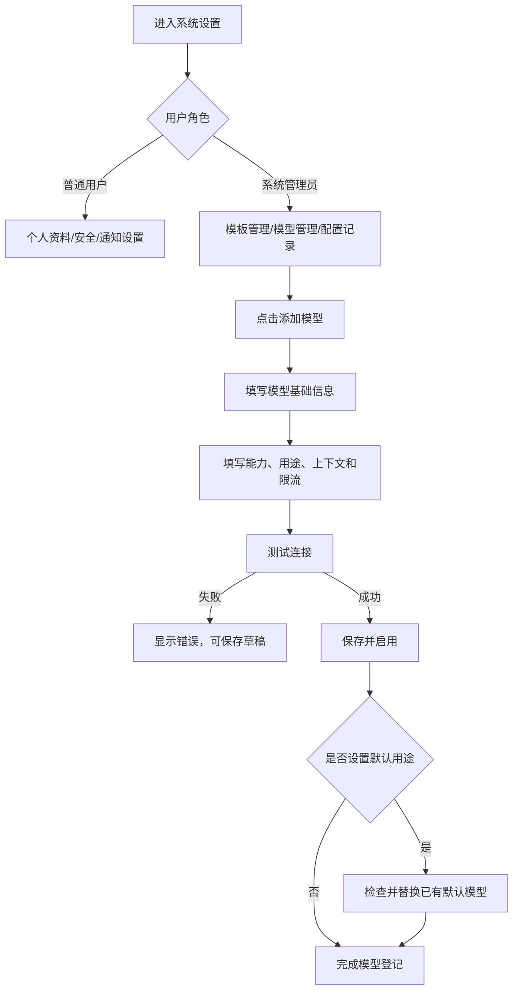
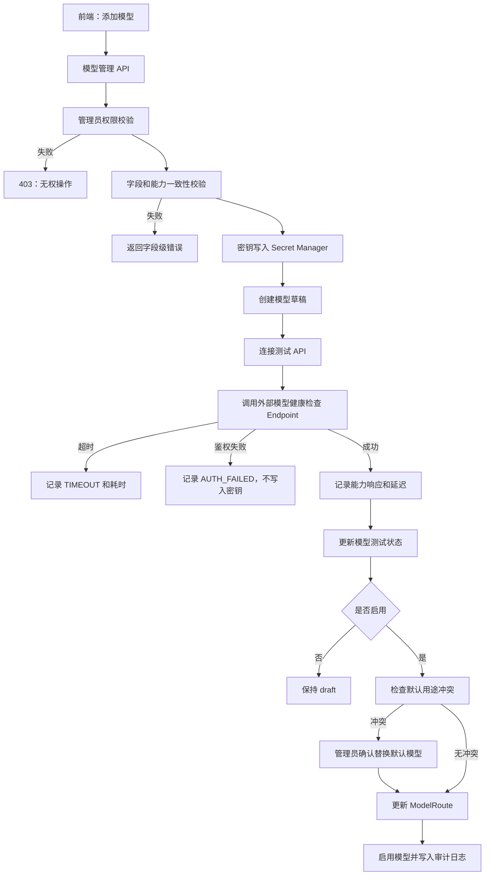

# 系统设置 PRD

## 1. 模块定位

系统设置是全局配置入口，用于管理个人账号、安全、通知入口、系统模板、AI 模型信息和管理员级系统参数。

本模块负责：

- 个人资料和账号安全
- 通知设置入口和免打扰设置
- 学校/组织模板管理
- AI 模型信息登记、连接测试和启停
- 模型能力、上下文、限流和默认用途配置
- 系统管理员查看配置变更记录

本模块不负责：课程内容编辑、课程成员权限、业务审核、Prompt 内容设计和具体 AI 业务调用。

## 2. 已确认业务规则

1. 普通用户只能修改自己的个人信息、安全和通知偏好。
2. 系统管理员才能添加、编辑、测试、启用、停用和删除模型信息。
3. API Key、Secret 和完整 Endpoint 凭据不得明文返回前端或写入普通日志。
4. 模型停用后不能被新任务路由，但历史任务记录仍保留模型快照。
5. 每个 AI 用途必须有一个当前默认模型；默认模型停用时必须重新指定或标记不可用。
6. 学校模板由管理员维护，教师只能查看并在课程中选择使用。
7. 通知设置由用户自行管理；系统设置只提供入口，不重复实现消息中心逻辑。
8. 模型连接测试不得修改业务数据，测试结果需要保留时间、耗时和错误码。
9. 课程归档不影响系统设置和模型配置。

## 3. 页面清单

| 编号 | 页面 | 路由建议 | 作用 |
|---|---|---|---|
| SS-01 | 设置首页 | `/settings` | 展示设置分类和当前账号摘要 |
| SS-02 | 个人资料 | `/settings/profile` | 修改姓名、头像和联系方式 |
| SS-03 | 账号安全 | `/settings/security` | 密码、登录设备和安全操作 |
| SS-04 | 通知设置 | `/settings/notifications` | 跳转或承载通知偏好 |
| SS-05 | 模板管理 | `/settings/templates` | 管理学校大纲、日历、课件和导出模板 |
| SS-06 | 模型管理 | `/settings/models` | 查看模型、用途、状态和默认配置 |
| SS-07 | 添加模型 | `/settings/models/create` | 登记模型信息并测试连接 |
| SS-08 | 模型详情/编辑 | `/settings/models/{model_id}` | 查看、编辑、启停和测试模型 |
| SS-09 | 配置变更记录 | `/settings/audit` | 管理员查看设置变更 |

## 4. SS-01 设置首页

### 4.1 分类卡片

- 个人资料
- 账号安全
- 通知设置
- 模板管理
- 模型管理（仅管理员）
- 配置变更记录（仅管理员）

### 4.2 展示字段

`user_id`、`display_name`、`account`、`role`、`avatar_url`、`last_login_at`、`unread_notification_count`、`enabled_model_count`（管理员）、`template_count`（管理员）。

点击分类卡片进入对应页面，不在首页展开具体配置。

## 5. SS-02 个人资料

### 5.1 字段

| 字段 | 类型 | 必填 | 规则 |
|---|---|---:|---|
| `user_id` | UUID | 是 | 只读 |
| `account` | string(100) | 是 | 只读，登录账号 |
| `display_name` | string(100) | 是 | 1-100 字 |
| `real_name` | string(100) | 是 | 1-100 字 |
| `avatar_url` | string(500) | 否 | 图片地址 |
| `email` | string(200) | 否 | 合法邮箱 |
| `phone` | string(30) | 否 | 合法手机号或区号格式 |
| `college_name` | string(100) | 否 | 学院 |
| `department_name` | string(100) | 否 | 系/教研室 |
| `job_title` | string(100) | 否 | 职务 |
| `timezone` | enum | 是 | `Asia/Shanghai`、`UTC`、其他系统支持时区 |
| `language` | enum | 是 | `zh_cn` 简体中文 |
| `updated_at` | datetime | 是 | 更新时间 |

### 5.2 交互

- 修改后点击保存。
- 邮箱和手机号变更需要验证码校验，是否启用由系统部署配置决定。
- 保存成功提示：`个人资料已更新`。

## 6. SS-03 账号安全

### 6.1 修改密码字段

`current_password`、`new_password`、`confirm_password`。

密码规则：8-32 位，必须包含字母和数字；是否强制特殊字符由管理员配置。

### 6.2 登录设备字段

`session_id`、`device_name`、`browser`、`ip_address_masked`、`last_active_at`、`created_at`、`is_current`。

### 6.3 操作

- 修改密码
- 退出其他设备
- 查看最近登录
- 申请注销账号（需管理员处理）

## 7. SS-04 通知设置

本页面复用消息提醒模块的通知设置数据和接口，不复制业务逻辑。

展示入口：

- 审核提醒
- 文件处理提醒
- AI 生成提醒
- 成绩导入提醒
- 版本提醒
- 系统提醒
- Toast 开关
- 免打扰时间

高优先级系统消息的站内通知不能关闭。

## 8. SS-05 模板管理

### 8.1 模板类型

| 编码 | 名称 | 使用模块 |
|---|---|---|
| `syllabus` | 教学大纲模板 | 教学大纲 |
| `calendar` | 教学日历模板 | 教学日历 |
| `courseware` | 课件模板 | 课件制作 |
| `assignment` | 作业模板 | 作业管理 |
| `exam` | 试卷模板 | 试卷管理 |
| `handout` | 讲义模板 | 课件制作 |
| `other` | 其他模板 | 预留 |

### 8.2 Template 字段

| 字段 | 类型 | 必填 | 规则 |
|---|---|---:|---|
| `template_id` | UUID | 是 | 模板标识 |
| `template_name` | string(200) | 是 | 名称 |
| `template_type` | enum | 是 | 模板类型 |
| `file_id` | UUID | 是 | 模板文件 |
| `file_type` | enum | 是 | `docx`、`xlsx`、`pptx`、`pdf` |
| `scope` | enum | 是 | `organization` 组织、`system` 系统 |
| `template_status` | enum | 是 | `draft`、`active`、`disabled`、`archived` |
| `description` | string(500) | 否 | 说明 |
| `is_default` | boolean | 是 | 同一类型只能一个默认模板 |
| `created_by` | UUID | 是 | 管理员 |
| `created_at` | datetime | 是 |  |
| `updated_at` | datetime | 是 |  |

### 8.3 权限

- 管理员可以新增、编辑、启用、停用和归档模板。
- 教师和教学秘书只能查看可用模板，并在对应模块选择。
- 已被课程使用的模板不能直接删除，只能停用或归档。

## 9. SS-06 模型管理

### 9.1 页面筛选字段

| 字段 | 类型 | 枚举/规则 |
|---|---|---|
| `keyword` | string | 匹配模型名称、编码、供应商 |
| `provider` | enum[] | `openai`、`anthropic`、`qwen`、`deepseek`、`local`、`custom` |
| `model_status` | enum[] | `draft`、`testing`、`active`、`disabled`、`error` |
| `model_capability` | enum[] | `chat`、`embedding`、`vision`、`rerank`、`ocr` |
| `use_case` | enum[] | `course_qa`、`structure_extract`、`knowledge_extract`、`syllabus_generate`、`calendar_suggest`、`preparation_generate`、`courseware_generate`、`assignment_generate`、`exam_generate`、`quality_check` |
| `sort_by` | enum | `updated_at`、`provider`、`model_name` |
| `sort_order` | enum | `asc`、`desc` |

### 9.2 模型列表字段

| 字段 | 类型 | 说明 |
|---|---|---|
| `model_id` | UUID | 模型标识 |
| `provider` | enum | 供应商 |
| `model_name` | string | 展示名称 |
| `model_code` | string | 供应商模型编码 |
| `model_status` | enum | 模型状态 |
| `capabilities` | enum[] | 模型能力 |
| `use_cases` | enum[] | 支持用途 |
| `is_default_for_any_use_case` | boolean | 是否为用途默认 |
| `supports_streaming` | boolean | 是否支持流式 |
| `supports_json` | boolean | 是否支持结构化 JSON |
| `supports_vision` | boolean | 是否支持图片 |
| `context_window_tokens` | integer | 上下文长度 |
| `max_output_tokens` | integer | 最大输出 |
| `timeout_seconds` | integer | 调用超时 |
| `last_test_status` | enum | `not_tested`、`success`、`failed` |
| `last_tested_at` | datetime/null | 最近测试 |
| `updated_at` | datetime | 更新时间 |

## 10. SS-07 添加模型信息

### 10.1 基础信息字段

| 字段 | 类型 | 必填 | 规则 |
|---|---|---:|---|
| `provider` | enum | 是 | `openai`、`anthropic`、`qwen`、`deepseek`、`local`、`custom` |
| `provider_name` | string(100) | 是 | 自定义供应商名称 |
| `model_name` | string(200) | 是 | 展示名称 |
| `model_code` | string(200) | 是 | 实际调用模型编码 |
| `endpoint_url` | string(500) | 是 | HTTPS URL；本地模型允许内网 HTTP |
| `api_key` | secret | 条件必填 | 云端供应商必填，写入密钥存储 |
| `api_secret` | secret | 否 | 供应商需要时填写 |
| `organization_id` | string(200) | 否 | 供应商组织标识 |
| `region` | string(100) | 否 | 区域 |
| `remark` | string(500) | 否 | 备注 |

### 10.2 能力字段

| 字段 | 类型 | 必填 | 枚举/规则 |
|---|---|---:|---|
| `capabilities` | enum[] | 是 | `chat`、`embedding`、`vision`、`rerank`、`ocr` |
| `use_cases` | enum[] | 是 | AI 业务用途枚举 |
| `supports_streaming` | boolean | 是 | 默认 false |
| `supports_json` | boolean | 是 | 默认 false |
| `supports_function_calling` | boolean | 是 | 默认 false |
| `supports_vision` | boolean | 是 | 默认 false；必须包含 vision 才可为 true |
| `supports_embeddings` | boolean | 是 | 默认 false；必须包含 embedding 才可为 true |

### 10.3 性能和限流字段

| 字段 | 类型 | 必填 | 规则 |
|---|---|---:|---|
| `context_window_tokens` | integer | 是 | 1,000-2,000,000 |
| `max_input_tokens` | integer | 是 | 1-`context_window_tokens` |
| `max_output_tokens` | integer | 是 | 1-`context_window_tokens` |
| `temperature` | decimal(3,2) | 是 | 0-2，默认 0.2 |
| `top_p` | decimal(3,2) | 是 | 0-1，默认 1 |
| `timeout_seconds` | integer | 是 | 5-600，默认 60 |
| `max_retries` | integer | 是 | 0-3，默认 1 |
| `requests_per_minute` | integer | 是 | 1-100000 |
| `tokens_per_minute` | integer | 是 | 1-100000000 |
| `priority` | integer | 是 | 1-100，数字越小优先级越高 |

### 10.4 默认用途字段

`default_for_use_cases` 为用途枚举数组；同一用途只能有一个启用默认模型。

用途枚举：

`course_qa`、`structure_extract`、`knowledge_extract`、`syllabus_generate`、`calendar_suggest`、`preparation_generate`、`courseware_generate`、`assignment_generate`、`exam_generate`、`quality_check`。

### 10.5 添加模型交互

1. 管理员填写基础信息、能力、用途和性能参数。
2. 点击“测试连接”。
3. 系统发起最小化健康检查请求，不发送真实课程资料。
4. 测试成功后允许保存并启用。
5. 测试失败允许保存为草稿，但不能启用。
6. 若勾选某用途为默认模型，系统检查该用途是否已有默认模型。
7. 已有默认模型时提示“是否替换当前默认模型”。
8. 保存成功后记录配置变更日志。

测试文案：

- 成功：`连接测试成功，模型响应正常。`
- 超时：`连接超时，请检查 Endpoint、网络或模型服务状态。`
- 鉴权失败：`鉴权失败，请检查 API Key 或组织信息。`
- 能力不匹配：`该模型未声明支持结构化 JSON，不能作为此用途的默认模型。`

## 11. SS-08 模型详情与编辑

### 11.1 展示

- 基础信息
- 能力和用途
- 性能参数
- 默认用途
- 当前状态
- 最近测试结果
- 最近调用统计（管理员）
- 配置变更记录

### 11.2 操作

- 编辑模型信息
- 修改用途
- 测试连接
- 启用
- 停用
- 替换默认模型
- 归档

编辑 API Key 时不回显原值，使用“重新填写”方式。

### 11.3 停用规则

- 停用前展示正在使用该模型的用途。
- 停用默认模型前必须先为每个用途指定替代模型，或确认该用途暂不可用。
- 已运行任务继续使用任务开始时的模型快照。
- 新任务不能路由到停用模型。

## 12. Model 数据字段

| 字段 | 类型 | 必填 | 说明 |
|---|---|---:|---|
| `model_id` | UUID | 是 | 主键 |
| `provider` | enum | 是 | 供应商编码 |
| `provider_name` | string(100) | 是 | 供应商名称 |
| `model_name` | string(200) | 是 | 展示名称 |
| `model_code` | string(200) | 是 | 实际模型编码 |
| `endpoint_url` | string(500) | 是 | 接口地址 |
| `secret_ref` | string(200) | 是 | 密钥存储引用，不保存明文 |
| `organization_id` | string(200) | 否 | 组织标识 |
| `region` | string(100) | 否 | 区域 |
| `capabilities` | enum[] | 是 | 模型能力 |
| `use_cases` | enum[] | 是 | 支持用途 |
| `supports_streaming` | boolean | 是 |  |
| `supports_json` | boolean | 是 |  |
| `supports_function_calling` | boolean | 是 |  |
| `supports_vision` | boolean | 是 |  |
| `supports_embeddings` | boolean | 是 |  |
| `context_window_tokens` | integer | 是 |  |
| `max_input_tokens` | integer | 是 |  |
| `max_output_tokens` | integer | 是 |  |
| `temperature` | decimal(3,2) | 是 |  |
| `top_p` | decimal(3,2) | 是 |  |
| `timeout_seconds` | integer | 是 |  |
| `max_retries` | integer | 是 |  |
| `requests_per_minute` | integer | 是 |  |
| `tokens_per_minute` | integer | 是 |  |
| `priority` | integer | 是 |  |
| `model_status` | enum | 是 | `draft`、`testing`、`active`、`disabled`、`error`、`archived` |
| `last_test_status` | enum | 是 | `not_tested`、`success`、`failed` |
| `last_test_error_code` | string(50) | 否 |  |
| `last_test_latency_ms` | integer | 否 |  |
| `last_tested_at` | datetime/null | 否 |  |
| `created_by` | UUID | 是 |  |
| `created_at` | datetime | 是 |  |
| `updated_by` | UUID | 是 |  |
| `updated_at` | datetime | 是 |  |
| `archived_at` | datetime/null | 否 |  |

## 13. 模型用途路由

| 用途 | 最低能力要求 | 默认策略 |
|---|---|---|
| `course_qa` | chat、streaming、JSON 可选 | 选择启用且优先级最高模型 |
| `structure_extract` | chat、JSON | 必须支持结构化输出 |
| `knowledge_extract` | chat、JSON | 必须支持结构化输出 |
| `syllabus_generate` | chat、JSON | 选择长上下文模型 |
| `calendar_suggest` | chat、JSON | 选择低延迟模型 |
| `preparation_generate` | chat、JSON | 选择长文本输出模型 |
| `courseware_generate` | chat、JSON | 选择结构化输出模型 |
| `assignment_generate` | chat、JSON | 选择结构化输出模型 |
| `exam_generate` | chat、JSON | 选择高稳定性模型 |
| `quality_check` | chat、JSON | 选择低温度模型 |

路由顺序：用途默认模型 → 同用途启用模型按 priority → 备用模型 → 返回模型不可用错误。

## 14. 业务流程图

## 15. 系统流程图

## 16. 技术开发要点

### 16.1 大模型介入

本模块不使用大模型。添加模型时的连接测试是直接调用模型供应商健康接口或最小测试请求，不使用课程资料、不生成业务内容。

### 16.2 安全

- API Key 和 Secret 使用密钥管理服务保存。
- 前端只显示掩码，如 `sk-****9a2f`。
- 日志禁止输出 Endpoint 中的 query secret、API Key 和完整请求内容。
- 模型测试请求使用固定无敏感文本：`health_check`。
- 模型配置变更写入管理员审计日志。
- 模型调用任务保存模型名称、编码和配置快照，避免后续配置变化影响历史追溯。

### 16.3 性能和并发

- 模型列表查询 P95 ≤ 1 秒。
- 添加模型保存 P95 ≤ 2 秒（不含连接测试）。
- 连接测试反馈 P95 ≤ 10 秒，超时上限由 `timeout_seconds` 控制。
- 单管理员同时最多 5 个连接测试任务。
- 模型路由查询 P95 ≤ 100ms。

### 16.4 错误码

- `MODEL_PROVIDER_REQUIRED`
- `MODEL_CODE_REQUIRED`
- `MODEL_ENDPOINT_INVALID`
- `MODEL_SECRET_REQUIRED`
- `MODEL_CAPABILITY_CONFLICT`
- `MODEL_DUPLICATE`
- `MODEL_AUTH_FAILED`
- `MODEL_CONNECTION_TIMEOUT`
- `MODEL_ENDPOINT_UNAVAILABLE`
- `MODEL_JSON_UNSUPPORTED`
- `MODEL_DEFAULT_CONFLICT`
- `MODEL_IN_USE`
- `MODEL_DISABLED`
- `MODEL_ACCESS_DENIED`

## 17. 埋点与业务验收

### 17.1 埋点

`settings_view`、`profile_view`、`profile_update`、`security_view`、`password_change_success`、`session_revoke`、`template_view`、`template_create`、`template_update`、`template_enable`、`template_disable`、`model_list_view`、`model_create_start`、`model_field_validation_fail`、`model_connection_test_start`、`model_connection_test_success`、`model_connection_test_fail`、`model_save_draft`、`model_enable`、`model_disable`、`model_default_replace`、`model_archive`、`settings_audit_view`。

### 17.2 正向 Case

- 管理员成功添加模型并测试连接。
- 模型能力和用途配置与实际接口一致。
- 管理员将模型设置为某用途默认模型。
- 模型停用前系统正确提示影响范围。
- 普通用户只能修改个人设置。
- API Key 从未在页面和日志中明文出现。

### 17.3 负向 Case

- 非管理员尝试添加或停用模型。
- Endpoint、模型编码或密钥校验失败。
- 模型声明支持 JSON，但测试实际不支持。
- 默认模型被停用后仍被新任务路由。
- 同一供应商和模型编码重复登记。
- 模型测试超时没有记录失败原因。

### 17.4 验收标准

- 普通用户可以维护个人资料、账号安全和通知偏好。
- 管理员可以管理学校模板。
- 管理员可以添加完整模型信息。
- 添加模型时必须支持供应商、模型编码、Endpoint、密钥、能力、用途、上下文、输出上限、超时和限流配置。
- 添加模型后可以测试连接，并保存成功/失败、错误码和延迟。
- 测试失败的模型不能启用。
- 每个 AI 用途的默认模型唯一且可替换。
- 停用模型不会影响历史任务模型快照。
- API Key 和 Secret 使用密钥引用保存，不明文返回。
- 模型配置变更可审计。
- 本模块不使用大模型处理业务内容。

## 18. 当前页面与交互规范（2026-09-04）

- 设置页面标题区保持紧凑两行，模型运行模式和管理操作并列展示。
- 系统设置通过顶部全局导航进入，模型信息管理作为独立页面展示模型列表、能力、用途默认模型、备用模型、启用状态和最近测试结果。
- 新增模型、编辑模型、测试连接、停用确认和默认用途配置全部使用居中模态窗口；遮罩不可关闭、打开时锁定背景滚动、右上角关闭、底部操作固定。
- 模型表单至少包含 `model_id`、`provider_name`、`model_name`、`model_code`、`endpoint_url`、`api_key`、`api_key_configured`、`capabilities`、`default_for_use_cases`、`priority`、`model_status`、`context_window`、`max_output_tokens`、`timeout_seconds`、`rate_limit_rpm`、`rate_limit_tpm`、`last_test_at`、`last_test_status`、`last_test_latency`、`last_test_error`。
- AI 用途至少覆盖 `course_qa`、`syllabus_generate`、`calendar_suggest`、`preparation_generate`、`courseware_generate`、`assignment_generate`、`exam_generate`、`grade_analysis`、`quality_check`。路由顺序为用途默认模型、同用途启用模型中 `priority` 最高者、备用模型，均不可用时返回明确错误。
- 原型默认显示“Mock 模式”，可以完整演示流式文本、结构化 JSON、超时、失败、429 限流、并发排队和备用模型切换。真实模型仅在本地安全配置后调用。
- API Key 只保存为受保护配置引用，页面只显示脱敏值（如 `sk-••••••••abcd`），不写死在代码、不提交 Git、不写入 `localStorage`；模型测试结果保留状态、延迟和错误原因。
