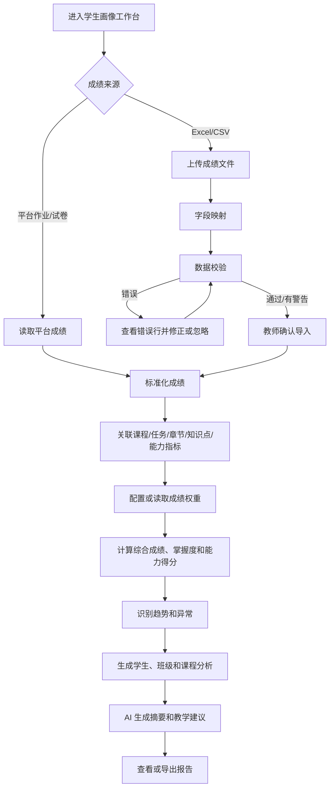
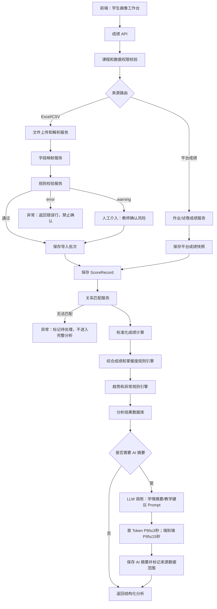

# 学生画像（成绩与学情分析）PRD

> 文档定位：本文件是“我的课程 > 学生画像”的唯一模块 PRD。页面、字段、交互、权限、状态、计算、AI、埋点和验收均以本文件为准；公共字段和通用规则引用 `requirements/shared/` 下文档。

## 1. 模块定位

学生画像模块用于保存课程作业和试卷成绩，导入教师已有 Excel/CSV 成绩，完成数据校验和任务关联，并基于章节、知识点、课程能力指标和综合成绩生成学生与班级分析。

本模块负责：

- 保存平台内部作业和试卷成绩
- 导入 Excel/CSV 成绩
- 成绩字段映射、预览和校验
- 成绩来源和导入批次管理
- 学生、班级、课程、任务、章节、知识点和能力指标关联
- 综合成绩计算
- 学生、班级、章节、知识点和能力指标分析
- 成绩趋势、异常和薄弱点识别
- AI 生成分析摘要和教学建议
- 分析结果查看和导出

本模块不负责：考勤数据、在线批改、成绩直接修改学生原始答卷、外部教务平台正式同步和教师代替学生录入成绩。

## 2. 已确认业务规则

1. 成绩数据必须绑定当前课程和课程版本，禁止跨课程引用。
2. 当前成绩来源包括平台作业、平台试卷、教师 Excel/CSV；考勤暂不纳入。
3. 外部成绩导入必须保留原文件、导入批次、字段映射、校验结果和确认记录。
4. 平台内部成绩优先使用；同一任务存在平台成绩和外部成绩时必须明确来源和取值规则。
5. 原始成绩不直接覆盖；修正成绩通过新批次或修订记录保存。
6. 综合成绩权重可配置，所有权重合计必须为 100%。
7. 章节、知识点和能力指标得分必须基于题目关联关系计算。
8. AI 只提供摘要、异常解释和教学建议，不直接修改成绩和计算规则。
9. 教师、教学秘书和查看者只能查看自己有权限的课程；查看者在授权课程内可查看全部成绩分析内容（包括学生、班级、章节、知识点、能力指标和异常明细），但不具备导入、修改、计算或导出权限。
10. 课程归档后允许查看和导出历史成绩及分析，禁止新导入、修改和重新计算正式结果。

## 3. 页面清单

| 编号 | 页面 | 路由建议 | 作用 |
|---|---|---|---|
| GA-01 | 学生画像工作台 | `/courses/{course_id}/grades` | 查看成绩概览、任务和分析入口 |
| GA-02 | 成绩导入 | `/courses/{course_id}/grades/import` | 上传 Excel/CSV 并开始导入 |
| GA-03 | 字段映射与校验 | `/courses/{course_id}/grades/import/{batch_id}` | 映射字段、查看错误和确认导入 |
| GA-04 | 成绩明细 | `/courses/{course_id}/grades/details` | 查看学生、任务和题目成绩 |
| GA-05 | 学生分析 | `/courses/{course_id}/grades/students/{student_id}` | 查看学生趋势、掌握度和建议 |
| GA-06 | 班级分析 | `/courses/{course_id}/grades/class` | 查看班级整体和分布 |
| GA-07 | 章节/知识点/能力分析 | `/courses/{course_id}/grades/analysis` | 查看教学内容和能力维度分析 |
| GA-08 | 分析报告导出 | `/courses/{course_id}/grades/report` | 配置并导出报告 |

补充页面：`GA-09 学生花名册`（`/courses/{course_id}/grades/students`），支持手动新增/编辑/停用学生、独立上传花名册和下载错误清单。第一版预留教务系统接口字段，但不实际调用外部接口。

花名册字段：`student_id`、`course_id`、`student_no`（可空）、`student_name`（必填）、`class_id`（可空）、`class_name`（可空）、`status`（`active`、`withdrawn`、`transferred`、`graduated`、`unknown`）、`source_type`（`manual`、`roster_import`、`grade_import`、`external_api_reserved`）。同一课程内有学号时以 `student_no` 唯一；无学号学生以系统生成 `student_id` 唯一。通过 `StudentEnrollment` 允许同一学生在同一课程多个班级，字段为 `student_id`、`class_id`、`effective_from`、`effective_to`、`is_current`。

弹窗：选择成绩来源、字段映射、重复数据处理、错误行处理、权重配置、异常详情、重新计算、导出设置。

### 3.1 页面通用交互

- 页面顶部固定显示课程名称、学期、课程版本和数据更新时间；切换课程必须重新校验课程成员权限。
- 列表默认按更新时间倒序，支持分页（默认 20 条，可选 50/100）、搜索、筛选、重置和导出当前筛选结果。
- 所有异步操作（导入、计算、AI 生成、导出）显示任务状态、进度、发起人和失败原因；用户可离开页面，完成后通过消息提醒。
- 危险操作（作废批次、忽略错误、重新计算覆盖分析快照）必须二次确认并记录审计日志。

### 3.2 弹窗与提示文案

| 场景 | 标题 | 确认按钮 | 必备提示/校验 |
|---|---|---|---|
| 作废导入批次 | 作废该导入批次？ | 确认作废 | 作废后不参与计算，原文件和审计记录仍保留。 |
| 忽略 warning | 忽略校验提醒？ | 确认忽略 | 需填写 1-500 字原因；忽略记录可追溯。 |
| 重新计算 | 重新计算成绩与分析？ | 开始计算 | 将生成新分析快照，不覆盖原始成绩；计算期间不可再次发起。 |
| 强制确认异常结构 | 仍要确认并继续？ | 强制确认 | 必须填写风险原因；结果标记“结构异常已强制确认”。 |
| AI 生成摘要 | 生成学情摘要？ | 生成 | 仅使用脱敏聚合数据，结果为 AI 草稿，需教师核阅。 |
| 导出隐私数据 | 导出含个人成绩的文件？ | 确认导出 | 仅课程负责人/教师可用，文件写入下载审计。 |

### 3.3 页面区块与交互要求

| 页面 | 必备区块 | 关键交互 |
|---|---|---|
| GA-01 工作台 | 指标卡、任务列表、待处理异常、分析入口 | 点击指标卡下钻；“待处理错误”直达批次错误页；无数据显示导入引导。 |
| GA-02 导入 | 来源选择、文件上传、任务信息、导入策略 | 分片上传显示百分比；文件校验通过后“下一步”进入映射；离开页面保留批次。 |
| GA-03 映射校验 | 原表头、系统字段、样例值、错误统计、错误行表格 | 支持拖拽/下拉映射；必填字段未映射不可继续；错误行可下载；warning 需勾选知悉。 |
| GA-04 明细 | 学生成绩表、来源/版本、修订记录、题目下钻 | 默认脱敏学号；按权限显示姓名；作废需填写原因；支持批量选择但二次确认。 |
| GA-05 学生分析 | 基本信息、任务趋势、维度掌握度、AI 摘要 | 点击趋势点查看任务明细；AI 结果可确认/编辑/驳回；数据不足显示原因。 |
| GA-06 班级分析 | 分布、趋势、维度排行、异常统计 | 班级多选；图表与表格联动；导出遵循当前筛选和脱敏规则。 |
| GA-07 维度分析 | 章节/知识点/能力切换、排行、来源下钻 | 切换维度不重新上传数据；点击维度查看题目和学生覆盖范围。 |
| GA-08 报告导出 | 报告范围、字段勾选、格式、隐私提示、历史任务 | 导出异步执行；重复条件复用最近配置；完成后消息提醒并提供下载期限。 |

## 4. GA-01 学生画像工作台

### 4.1 页面筛选字段

| 字段 | 类型 | 枚举/规则 |
|---|---|---|
| `student_keyword` | string | 0-100 字，匹配姓名或学号 |
| `class_name` | string | 0-100 字 |
| `task_type` | enum[] | `assignment` 作业、`exam` 试卷、`experiment` 实验、`project` 项目、`other` 其他 |
| `score_source` | enum[] | `platform_assignment`、`platform_exam`、`excel_import`、`csv_import`、`future_external_api` |
| `score_status` | enum[] | `raw`、`validated`、`confirmed`、`revised`、`voided` |
| `term_label` | string | 当前课程学期 |
| `date_from` | date/null | 成绩日期开始 |
| `date_to` | date/null | 成绩日期结束 |
| `analysis_dimension` | enum | `student`、`class`、`chapter`、`knowledge_point`、`ability` |

`term_label` 展示格式固定为“YYYY + 空格 + 学期名称”，例如 `2026 春季`；学期名称枚举沿用公共字典：`spring` 春季、`summer` 夏季、`autumn` 秋季、`winter` 冬季。课程学年必须为四位数字，禁止自由输入其他格式。

### 4.2 概览字段

| 字段 | 类型 | 说明 |
|---|---|---|
| `course_id` | UUID | 当前课程 |
| `course_version_id` | UUID | 当前课程版本 |
| `student_count` | integer | 学生数 |
| `class_count` | integer | 班级数 |
| `task_count` | integer | 有成绩任务数 |
| `score_record_count` | integer | 成绩记录数 |
| `import_batch_count` | integer | 导入批次数 |
| `average_score` | decimal(6,2) | 平均分 |
| `highest_score` | decimal(6,2) | 最高分 |
| `lowest_score` | decimal(6,2) | 最低分 |
| `pass_rate` | decimal(5,4) | 及格率 |
| `completion_rate` | decimal(5,4) | 有成绩学生比例 |
| `pending_error_count` | integer | 待处理错误数 |
| `last_import_at` | datetime/null | 最近导入时间 |
| `last_calculated_at` | datetime/null | 最近计算时间 |
| `analysis_status` | enum | `not_ready`、`calculating`、`ready`、`partial`、`error` |

### 4.3 操作

- 导入成绩
- 查看成绩明细
- 配置综合成绩
- 重新计算
- 查看学生分析
- 查看班级分析
- 查看章节/知识点/能力分析
- 导出报告

## 5. GA-02 成绩导入

### 5.1 导入来源

| 编码 | 名称 | 说明 |
|---|---|---|
| `platform_assignment` | 平台作业 | 系统内部生成 |
| `platform_exam` | 平台试卷 | 系统内部生成 |
| `excel_import` | Excel 导入 | `.xlsx` |
| `csv_import` | CSV 导入 | `.csv` |
| `future_external_api` | 外部接口 | 预留，不在当前版本启用 |

### 5.2 导入字段

| 字段 | 类型 | 必填 | 枚举/规则 |
|---|---|---:|---|
| `import_batch_id` | UUID | 是 | 导入批次 |
| `course_id` | UUID | 是 | 当前课程 |
| `course_version_id` | UUID | 是 | 当前课程版本 |
| `file_id` | UUID | 是 | 原始文件 |
| `source_type` | enum | 是 | `excel_import`、`csv_import` |
| `score_task_type` | enum | 是 | `assignment`、`exam`、`experiment`、`project`、`other` |
| `task_id` | UUID/null | 否 | 已有作业或试卷 |
| `task_name` | string(200) | 是 | 外部任务名称 |
| `score_date` | date | 否 | 成绩日期 |
| `class_name` | string(100) | 否 | 班级 |
| `import_mode` | enum | 是 | `new_batch` 新批次、`replace_same_batch` 替换未确认批次、`append` 追加 |
| `duplicate_policy` | enum | 是 | `reject` 拒绝、`keep_latest` 保留最新、`keep_highest` 保留最高、`keep_all_mark_review` 全部保留待确认 |
| `missing_score_policy` | enum | 是 | `empty` 空值、`zero` 记 0、`absent` 缺考、`not_submitted` 未提交 |
| `remark` | string(500) | 否 | 备注 |

### 5.3 文件要求

- Excel 支持一个或多个工作表。
- CSV 支持 UTF-8，其他编码需要在页面选择编码。
- 成绩导入/学生花名册单文件默认上限 200MB；主教材上限遵循公共平台规范 500MB。
- 文件必须至少包含一行表头和一行数据。
- 原文件保存到当前课程资料库或成绩导入专用存储，不建立跨课程引用。

## 6. GA-03 字段映射与校验

### 6.1 系统字段

| 字段编码 | 名称 | 必填 |
|---|---|---:|
| `student_no` | 学号 | 是 |
| `student_name` | 姓名 | 是 |
| `class_name` | 班级 | 否 |
| `task_name` | 任务名称 | 是 |
| `score` | 成绩 | 是 |
| `full_score` | 满分 | 是 |
| `score_date` | 成绩日期 | 否 |
| `remark` | 备注 | 否 |

### 6.2 映射字段

| 字段 | 类型 | 必填 | 说明 |
|---|---|---:|---|
| `mapping_id` | UUID | 是 | 映射记录 |
| `import_batch_id` | UUID | 是 | 导入批次 |
| `source_column_name` | string(200) | 是 | 原表头 |
| `target_field` | enum | 是 | 系统字段编码 |
| `mapping_status` | enum | 是 | `mapped`、`unmapped`、`conflict` |
| `sample_value` | string(500) | 否 | 示例值 |
| `mapping_message` | string(500) | 否 | 映射提示 |

### 6.3 校验项

| 编码 | 内容 | 等级 |
|---|---|---|
| `GA001` | 缺少学号列 | error |
| `GA002` | 缺少姓名列 | error |
| `GA003` | 缺少成绩列 | error |
| `GA004` | 缺少满分列 | error |
| `GA005` | 学号为空 | error |
| `GA006` | 姓名为空 | error |
| `GA007` | 成绩不是数字 | error |
| `GA008` | 成绩小于 0 | error |
| `GA009` | 成绩大于满分 | error |
| `GA010` | 满分小于等于 0 | error |
| `GA011` | 学号不存在于当前课程 | warning |
| `GA012` | 姓名与学号不匹配 | error |
| `GA013` | 同一学生任务重复 | warning |
| `GA014` | 任务名称无法匹配 | warning |
| `GA015` | 课程版本不一致 | error |
| `GA016` | 成绩日期超出学期范围 | warning |
| `GA017` | 缺考/未提交标记异常 | warning |
| `GA018` | 文件编码无法识别 | error |
| `GA019` | 表头重复 | error |
| `GA020` | 空数据行 | info |

### 6.4 错误行字段

`error_row_id`、`import_batch_id`、`row_number`、`error_code`、`severity`、`field_name`、`raw_value`、`message`、`resolution_status`(`open`/`ignored`/`fixed`)、`resolution_note`。

### 6.5 确认导入

- error 未处理时不能确认导入。
- warning 可以确认，但必须勾选“已知悉风险”。
- 确认后写入 ScoreRecord，不再修改原始文件。
- 导入完成后触发成绩计算任务。

## 7. GA-04 成绩明细

### 7.1 Student 字段

`student_id`、`student_no`、`student_name`、`class_id`、`class_name`、`course_id`、`student_status`(`active`、`withdrawn`、`transferred`、`unknown`)。

### 7.2 ScoreRecord 字段

| 字段 | 类型 | 必填 | 说明 |
|---|---|---:|---|
| `score_record_id` | UUID | 是 | 成绩记录 |
| `student_id` | UUID | 是 | 学生 |
| `course_id` | UUID | 是 | 课程 |
| `course_version_id` | UUID | 是 | 课程版本 |
| `task_type` | enum | 是 | `assignment`、`exam`、`experiment`、`project`、`other` |
| `task_id` | UUID/null | 否 | 平台任务 |
| `task_name` | string(200) | 是 | 任务名称快照 |
| `question_id` | UUID/null | 否 | 题目成绩，可为空 |
| `score` | decimal(8,2) | 是 | 原始得分 |
| `full_score` | decimal(8,2) | 是 | 满分 |
| `normalized_score` | decimal(5,4) | 是 | 0-1 |
| `score_status` | enum | 是 | `raw`、`validated`、`confirmed`、`revised`、`voided` |
| `score_source` | enum | 是 | 成绩来源 |
| `import_batch_id` | UUID/null | 否 | 导入批次 |
| `chapter_id` | UUID/null | 否 | 章节 |
| `knowledge_point_ids` | UUID[] | 否 | 知识点 |
| `ability_indicator_ids` | UUID[] | 否 | 能力指标 |
| `score_date` | date/null | 否 | 成绩日期 |
| `remark` | string(500) | 否 | 备注 |
| `recorded_at` | datetime | 是 | 记录时间 |
| `recorded_by` | UUID | 是 | 记录人 |

### 7.3 明细操作

- 按学生、班级、任务和来源筛选。
- 查看原始成绩和标准化成绩。
- 查看导入批次和来源文件。
- 查看章节、知识点和能力指标关联。
- 查看修订记录。
- 作废错误批次或错误记录。

原始成绩只能通过修订记录更正，不能无审计直接覆盖。

## 8. 成绩计算

### 8.1 标准化成绩

```text
标准化成绩 = 原始得分 ÷ 满分
```

当满分小于等于 0 时，记录无效并不能进入计算。

### 8.2 任务成绩

```text
任务成绩 = 该任务有效题目得分之和 ÷ 该任务有效题目满分之和 × 100
```

如果没有题目级成绩，则使用任务导入的总分和满分。

### 8.3 综合成绩配置

| 字段 | 类型 | 必填 | 规则 |
|---|---|---:|---|
| `weight_config_id` | UUID | 是 | 配置标识 |
| `course_id` | UUID | 是 | 课程 |
| `course_version_id` | UUID | 是 | 课程版本 |
| `task_type` | enum | 是 | `assignment`、`exam`、`experiment`、`project`、`other` |
| `task_id` | UUID/null | 否 | 具体任务，空值表示该类任务 |
| `weight` | decimal(5,4) | 是 | 0-1 |
| `missing_policy` | enum | 是 | `exclude` 排除、`zero` 记 0、`manual` 人工处理 |
| `effective_from` | date | 是 | 生效日期 |
| `effective_to` | date/null | 否 | 失效日期 |
| `created_by` | UUID | 是 |  |
| `created_at` | datetime | 是 |  |

约束：当前课程版本有效配置的权重合计必须为 1。

```text
综合成绩 = Σ（任务成绩 × 任务权重）
```

### 8.4 章节掌握度

```text
章节掌握度 = 该章节关联题目得分之和 ÷ 该章节关联题目满分之和
```

没有题目级关联时，使用任务与章节的直接关联；没有任何关联时显示“暂无数据”。

### 8.5 知识点掌握度

```text
知识点掌握度 = 该知识点关联题目得分之和 ÷ 该知识点关联题目满分之和
```

### 8.6 能力指标得分

```text
能力指标得分 = 关联该能力指标的题目得分之和 ÷ 关联题目满分之和
```

### 8.7 趋势

按成绩日期排序，至少需要两次有效成绩才能计算趋势：

- `rising` 上升：最近成绩 - 前次成绩 ≥ 5 分
- `stable` 平稳：差值绝对值 < 5 分
- `falling` 下降：最近成绩 - 前次成绩 ≤ -5 分
- `insufficient_data` 数据不足：有效成绩少于 2 次

阈值由系统常量配置，不允许在前端写死多个版本。

## 9. GA-05 学生分析

### 9.1 页面字段

`student_no`、`student_name`、`class_name`、`course_name`、`term_label`、`composite_score`、`score_rank`、`score_trend`、`task_average`、`chapter_mastery`、`knowledge_mastery`、`ability_scores`、`weak_points`、`last_score_date`、`data_completeness`。

### 9.2 分析内容

- 综合成绩
- 各任务成绩
- 成绩趋势
- 章节掌握度
- 知识点薄弱项
- 能力指标得分
- 与班级平均分差异
- 需要关注的异常
- AI 学习情况摘要

## 10. GA-06 班级分析

### 10.1 页面字段

`class_name`、`student_count`、`valid_score_count`、`average_score`、`median_score`、`highest_score`、`lowest_score`、`standard_deviation`、`pass_rate`、`score_distribution`、`trend_distribution`、`chapter_mastery`、`knowledge_mastery`、`ability_scores`、`outlier_count`、`data_completeness`。

### 10.2 图表

- 成绩分布柱状图
- 任务平均分趋势
- 章节掌握度排行
- 知识点薄弱度排行
- 能力指标雷达或条形图
- 上升/平稳/下降人数分布

图表必须提供数据表格和具体数值，不能只展示视觉图形。

## 11. GA-07 章节/知识点/能力分析

### 11.1 维度字段

| 字段 | 类型 | 说明 |
|---|---|---|
| `dimension_type` | enum | `chapter`、`knowledge_point`、`ability_indicator` |
| `dimension_id` | UUID | 维度对象 |
| `dimension_name` | string | 名称 |
| `score` | decimal(5,4) | 0-1 |
| `score_percent` | decimal(5,2) | 0-100 |
| `sample_count` | integer | 有效题目或成绩数量 |
| `student_count` | integer | 有效学生数量 |
| `mastery_level` | enum | `strong`、`normal`、`weak`、`insufficient_data` |
| `source_task_ids` | UUID[] | 来源任务 |
| `calculated_at` | datetime | 计算时间 |

### 11.2 掌握度分级

- `strong`：≥ 0.80
- `normal`：0.60-0.7999
- `weak`：< 0.60
- `insufficient_data`：样本数低于配置最小值，默认 3 条有效题目或 3 名有效学生

## 12. 异常识别

### 12.1 规则异常

- 成绩大于满分或小于 0
- 同一学生同一任务重复成绩
- 短时间内成绩异常跳变
- 班级成绩极端偏离
- 章节或知识点样本不足
- 成绩来源和课程不匹配

### 12.2 Anomaly 字段

`anomaly_id`、`course_id`、`student_id`、`task_id`、`dimension_type`、`dimension_id`、`anomaly_type`(`score_out_of_range`、`duplicate`、`sudden_change`、`class_outlier`、`insufficient_data`、`source_mismatch`)、`severity`(`info`/`warning`/`error`)、`message`、`evidence_json`、`status`(`open`/`ignored`/`resolved`)、`created_at`。

## 13. GA-08 分析报告导出

### 13.1 导出字段

`report_type`、`dimension`、`class_ids`、`student_ids`、`task_ids`、`include_raw_scores`、`include_composite_scores`、`include_chapter_analysis`、`include_knowledge_analysis`、`include_ability_analysis`、`include_ai_summary`、`include_anomalies`、`export_format`、`report_title`。

### 13.2 枚举

- `report_type`：`student`、`class`、`course`
- `dimension`：`student`、`class`、`chapter`、`knowledge_point`、`ability_indicator`
- `export_format`：`xlsx`、`docx`、`pdf`

学生个人报告必须遵循课程权限；不允许导出无权限学生数据。

## 14. 状态机

### 导入批次

```text
queued → processing → mapped → validating → failed/partial_success → confirmed → voided

补充状态：`cancelled`（用户取消且未写入成绩）、`timeout`（处理超时可重试）。`voided` 为终态；已确认批次不可回退到 processing。
```

### 分析任务

```text
not_ready → calculating → ready → partial → error
```

## 15. 业务流程图



## 16. 系统流程图



## 17. 技术开发要点

### 17.1 传统技术优先

- 文件上传、解析和字段映射
- 姓名、学号和课程匹配
- 成绩范围、重复和日期校验
- 标准化成绩和综合成绩计算
- 章节、知识点和能力指标聚合
- 趋势、分级和异常规则
- 权限、脱敏和导出

### 17.2 大模型介入

- 学情摘要
- 班级薄弱点解释
- 能力指标表现解释
- 基于结构化分析结果生成教学调整建议

大模型不得直接读取未脱敏的完整学生身份信息，不得修改成绩或计算结果。

### 17.3 性能目标

- 成绩明细查询 P95 ≤ 2 秒。
- 规则校验 10,000 行成绩 P95 ≤ 10 秒；更大批次异步处理。
- 成绩计算任务 10,000 条记录 P95 ≤ 15 秒。
- 分析页面查询 P95 ≤ 3 秒。
- AI 摘要首 Token P95 ≤ 3 秒，端到端 P95 ≤ 15 秒。
- 初始目标：100 个同时在线用户、1000 个异步导入/计算任务排队、10 个并行 AI 请求；单用户最多 5 个 AI 任务，超出后排队。

## 18. 完整 Prompt

### 18.1 学生学情摘要 Prompt

```text
System：
你是高校课程学情分析助手。请根据系统提供的结构化成绩指标，生成面向教师的学生学习情况摘要。

规则：
1. 只能使用输入的统计结果，不能自行修改成绩或重新计算。
2. 不得使用学生真实姓名、学号等不必要的身份信息；使用 student_id 和脱敏标签即可。
3. 必须区分事实、推测和建议。
4. 没有足够样本时必须说明数据不足。
5. 不得给学生贴固定能力标签，不得输出歧视性或诊断性结论。
6. 建议必须对应章节、知识点或能力指标证据。
7. 只输出合法 JSON，不输出 Markdown。

User：
课程：{{course_name}}
课程版本：{{course_version_id}}
学生脱敏标识：{{student_alias}}
综合成绩：{{composite_score}}
任务成绩：{{task_scores}}
成绩趋势：{{score_trend}}
章节掌握度：{{chapter_mastery}}
知识点掌握度：{{knowledge_mastery}}
能力指标得分：{{ability_scores}}
异常记录：{{anomalies}}
数据完整性：{{data_completeness}}

请输出学生表现摘要、优势、需要关注的章节/知识点、可能原因、教学建议和数据限制。

JSON：
{
  "summary":"",
  "strengths":[{"dimension_type":"chapter", "dimension_id":"", "description":"", "evidence":{}}],
  "focus_points":[{"dimension_type":"knowledge_point", "dimension_id":"", "description":"", "evidence":{}}],
  "possible_reasons":[],
  "teaching_suggestions":[{"action":"", "target_dimension_ids":[], "reason":""}],
  "data_limitations":[],
  "needs_teacher_confirmation":true,
  "warnings":[]
}
```

### 18.2 班级学情与教学建议 Prompt

```text
System：
你是高校班级学情分析助手。请根据当前课程的班级统计数据、章节掌握度、知识点掌握度、能力指标得分、成绩趋势和异常统计，生成教师可执行的教学调整建议。

规则：
1. 只能使用输入的聚合数据，不得重新计算或编造数据。
2. 不输出学生姓名、学号等个人身份信息。
3. 样本数不足时必须标记 insufficient_data。
4. 建议必须与具体章节、知识点或能力指标关联。
5. 不得将相关性直接表述为因果关系。
6. 不得替教师决定成绩处理或课程考核政策。
7. 只输出合法 JSON。

User：
课程信息：{{course_info}}
班级统计：{{class_statistics}}
任务趋势：{{task_trends}}
章节掌握度：{{chapter_mastery}}
知识点掌握度：{{knowledge_mastery}}
能力指标得分：{{ability_scores}}
异常统计：{{anomaly_statistics}}
数据完整性：{{data_completeness}}

请输出班级概况、主要薄弱点、可能的教学关注方向、建议的复习/练习/答疑动作、优先级和数据限制。

JSON：
{
  "overview":"",
  "weak_dimensions":[{
    "dimension_type":"chapter",
    "dimension_id":"",
    "name":"",
    "score":0.0,
    "sample_count":0,
    "description":""
  }],
  "teaching_actions":[{
    "priority":"high",
    "action_type":"review",
    "description":"",
    "target_dimension_ids":[],
    "evidence":{}
  }],
  "data_limitations":[],
  "needs_teacher_confirmation":true,
  "warnings":[]
}
```

### 18.3 异常解释 Prompt

```text
System：
你是课程成绩异常解释助手。请解释系统规则已经识别出的成绩异常，不要自行增加新的异常，也不要修改原始成绩。

规则：
1. 只能依据提供的异常类型、证据和统计数据解释。
2. 不得断言作弊、能力缺陷或个人原因。
3. 使用“可能”“需要核实”等谨慎表达。
4. 给出教师可执行的核查动作。
5. 只输出合法 JSON。

User：
课程：{{course_info}}
异常类型：{{anomaly_type}}
异常对象：{{anomaly_target}}
异常证据：{{evidence_json}}
相关任务统计：{{task_statistics}}
相关章节/知识点：{{related_dimensions}}

请输出异常说明、可能解释、需要核查的数据、建议动作和数据限制。

JSON：
{
  "description":"",
  "possible_explanations":[],
  "verification_actions":[],
  "related_dimensions":[],
  "data_limitations":[],
  "needs_teacher_confirmation":true,
  "warnings":[]
}
```

## 19. 埋点与验收标准

### 19.1 埋点

`grade_dashboard_view`、`grade_import_start`、`grade_file_upload_success`、`grade_file_upload_fail`、`grade_mapping_open`、`grade_mapping_save`、`grade_validation_start`、`grade_validation_complete`、`grade_error_view`、`grade_error_resolve`、`grade_import_confirm`、`grade_import_void`、`grade_detail_view`、`grade_weight_config_open`、`grade_weight_config_save`、`grade_recalculate_start`、`grade_recalculate_complete`、`student_analysis_view`、`class_analysis_view`、`dimension_analysis_view`、`ai_summary_generate`、`ai_summary_view`、`ai_suggestion_accept`、`grade_report_export`。

### 19.2 验收标准

- 支持平台作业、平台试卷和 Excel/CSV 成绩来源。
- 成绩导入包含字段映射、预览、错误行、警告和确认。
- 原始文件、导入批次、字段映射和校验结果可追溯。
- 成绩必须绑定当前课程和课程版本。
- 支持学号、姓名、班级、任务、成绩和满分字段。
- 支持重复、缺考、未提交和错误成绩处理策略。
- 综合成绩权重可配置且合计必须为 100%。
- 支持章节、知识点和课程能力指标分析。
- 支持学生、班级和课程维度趋势分析。
- 规则引擎能识别成绩范围、重复、突变、样本不足和来源异常。
- AI 只能生成摘要、异常解释和教学建议，不修改成绩和计算结果。
- 学生隐私数据按课程权限隔离，发送给模型前必须脱敏。
- 课程归档后历史成绩和分析可查看、导出，写操作被拦截。

## 20. 数据关系与唯一性约束

```text
Course 1──N CourseVersion 1──N ScoreRecord
Course 1──N CourseMember
CourseVersion 1──N ScoreTask 1──N ScoreRecord
ScoreRecord N──1 Student
ScoreRecord N──N StructureNode(章节/知识点/能力指标)
ImportBatch 1──N ImportMapping 1──N ImportErrorRow
ScoreRecord 1──N ScoreRevision
AnalysisSnapshot 1──N AnalysisMetric
AnalysisSnapshot 1──N Anomaly
```

- `ScoreRecord` 唯一键：`course_version_id + student_id + task_id + question_id + score_source + active_revision`；外部导入无 `task_id` 时使用 `task_name_snapshot + score_date` 参与去重。
- 同一学生同一任务允许保留多个来源，但只能有一个 `is_counted=true` 的有效记录；来源取值按教师在导入确认时的选择固化。
- 删除采用逻辑作废，不物理删除原始成绩、文件、批次、分析快照和 AI 结果。
- 分析结果必须带 `snapshot_id`、计算规则版本、数据截止时间；重新计算生成新快照，历史快照只读。

## 21. 权限矩阵

| 操作 | 课程负责人 | 任课教师 | 教学秘书 | 查看者 | 管理员 |
|---|---:|---:|---:|---:|---:|
| 查看成绩与分析 | ✓ | ✓ | ✓ | 按授权 | ✓ |
| 导入 Excel/CSV | ✓ | ✓ | ✗ | ✗ | ✓ |
| 修改字段映射、处理错误 | ✓ | ✓ | ✗ | ✗ | ✓ |
| 配置综合成绩权重 | ✓ | ✓ | ✗ | ✗ | ✓ |
| 作废批次/修订成绩 | ✓ | 需课程授权 | ✗ | ✗ | ✓ |
| 生成 AI 摘要 | ✓ | ✓ | ✓ | ✗ | ✓ |
| 导出含个人成绩报告 | ✓ | ✓ | ✗ | ✗ | ✓ |
| 查看全部班级及学情分析 | ✓ | ✓ | ✓ | ✓ | ✓ |
| 归档后写操作 | ✗ | ✗ | ✗ | ✗ | 仅系统维护 |

教学秘书可以查看所负责课程的学生个人成绩，并处理与其职责相关的审核事项，但不得修改教师导入文件、成绩记录或计算权重。课程负责人、任课教师和管理员均可导出带姓名/学号的成绩文件；查看者在授权课程内可查看全部分析内容，但不能导出或执行写操作。学生端不开放本模块页面。

## 22. 边界、异常与恢复策略

- 成绩导入或学生花名册文件超过 200MB、格式不支持或病毒扫描失败：阻止进入解析，提示“文件无法使用，请检查格式或大小”。
- 解析/校验任务超过 10 分钟：状态置为 `timeout`，保留已解析结果，允许重试，不重复写入有效成绩。
- 同一批次重复提交：按文件哈希拦截并提示“已存在相同文件，可查看原批次”。
- 学号不存在：默认 warning；确认导入后记录为 `unmatched_student`，该行不进入学生维度分析，仍可在明细中追溯。
- 题目未关联章节/知识点：任务总分可计算，内容维度显示“暂无数据”，不得用总体成绩推断章节掌握度。
- 权重缺失或合计不等于 100%：禁止保存和计算，提示当前合计值及差额。
- AI 服务超时/限流/返回非法 JSON：保留结构化分析，AI 状态为 `failed`，支持重试；不得阻塞成绩计算和页面查看。

## 23. AI 输出数据结构与来源标记

AI 结果实体 `AIAnalysisResult` 必须包含：`result_id`、`course_id`、`course_version_id`、`snapshot_id`、`result_type`（`student_summary`/`class_summary`/`anomaly_explanation`）、`input_hash`、`model_id`、`prompt_template`、`output_json`、`source_dimension_ids`、`source_metric_ids`、`generated_at`、`status`（`draft`/`confirmed`/`dismissed`/`failed`）、`confirmed_by`、`confirmed_at`、`failure_code`。

页面展示 AI 文案时必须同时展示“数据截止时间、样本数、来源维度、生成模型、生成时间”和“AI 草稿”标签；教师可确认、编辑或驳回，编辑内容与原始输出并存。

## 24. 技术验收补充

- 10,000 行导入在规则校验完成后，错误行可按行号、错误码和严重级别筛选，并可下载错误清单。
- 任一分析数值均可下钻至学生/任务/题目来源；下钻结果与当前 `snapshot_id` 一致。
- 同一输入快照重复计算得到相同结果（浮点误差不超过 0.01 分）。
- 课程、课程版本和权限任一不匹配时，API 返回 403/404，不泄露其他课程学生信息。
- 归档课程访问历史页面返回只读标识；所有写接口返回明确错误码 `COURSE_ARCHIVED_READONLY`。
- AI 端到端 P95 ≤ 15 秒、首 Token P95 ≤ 3 秒；并发超过 20 个请求时进入队列，前端显示排队位置，不丢失任务。

## 25. 当前页面与交互规范（2026-09-04）

- 页面标题区保持紧凑两行，课程上下文、学情范围和数据更新时间并列展示。
- 课程内导航显示名称为“学生画像”，页面内部可继续使用“成绩与学情分析”作为说明性副标题；左侧导航不放课程信息，课程上下文和切换控件位于右侧内容区顶部。
- 页面优先展示学生/班级画像卡片、章节与能力矩阵、成绩趋势、异常和证据表格；所有图表必须同时提供可读数据表格。
- 成绩导入、字段映射、warning 确认、学生详情、AI 学情摘要、保存/编辑/驳回和导出设置均使用居中模态窗口，不使用侧边抽屉；遮罩不可关闭，背景锁定滚动，关闭按钮在右上角，底部操作固定。
- AI 学情摘要只能接收脱敏后的聚合数据（样本数、均值、分布、章节/能力指标统计、异常计数），不得发送姓名、学号或可识别个人信息。结果显示数据截止时间、样本数、来源维度、证据和数据限制。
- AI 结果状态为草稿、已确认、已编辑、已驳回、失败；教师可以保存、编辑或驳回，编辑内容与原始输出并存。超时、限流、非法 JSON 或数据不足时保留结构化成绩结果并提供重试/切换备用模型。
- 权限：课程负责人、任课教师和管理员可导出带姓名/学号成绩；教学秘书可查看所负责课程个人成绩但不能修改教师资料；查看者可查看成绩和学情分析但不能导出或写入。课程归档后只读，可查看、对比和导出。
