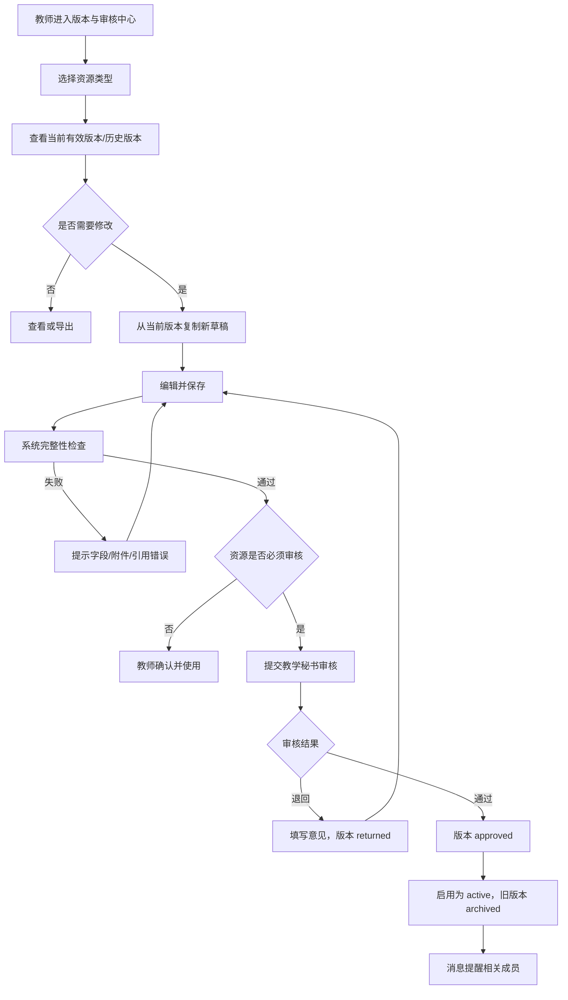
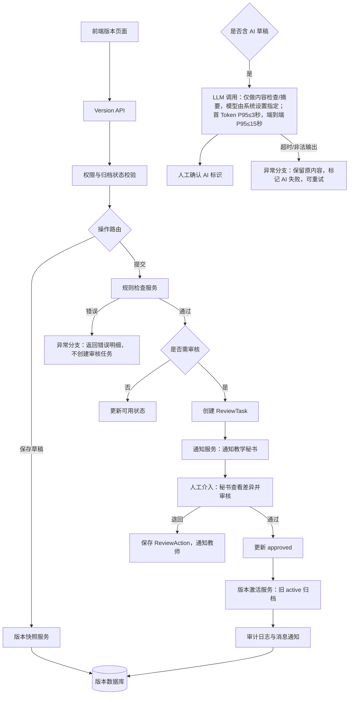

# 版本与审核统一中心 PRD

> 文档定位：统一管理课程大纲、教学日历、章节备课、课件、作业、试卷及分析报告的版本、提交、审核、退回、启用和归档。页面、字段、状态、权限和流程均在本文件定义；通用角色与状态遵循 `requirements/shared/permission-status.md`。

## 1. 模块定位与范围

本模块解决“内容改了什么、当前哪个版本有效、是否需要审核、谁审核、为什么退回”的问题。

纳入对象：`syllabus` 教学大纲、`calendar` 教学日历、`preparation` 章节备课、`courseware` 课件、`assignment` 作业、`exam` 试卷、`analysis_report` 分析报告。

规则：教学日历必须由教学秘书审核后才能标记为有效；正式试卷遵循试卷模块审核规则；课件和作业不强制审核；AI 生成内容默认草稿；课程归档后所有对象只读。

## 2. 页面清单

| 编号 | 页面 | 路由建议 | 作用 |
|---|---|---|---|
| VR-01 | 版本与审核工作台 | `/courses/{course_id}/versions` | 查看各对象当前版本、待办和状态 |
| VR-02 | 版本列表与详情 | `/courses/{course_id}/versions/{resource_type}` | 查看某类资源的全部版本及差异 |
| VR-03 | 版本编辑/提交 | `/courses/{course_id}/versions/{resource_type}/{version_id}` | 编辑草稿、提交审核、撤回提交 |
| VR-04 | 审核处理页 | `/courses/{course_id}/reviews/{review_id}` | 教学秘书审核、退回、通过 |
| VR-05 | 版本差异与历史 | `/courses/{course_id}/versions/{resource_type}/{version_id}/diff` | 对比两个版本并查看操作记录 |

### 2.1 工作台区块

- 状态统计卡：草稿、待审核、已退回、已通过、当前有效、已归档数量。
- 审核待办：待本人处理的审核任务，按截止时间和提交时间排序。
- 最近变更：版本号、变更人、变更时间、变更摘要。
- 对象筛选：资源类型、状态、创建人、提交人、时间范围。

### 2.2 通用交互与文案

| 场景 | 弹窗/提示 | 规则 |
|---|---|---|
| 提交审核 | “提交后将进入教学秘书审核，提交人仍可查看但不能直接编辑。确定提交吗？” | 必须填写变更摘要 1-500 字。 |
| 撤回审核 | “撤回后审核任务将关闭，内容回到编辑状态。” | 仅提交人或课程负责人可撤回，审核已处理后不可撤回。 |
| 退回 | “请填写退回原因。” | 原因必填 1-1000 字，退回后生成待修订状态。 |
| 通过 | “通过后该版本将成为当前有效版本，是否确认？” | 教学日历通过时自动停用同类旧有效版本。 |
| 发布/启用 | “启用后教师端将使用此版本内容。” | 仅课程负责人或审核通过的指定角色可操作。 |
| 归档版本 | “归档后不可编辑，但历史内容仍可查看和导出。” | 需二次确认并写入审计日志。 |
| 删除草稿 | “删除后无法恢复，确认删除？” | 仅未提交审核的草稿可删除；正式版本不可删除。 |

## 3. 核心数据模型

### 3.1 VersionResource

| 字段 | 类型 | 必填 | 规则 |
|---|---|---:|---|
| `resource_id` | UUID | 是 | 业务对象标识 |
| `resource_type` | enum | 是 | `syllabus`、`calendar`、`preparation`、`courseware`、`assignment`、`exam`、`analysis_report` |
| `course_id` | UUID | 是 | 不允许跨课程 |
| `course_version_id` | UUID | 是 | 所属课程版本 |
| `title` | string(200) | 是 | 资源标题 |
| `current_version_id` | UUID/null | 否 | 当前有效版本 |
| `owner_id` | UUID | 是 | 资源负责人 |
| `is_archived` | boolean | 是 | 默认 false |

### 3.2 ResourceVersion

| 字段 | 类型 | 必填 | 规则 |
|---|---|---:|---|
| `version_id` | UUID | 是 | 版本标识 |
| `resource_id` | UUID | 是 | 所属对象 |
| `version_no` | string(20) | 是 | `v主版本.次版本`，如 `v1.0`、`v1.1` |
| `version_type` | enum | 是 | `major` 主版本、`minor` 次版本 |
| `content_snapshot` | JSON | 是 | 完整内容快照，不保存差异片段替代全文 |
| `content_hash` | string(128) | 是 | 内容完整性校验 |
| `status` | enum | 是 | `draft`、`editing`、`checking`、`pending_review`、`reviewing`、`returned`、`resubmitted`、`approved`、`active`、`archived`、`rejected`、`voided` |
| `change_summary` | string(500) | 是 | 本版本变更说明 |
| `created_by` | UUID | 是 | 创建人 |
| `submitted_by` | UUID/null | 否 | 提交人 |
| `submitted_at` | datetime/null | 否 | 提交时间 |
| `approved_by` | UUID/null | 否 | 审核人 |
| `approved_at` | datetime/null | 否 | 审核时间 |
| `activated_by` | UUID/null | 否 | 启用人 |
| `activated_at` | datetime/null | 否 | 启用时间 |
| `archived_by` | UUID/null | 否 | 归档人 |
| `archived_at` | datetime/null | 否 | 归档时间 |
| `source_version_id` | UUID/null | 否 | 复制/修订来源版本 |
| `ai_generated` | boolean | 是 | 是否含 AI 生成内容 |
| `ai_confirmation_status` | enum | 否 | `not_applicable`、`unconfirmed`、`confirmed`、`edited` |

### 3.3 ReviewTask 与 ReviewAction

`ReviewTask` 字段：`review_id`、`course_id`、`resource_type`、`resource_id`、`version_id`、`reviewer_ids`、`status`（`pending`/`in_review`/`returned`/`approved`/`cancelled`/`overdue`）、`due_at`、`due_date_type`（`business_day`/`calendar_day`）、`submitted_by`、`submitted_at`、`completed_by`、`completed_at`、`latest_comment`、`transferred_from`、`transferred_to`。

`ReviewAction` 字段：`action_id`、`review_id`、`action`（`submit`/`comment`/`return`/`approve`/`withdraw`/`transfer`/`activate`/`archive`）、`operator_id`、`comment`、`created_at`、`before_status`、`after_status`。

唯一性：同一版本同时只能存在一个有效审核任务；审核记录和意见不可删除。

## 4. 版本规则

1. 正式版本不可覆盖，任何修改都从当前有效版本复制生成新草稿。
2. 次版本用于内容修订（`v1.1`），结构、教学目标或教学体系相对来源版本偏离达到 40% 及以上时使用主版本（`v2.0`）；偏离比例由系统按结构化差异计算并允许教师确认。
3. 同一资源同一时间只能有一个 `active` 版本；启用新版本自动将旧版本转为 `archived`。
4. 版本号由服务端生成，客户端不可自定义已存在版本号；教师可手动填写版本说明。
5. 版本差异支持字段级、章节级和附件级对比；二进制文件显示文件哈希、大小和预览链接。
6. 课程归档后允许查看、对比、导出历史版本，禁止编辑、提交、审核、启用、归档和删除。

## 5. 审核规则

| 资源类型 | 是否必须审核 | 审核人 | 通过后的动作 |
|---|---:|---|---|
| 教学大纲 | 是 | 教学秘书 | 可标记当前有效 |
| 教学日历 | 是 | 教学秘书 | 自动启用，旧版本归档 |
| 章节备课 | 否 | 无 | 教师确认后即可使用 |
| 课件 | 否 | 无 | 教师保存即为可用草稿/成稿 |
| 作业 | 否 | 无 | 教师发布规则另见作业模块 |
| 试卷 | 按试卷模块 | 教学秘书（正式试卷） | 审核通过后可发布 |
| 学情分析报告 | 否 | 无 | AI 草稿需教师确认 |

审核前系统自动检查：必填字段、附件可访问性、课程/版本归属、引用资料归属、AI 内容确认状态（适用时）、教学日历周次连续性。检查失败进入 `checking`/`returned`，不创建审核任务。

审核默认截止时间为提交后 3 个工作日；提交人可设置自定义截止日期（不得早于提交时间）。逾期进入 `overdue`，教学日历和正式试卷/正式内容禁止启用，系统向审核人、提交人和课程负责人发送高优先级消息。审核人可直接处理，无需领取；评论支持多人追加，只有最终执行通过/退回动作的人员写入 `completed_by`。课程负责人可将未完成任务转派给其他教学秘书。

## 6. 权限矩阵

| 操作 | 课程负责人 | 任课教师 | 教学秘书 | 查看者 | 管理员 |
|---|---:|---:|---:|---:|---:|
| 查看版本和审核记录 | ✓ | ✓ | ✓ | 只读 | ✓ |
| 创建/编辑草稿 | ✓ | ✓（本人负责资源） | ✗ | ✗ | ✓ |
| 提交/撤回审核 | ✓ | ✓ | ✗ | ✗ | ✓ |
| 审核大纲/教学日历 | ✗（不能自审） | ✗（不能自审） | ✓ | ✗ | ✓ |
| 通过后启用 | ✓ | 按资源规则 | 系统自动/✓ | ✗ | ✓ |
| 退回并填写意见 | ✗ | ✗ | ✓ | ✗ | ✓ |
| 归档版本 | ✓ | ✗ | ✗ | ✗ | ✓ |
| 删除草稿 | ✓ | 本人草稿 | ✗ | ✗ | ✓ |

服务端必须按“身份→课程成员→资源归属→当前状态→操作权限”顺序校验；不能通过修改 URL 或 API 参数越权。

## 7. 业务流程图



## 8. 系统流程图



## 9. AI 使用与 Prompt

本模块不让大模型决定审核结果。大模型仅在用户主动请求时执行“版本变更摘要”和“审核辅助检查”，最终通过/退回必须由教学秘书或系统规则完成。

### 9.1 版本变更摘要 Prompt

```text
System：你是高校教学文档版本差异助手。只能根据输入的旧版本和新版本结构化差异生成中文摘要。不得编造未出现在差异中的内容，不得判断审核是否通过。输出合法 JSON，不输出 Markdown。
输出字段：summary（不超过200字）、added_items（数组）、removed_items（数组）、changed_items（数组，每项含 path、before、after）、risk_notes（数组）、data_limitations（数组）。
User：资源类型={{resource_type}}；旧版本={{old_snapshot}}；新版本={{new_snapshot}}；差异清单={{diff_items}}。请生成可供审核人快速阅读的变更摘要，并指出需要人工核对的字段。
```

### 9.2 审核辅助检查 Prompt

```text
System：你是高校教学文档合规检查助手。只检查输入文档是否存在字段缺失、前后矛盾、引用越权、教学周次冲突或明显格式问题。不得替代教学秘书做通过/退回决定，不得修改文档内容。输出合法 JSON。
User：资源类型={{resource_type}}；课程与版本={{course_context}}；文档结构={{content_snapshot}}；规则清单={{validation_rules}}。请输出 issues（severity 为 error/warning/info，含 path、message、evidence）、suggested_checks、data_limitations。
```

AI 结果字段：`ai_result_id`、`version_id`、`result_type`、`model_id`、`prompt_template`、`input_hash`、`output_json`、`status`（`draft`/`confirmed`/`failed`）、`generated_at`、`confirmed_by`、`confirmed_at`。AI 失败不阻塞人工审核。

## 10. 埋点与验收标准

核心埋点：`version_center_view`、`version_filter_use`、`version_create_draft`、`version_save`、`version_diff_view`、`version_submit_review`、`version_withdraw_review`、`review_task_open`、`review_claim`、`review_return`、`review_approve`、`version_activate`、`version_archive`、`version_delete_draft`、`ai_diff_summary_generate`、`ai_review_check_generate`、`ai_result_confirm`、`version_export`。

正向 Case：教师能从有效版本创建草稿、查看差异并成功提交；秘书能看到待办、填写意见并通过/退回；通过后只有一个 active 版本；历史版本可追溯和导出。

负向 Case：无权限用户不可编辑或审核；归档课程写操作全部被拦截；缺少必填字段、跨课程资料引用、教学日历周次冲突不能提交；退回无意见不能完成；同一版本不能创建重复审核任务。

业务指标：审核平均处理时长、退回率、重复修改次数、版本按时启用率、审核后紧急修订率、版本差异查看率、AI 摘要被采纳/编辑/驳回比例。

验收要求：

- 所有版本均可按资源类型、版本号、状态、创建人和时间筛选。
- 正式版本内容不可覆盖，修改必产生新版本和完整审计记录。
- 教学日历未经教学秘书通过不可标记为 active。
- 退回必须有意见，意见不可删除；提交人收到站内消息提醒。
- 课程归档后可以查看、对比、导出，但任何写接口返回 `COURSE_ARCHIVED_READONLY`。
- 版本差异、审核动作、AI 结果均可追溯到用户、时间和输入快照。
- 规则检查查询 P95≤3 秒；AI 首 Token P95≤3 秒、端到端 P95≤15 秒，超过并发阈值进入异步队列。

## 11. 当前页面与交互规范（2026-09-04）

- 审核中心标题区保持紧凑两行，课程上下文、当前版本和待审核数量并列展示。
- 版本与审核统一中心作为课程内“版本与审核”入口，右侧内容区显示当前课程名称、学期、版本和状态；左侧导航不放课程信息和切换控件。
- 工作台统一汇总教学大纲、教学日历、备课工作台、课件制作、作业管理、试卷管理、学生画像的版本状态、审核待办、退回意见和最近变更。
- 版本详情、差异查看、提交审核、退回意见、通过确认、归档确认和 AI 检查结果全部使用居中模态窗口，不使用侧边抽屉；遮罩不可关闭、背景禁止滚动、右上角关闭、底部操作固定。
- 教学日历必须经教学秘书审核后才可启用；正式试卷必须经教学秘书审核；课件、作业和个人备课不强制秘书审核。退回必须填写意见并产生消息提醒。
- AI 生成内容默认标记为草稿；教师可编辑后重新提交，审核中心保留 AI 原始结果、教师编辑内容、模型和输入快照。审核失败、超时和排队状态均可查看并重试。
- 归档课程支持查看、对比和导出历史版本与审核记录，所有新建、编辑、提交、审核、启用和删除操作均被拦截。
