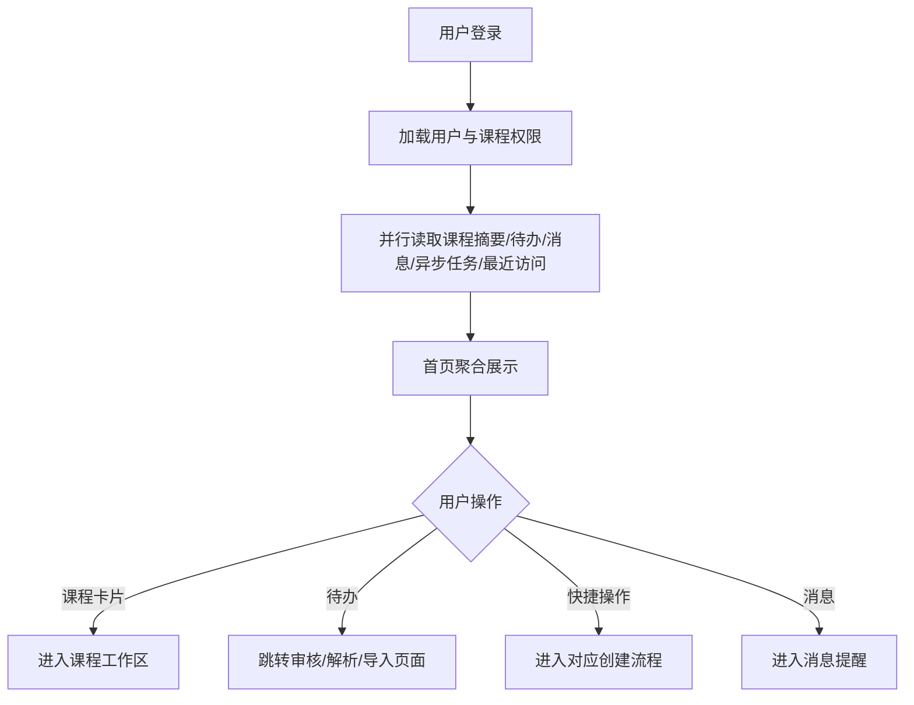

# 首页与全局总览 PRD

> 首页是登录后的系统级工作台，不替代课程内“课程总览”。页面只聚合用户有权限访问的课程和待办，不直接编辑业务内容。

## 1. 页面与字段

路由：`/home`。顶部导航：首页、我的课程、资料库、消息提醒、系统设置。

| 区块 | 字段/枚举 | 规则 |
|---|---|---|
| 欢迎区 | `display_name`、`last_login_at`、`today_date` | 按用户时区展示 |
| 课程概览 | `course_count`、`active_course_count`、`archived_course_count`、`pending_task_count` | 只统计有权限课程 |
| 我的课程卡片 | `course_id`、`course_name`、`course_code`、`term_label`、`course_status`、`role`、`current_version_no`、`last_visited_at` | 默认最近访问倒序，最多 6 张 |
| 待办 | `todo_id`、`todo_type`、`title`、`priority`、`due_at`、`related_id`、`status` | 点击跳转业务页面；过期标红 |
| 最近使用 | `resource_type`、`resource_id`、`title`、`course_name`、`visited_at` | 最多 10 条 |
| 异步任务 | `task_id`、`task_type`、`progress_percent`、`task_status`、`updated_at` | 展示排队、处理中、成功、失败、超时 |
| 快捷操作 | 创建课程、上传资料、生成大纲、导入成绩 | 无权限或无课程时置灰并说明原因 |
| 消息摘要 | `unread_count`、最近 5 条 `notification_id/title/severity` | 与消息提醒模块实时同步 |

`term_label` 固定为 `YYYY 春季/夏季/秋季/冬季`，例如 `2026 春季`；`course_status` 使用 `draft`、`processing`、`pending_review`、`active`、`archived`。

## 2. 交互与状态

- 首次登录无课程：显示“还没有课程，创建课程即上传主教材”，按钮“创建课程”。
- 无待办：显示“当前没有待处理事项”。
- 数据加载失败：显示“首页数据暂时无法加载，请重试”，保留已缓存的最近访问。
- 首页默认展示归档课程卡片，并提供 `course_status` 筛选；进入归档课程后全程只读。
- 快捷操作“创建课程”进入课程创建页；“上传资料”要求先选择课程和资料归属（个人/课程共享）。
- 所有卡片点击前重新校验权限；无权限返回 404，不泄露其他课程信息。

## 3. 数据流与业务流程

## 4. 系统流程与性能

首页聚合服务并行调用课程服务、通知服务、任务服务和最近访问服务；任一非核心服务失败时返回局部数据并标记区块异常，不阻塞整页。首页首屏 P95≤2 秒，聚合接口 P95≤3 秒；缓存 60 秒，权限变更和归档事件立即失效相关缓存。

本模块不主动调用大模型。AI 推荐入口只负责跳转到课程 AI 对话或具体业务模块，AI 生成遵循对应模块 Prompt 和公共 AI 规范。

## 5. 权限、埋点与验收

教师、课程负责人、查看者仅看到其课程范围；教学秘书可看到其负责院系/课程范围；系统管理员可看到全平台课程统计，但不得绕过业务模块权限执行写操作。首页不增加“本周待办”“本月生成量”等运营指标。

埋点：`home_view`、`home_course_card_click`、`home_todo_click`、`home_quick_action_click`、`home_recent_resource_click`、`home_task_view`、`home_retry`、`home_archived_filter`。

验收：课程数量与课程列表一致；待办只显示用户可处理事项；归档课程只读；异步任务状态与任务中心一致；局部服务失败不导致首页白屏；快捷入口均能携带正确 `course_id/course_version_id`；无权限数据不出现在接口响应中。

## 6. 当前页面与交互规范（2026-09-04）

- 首页沿用顶部全局导航，采用明亮、紧凑的工作台布局；标题区最多两行，不使用占据大面积空间的三联式头部。
- 首屏聚合课程概览、待办、最近使用、异步任务、消息摘要和快捷操作。课程卡片点击进入课程工作空间，待办和异步任务点击进入对应处理页面，所有跳转携带正确的课程和版本上下文。
- 首页只做聚合和导航，不直接编辑课程、资料、大纲、日历、备课、课件、作业、试卷或成绩；创建课程、上传资料、生成大纲和导入成绩通过居中弹窗/业务页面完成。
- 异步任务卡片显示“思考中”、排队、处理中、部分成功、成功、失败和超时；失败提示说明影响、重试方式和下一步。课程创建后的文件处理信息流可以从首页恢复查看。
- 无课程、无待办、加载失败和局部服务异常均提供可读空/错误状态；Mock 原型数据需在页面明确标识，不得误认为真实教务数据。
